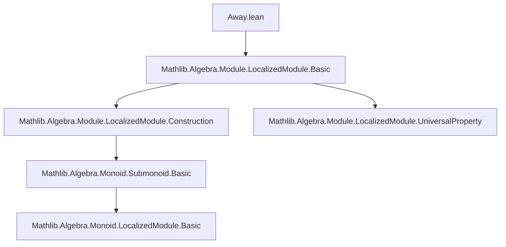
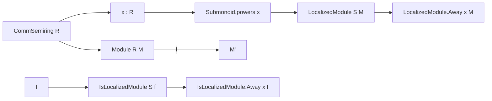

**Technical Brief: `Away.lean` Module**

---

### 1. KEY DEFINITIONS & THEOREMS

| Name | Type / Signature | Purpose |
|------|------------------|---------|
| `IsLocalizedModule.Away` | `{R M M' : Type*} [CommSemiring R] (x : R) [AddCommMonoid M] [Module R M] [AddCommMonoid M'] [Module R M'] (f : M →ₗ[R] M') → Prop` | Expresses that `f : M →ₗ M'` exhibits `M'` as the localization of `M` at the submonoid generated by `x`. |
| `LocalizedModule.Away` | `{R : Type*} [CommSemiring R] (x : R) (M : Type*) [AddCommMonoid M] [Module R M] → Type*` | Constructs the localization of an `R`-module `M` at the multiplicative submonoid $\{1, x, x^2, \dots\}$. |

- **No theorems** are stated in this file; it only introduces *abbreviations* (i.e., definitional aliases) for localized modules and maps away from an element.

---

### 2. NAMING CONVENTIONS

- **Prefix `Away`**: Used to denote localization *away from* a single element (i.e., at the powers of that element).
- **Structure**: `IsLocalizedModule.Away` and `LocalizedModule.Away` mirror the standard `IsLocalizedModule` and `LocalizedModule` constructors, parameterized by `Submonoid.powers x`.
- **No suffixes like `_equiv`, `_map`, `_prop`** appear — this is purely definitional.

---

### 3. TACTIC STACK

- **No proofs or tactics** are present in this file.
- The file uses only `abbrev` (definitional), so no tactic mode is invoked.
- Expected tactics in *related* files (e.g., proofs about `Away`) would likely include:
  - `simp`, `rw`, `exact`, `refine`, `apply`, `ext`, `aesop`, `ring`, `module`.

---

### 4. PROOF LOGIC

- Not applicable — this file contains no proofs.
- It sets up *definitions* for later use in localization theory, especially in contexts where one inverts a single element (e.g., in studying localization at a prime, or in algebraic geometry for distinguished opens).

---

### 5. IMPORTS

- **Primary dependency**:
  ```lean
  Mathlib.Algebra.Module.LocalizedModule.Basic
  ```
  - Provides the foundational `LocalizedModule` and `IsLocalizedModule` infrastructure.
  - `Submonoid.powers` is imported from `Mathlib.Algebra.Monoid.Submonoid.Basic` (transitively via `LocalizedModule.Basic`).

---

### 8. DEPENDENCY & THEORY OVERVIEW

#### Mermaid Diagram: Module Dependencies



#### Mermaid Diagram: Conceptual Theory Flow



#### Theory Context

- This file formalizes **localization of modules at a single element**, a special case of multiplicative subset localization.
- It is foundational for:
  - Constructing the *distinguished open subsets* $D(x)$ in scheme theory.
  - Defining *localization at a prime ideal* (via localization at the complement of the prime).
  - Studying *flatness*, *exactness*, and *descent* properties in commutative algebra.
- The use of `abbrev` (vs. `def` or `class`) indicates that these are *convenience shorthands*, not new structures — they reduce definitionally to `LocalizedModule (Submonoid.powers x) M`.

--- 

Let me know if you'd like the next-level formalization (e.g., universal property, functoriality, or exactness of `Away`).
