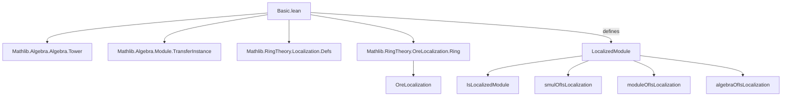

Here is the **technical metadata** extracted from the provided `Basic.lean` file, structured as requested:

---

### 1. **Key Definitions & Theorems**

| Name | Type / Signature | Purpose |
|------|------------------|---------|
| `r` | `r : M × S → M × S → Prop` | Equivalence relation defining localization: $(m,s) ≈ (m',s') \iff \exists u \in S,\ u \cdot s' \cdot m = u \cdot s \cdot m'$. |
| `LocalizedModule` | `Type (max u v)` | The localized module $M[S^{-1}]$, defined as `OreLocalization S M`. |
| `mk` | `mk : M → S → LocalizedModule S M` | Canonical fraction map: $m \mapsto s \mapsto m/s$. |
| `mk_eq` | `mk m s = mk m' s' ↔ ∃ u : S, u • s' • m = u • s • m'` | Characterization of equality in localized module. |
| `induction_on`, `induction_on₂` | Eliminators for `LocalizedModule` | Induction principles over fractions. |
| `liftOn`, `liftOn₂` | Universal properties of quotient | Descend functions respecting `r`. |
| `mk_add_mk` | `mk m₁ s₁ + mk m₂ s₂ = mk (s₂ • m₁ + s₁ • m₂) (s₁ * s₂)` | Addition in localized module. |
| `mk_mul_mk`, `mk_mul_mk'` | Multiplication rules in localized ring/module | `mk a₁ s₁ * mk a₂ s₂ = mk (a₁ * a₂) (s₁ * s₂)` (up to commutativity). |
| `smul_def`, `mk'_smul_mk`, `mk_smul_mk` | Scalar multiplication by localized ring elements | e.g., $r/s \cdot m/t = (r \cdot m)/(s \cdot t)$. |
| `moduleOfIsLocalization` | `Module T (LocalizedModule S M)` | Constructs $T$-module structure when $T = R[S^{-1}]$. |
| `algebraOfIsLocalization` | `Algebra T (LocalizedModule S A)` | Constructs $T$-algebra structure on localized module/algebra. |
| `numeratorRingHom` | `A →+* A[S⁻¹]` | Ring homomorphism $r \mapsto r/1$. |
| `mkLinearMap` | `M →ₗ[R] LocalizedModule S M` | Linear map $m \mapsto m/1$. |
| `divBy` | `LocalizedModule S M →ₗ[R] LocalizedModule S M` | Multiplication-by-$s$ inverse: $a/b \mapsto a/(b \cdot s)$. |
| `IsLocalizedModule` | `Prop` | Characterizes maps $f : M → M'$ that exhibit $M'$ as the localization of $M$ at $S$. |
| `lift`, `lift'` | Universal property of localization | Given $g : M → M''$ with $S$-actions invertible, induces $M[S^{-1}] → M''$. |
| `localizedModuleIsLocalizedModule` | `IsLocalizedModule S (mkLinearMap S M)` | The canonical map $M → M[S^{-1}]$ satisfies the universal property. |

---

### 2. **Naming Conventions**

- **Prefixes**:
  - `mk_`: canonical fraction map (`mk`, `mk_add_mk`, `mk_mul_mk`, `mk_eq`, `mk_cancel`, etc.)
  - `lift_`: universal property constructions (`liftOn`, `liftOn₂`, `lift`, `lift'`)
  - `smul_`, `algebraMap_`, `divBy_`, `numeratorRingHom`: operations and maps involving scalar multiplication or algebra structure.
  - `oreEqv_`, `isLocalizedModule_`: internal technical lemmas (often related to `OreLocalization`).
- **Suffixes**:
  - `_eq`: characterizations of equality or definitional equality.
  - `_aux`: internal auxiliary lemmas used in proofs of module axioms.
  - `_def`, `_mk`, `_apply`: definitions or computational content.
- **Notable pattern**: `mk_cancel_*` lemmas express simplifications like $s \cdot m / (s \cdot t) = m/t$.

---

### 3. **Tactic Stack**

Frequently used tactics in proofs:
- `simp` / `simp only` / `simp_rw`: simplification with definitional equalities and lemmas like `mk_eq`, `mk_add_mk`, `smul_def`.
- `rw`: rewriting using equivalences and lemmas (especially `mk_eq`, `mk_mul_mk`, `smul_def`).
- `induction_on`, `induction_on₂`: custom eliminators for inductive proofs over fractions.
- `convert`, `congr`, `congr'`: for congruence reasoning and partial equality proofs.
- `with_unfolding_all`: for unfolding definitions deeply (e.g., for `mul_assoc`, `distrib` proofs).
- `ring`, `ring_nf`: simplifying commutative ring expressions (used sparingly due to non-defeq issues).
- `dsimp`, `change`: for targeted definitional simplification.
- `apply_fun`, `congr_arg`: for applying functions to equalities.
- `exact`, `refine`, `use`: for constructing existential witnesses (especially in `mk_eq.mpr`).

---

### 4. **Proof Logic**

- **Inductive structure**: Most proofs proceed by:
  1. **Induction on fractions** using `induction_on` or `induction_on₂`.
  2. **Reduction to generators** (`mk m s`) and then applying definitional lemmas (`mk_add_mk`, `mk_mul_mk`, `smul_def`, etc.).
  3. **Equational reasoning** using `mk_eq.mpr` to construct equality via the equivalence relation `r`.
- **Key logical pattern**:
  - To prove $p = q$ in `LocalizedModule`, show $\exists u \in S,\ u \cdot \text{numerator}_p = u \cdot \text{numerator}_q$.
  - To prove properties of maps out of `LocalizedModule`, use `liftOn` or `lift`, verifying well-definedness via `r`.
- **Module/Algebra axioms**: Verified via `fast_instance%` and `with_unfolding_all`, often requiring manual verification of distributivity, associativity, etc., using `mk_eq.mpr` and ring simplifications.

---

### 5. **Imports**

| Import | Purpose |
|--------|---------|
| `Mathlib.Algebra.Algebra.Tower` | Scalar tower laws (`IsScalarTower`). |
| `Mathlib.Algebra.Module.TransferInstance` | Transfer module structures along equivalences. |
| `Mathlib.RingTheory.Localization.Defs` | Basic definitions of localization of rings. |
| `Mathlib.RingTheory.OreLocalization.Ring` | Ore localization (used for module localization). |

> **Note**: `LocalizedModule` is defined as `OreLocalization S M`, indicating reliance on Ore localization machinery for noncommutative generalizations (though here $R$ is commutative).

---

### 6. **Mermaid Diagrams**

#### **Dependency Graph (Module-Level)**



#### **Overview of Theory Flow**

```mermaid
flowchart LR
  R[CommSemiring R] --> S[Submonoid S ⊆ R]
  S --> M[Module M over R]
  M --> L[LocalizedModule L = M[S⁻¹]]
  L -->|via IsLocalization S T| T[T-Module structure]
  L -->|via algebraOfIsLocalization| A[Algebra T L]
  L -->|via mkLinearMap| M[M → L]
  L -->|via divBy s| L[Endomorphism inverse to ×s]
  L -->|IsLocalizedModule| F[Universal property: maps from M factoring through L]
```

---

Let me know if you'd like a **dependency graph of definitions** (e.g., `mk`, `lift`, `smul`) or a **proof dependency tree** for a specific theorem (e.g., `moduleOfIsLocalization`).
