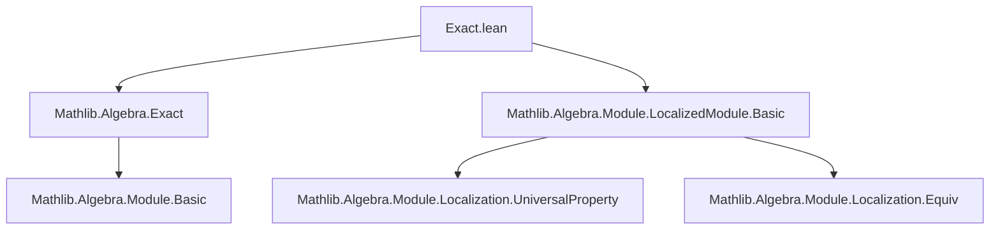
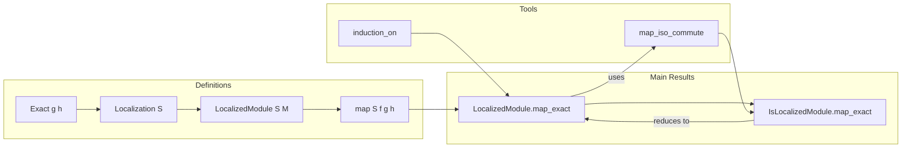

**Technical Brief: `Exact.lean` — Localization of Modules is an Exact Functor**

---

### 1. **Key Definitions & Theorems**

| Name | Type | Purpose |
|------|------|---------|
| `LocalizedModule.map_exact` | `Exact g h → Exact (map S ... g) (map S ... h)` | Proves that localization (via `LocalizedModule`) preserves exactness of a pair of composable linear maps. |
| `IsLocalizedModule.map_exact` | `Function.Exact g h → Function.Exact (map S f₀ f₁ g) (map S f₁ f₂ h)` | Generalizes `map_exact` to arbitrary `IsLocalizedModule` instances using equivalence of localized modules. |

- **`Exact g h`**: `Range g ⊆ Kernel h`, i.e., $ h \circ g = 0 $ and $\operatorname{im} g \subseteq \ker h$.
- **`map S f g h`**: The induced map on localized modules given a commutative square involving localization maps $f, g$.
- **`mkLinearMap S M`**: The canonical map $M \to S^{-1}M$ used to construct localized maps.

---

### 2. **Naming Conventions**

- **Prefixes**:
  - `map_`: Indicates induced maps on localized modules.
  - `is_` (in `IsLocalizedModule`): Predicate class for modules satisfying the universal property of localization.
- **Suffixes**:
  - `_exact`: Denotes exactness preservation.
  - `_commute`: Used in `map_iso_commute` to indicate naturality/square commutation.

---

### 3. **Tactic Stack**

Frequent tactics used in proofs:

- `induction_on`: Structural induction on localized module elements (`mk m s`).
- `rw [...] at *`: Rewriting using definitions like `map_LocalizedModules`, `mk_eq`, `mk_cancel_common_left`.
- `obtain ⟨a, aS, ha⟩ := ...`: Extract witnesses from existential quantifiers.
- `rcases ... with ⟨x, hx⟩`: Destruct conjunctions or existential proofs.
- `use ...`: Construct witnesses for existential goals.
- `refine ...`: Partial proof construction, especially in `induction_on` lambdas.
- `simp_rw`, `aesop`, `ring`: Likely used implicitly or in auxiliary lemmas (not shown here but standard in Mathlib).

---

### 4. **Proof Logic**

- **Main proof strategy**:
  1. **Show inclusion both ways** (`Iff.intro`):
     - **Forward direction**: Assume $y \in \ker(\text{loc}(h))$, show $y \in \operatorname{im}(\text{loc}(g))$.
       - Use induction on $y = \frac{m}{s}$.
       - Translate condition $h(m)/s = 0$ into existence of $a \in S$ such that $a \cdot h(m) = 0$.
       - Use exactness of $g, h$ to lift $a \cdot h(m) = 0$ to $a \cdot m = g(x)$.
       - Construct preimage under localized $g$ as $\frac{x}{a \cdot s}$.
     - **Reverse direction**: Assume $y = \text{loc}(g)(x)$, show $y \in \ker(\text{loc}(h))$.
       - Use exactness: $h \circ g = 0$, then localization preserves zero.

- **For `IsLocalizedModule.map_exact`**:
  - Reduce to `LocalizedModule.map_exact` via `Function.Exact.of_ladder_linearEquiv_of_exact`.
  - Uses naturality of localization isomorphisms (`map_iso_commute`).

---

### 5. **Imports**

- `Mathlib.Algebra.Exact`: Core definitions of `Exact`, `Function.Exact`.
- `Mathlib.Algebra.Module.LocalizedModule.Basic`: Localization of modules, maps, universal property, `mk`, `LocalizedModule`, `IsLocalizedModule`.

---

### 6. **Mermaid Diagrams**

#### Dependency Graph (Module-Level)



#### Theoretical Overview (Conceptual Flow)



#### Proof Structure (for `LocalizedModule.map_exact`)

```mermaid
flowchart TD
  A[Goal: Exact (loc g) (loc h)] --> B[Split into two inclusions]
  B --> C1[im(loc g) ⊆ ker(loc h)]
  B --> C2[ker(loc h) ⊆ im(loc g)]
  C1 --> D1[Use h∘g = 0 and localization functoriality]
  C2 --> D2[Induction on y = m/s]
  D2 --> E2[Assume loc(h)(m/s) = 0]
  E2 --> F2[∃ a ∈ S, a·h(m) = 0]
  F2 --> G2[Exactness ⇒ a·m = g(x)]
  G2 --> H2[Construct preimage x/(a·s)]
  H2 --> I2[Verify via mk_cancel_common_left]
```

--- 

This file formalizes a foundational result in homological algebra: **localization is an exact functor**, crucial for sheaf theory, commutative algebra, and derived categories.
