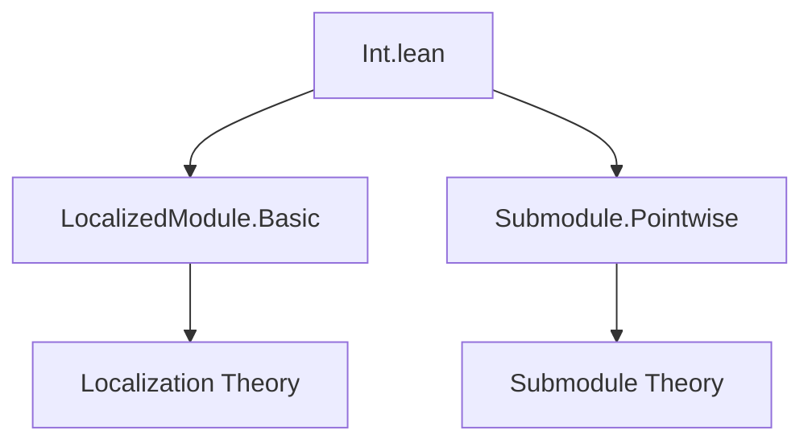
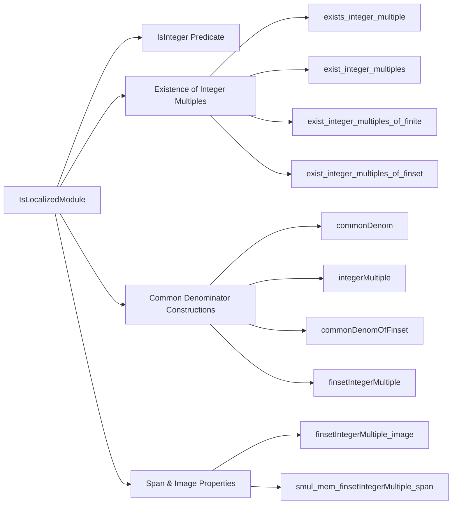

Here is the structured technical brief for the `Int.lean` file:

---

### **1. Key Definitions & Theorems**

| Name | Type | Purpose |
|------|------|---------|
| `IsInteger f x` | `Prop` | Predicate stating that `x : M'` lies in the image of the localization map `f : M →ₗ[R] M'`. |
| `isInteger_zero` | `IsInteger f 0` | Zero is an integer element (i.e., in the image of `f`). |
| `isInteger_add` | `IsInteger f x → IsInteger f y → IsInteger f (x + y)` | Closure under addition of integer elements. |
| `isInteger_smul` | `IsInteger f x → IsInteger f (a • x)` | Closure under scalar multiplication by `R`. |
| `exists_integer_multiple` | `∃ a : S, IsInteger f (a.val • x)` | Every element in the localized module has an `S`-multiple that is integer. |
| `exist_integer_multiples` | `∃ b : S, ∀ i ∈ s, IsInteger f (b.val • g i)` | For a finite family indexed by a `Finset`, a common denominator exists. |
| `exist_integer_multiples_of_finite` | `∃ b : S, ∀ i, IsInteger f ((b : R) • g i)` | Same as above for finite types (not just `Finset`). |
| `exist_integer_multiples_of_finset` | `∃ b : S, ∀ a ∈ s, IsInteger f ((b : R) • a)` | Common denominator for a finite *set* of elements in `M'`. |
| `commonDenom` | `S` | Noncomputable choice of common denominator for a `Finset`-indexed family. |
| `integerMultiple` | `M` | Numerator after clearing denominators for a specific index. |
| `map_integerMultiple` | `f (integerMultiple … i) = commonDenom … • g i` | Ensures the numerator maps correctly under `f`. |
| `commonDenomOfFinset` | `S` | Specialization of `commonDenom` to identity on `Finset M'`. |
| `finsetIntegerMultiple` | `Finset M` | Image of numerators after clearing denominators for a `Finset M'`. |
| `finsetIntegerMultiple_image` | `f '' finsetIntegerMultiple … = commonDenomOfFinset … • s` | Relates image of numerators to scaled set. |
| `smul_mem_finsetIntegerMultiple_span` | `f x ∈ span s → ∃ m, m • x ∈ span (finsetIntegerMultiple s)` | Enables clearing denominators in submodule membership proofs. |

---

### **2. Naming Conventions**

- **Predicates**: `isInteger_…`, `IsInteger` — unary predicate on `M'`.
- **Existential witnesses**:
  - `commonDenom` / `commonDenomOfFinset`: denominator choices.
  - `integerMultiple` / `finsetIntegerMultiple`: numerator constructions.
- **Properties**:
  - `isInteger_…`: basic closure properties.
  - `exist_…`: existence of common denominators.
- **Suffixed with `_image`, `_span`, `_of_finset`, `_of_finite`**: indicate specific contexts or types of families.

---

### **3. Tactic Stack**

- `rcases`, `use`, `rw`, `simp only`, `congr`, `convert`, `exact`, `apply`, `cases`, `intro`, `ext`, `delta`, `rw [← …]`, `simp`, `ring` (implicit via `smul_smul`, `mul_smul`, etc.), `aesop` (not explicitly used, but `rw` + `simp` dominate).

---

### **4. Proof Logic**

- **Existence proofs** rely on `IsLocalizedModule.surj`, which gives a representation `x = f(m)/s`.
- **Common denominator constructions** use finite products over denominators from `surj` applications.
- **Finite set arguments** reduce to `Finset` cases via `Finset.univ` or `Finset.attach`.
- **Submodule/span arguments** use:
  - `Submodule.span_smul`, `Submodule.map_span`, `Set.smul_mem_smul_set`,
  - `eq_iff_exists` to lift equality in `M'` to existence in `M`,
  - `smul_mem_smul_set` and `Submodule.span` properties to relate scaled sets and spans.

---

### **5. Imports**

- `Mathlib.Algebra.Module.LocalizedModule.Basic`: core theory of localized modules.
- `Mathlib.Algebra.Module.Submodule.Pointwise`: for `Pointwise.smul`, `smul_mem`, etc.

---

### **6. Mermaid Diagrams**

#### **Dependency Graph (Module-Level)**

#### **Overview of File Structure**

---

### **7. Theory Context**

This file formalizes the *integer part* of a localized module — the analog of $\mathbb{Z} \subseteq \mathbb{Q}$ for modules. It supports:
- Denominator clearing in linear algebra over localized modules.
- Constructive reasoning about preimages under localization maps.
- Bridging between submodule membership in $M'$ and $M$ via scaling.

It is designed to support future unification with `IsLocalization` (ring case) once the module/ring theories converge.

--- 

Let me know if you'd like a formalized dependency graph for the entire `Mathlib.Algebra.Module.LocalizedModule` hierarchy.
