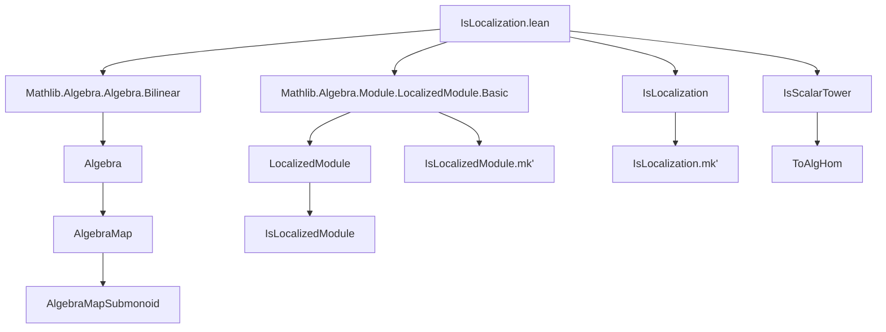

**Technical Brief: `IsLocalization.lean`**

---

### 1. **Key Definitions & Theorems**

| Name | Type / Signature | Purpose |
|------|------------------|---------|
| `isLocalizedModule_iff_isLocalization` | `IsLocalizedModule S (toAlgHom R A Aₛ).toLinearMap ↔ IsLocalization (algebraMapSubmonoid A S) Aₛ` | Establishes equivalence between module localization and ring localization under scalar tower assumptions. |
| `isLocalizedModule_iff_isLocalization'` | `IsLocalizedModule S (Algebra.linearMap R A) ↔ IsLocalization S A` | Special case where the algebra map is used directly (i.e., $ R \to A $), showing equivalence with localization at $ S \subseteq R $. |
| `IsLocalization.mk'_algebraMap_eq_mk'` | `IsLocalization.mk' Aₛ x ⟨s, h⟩ = IsLocalizedModule.mk' (toAlgHom R A Aₛ).toLinearMap x s` | Shows agreement of localization element constructors under algebra map. |
| `IsLocalization.mk'_eq_mk'` | `IsLocalization.mk' A x s = IsLocalizedModule.mk' (Algebra.linearMap R A) x s` | Agreement of constructors when localizing $ R $ at $ S $ to get $ A $. |
| `isLocalizedModule_of_isLocalization` (instance) | `[IsLocalization (algebraMapSubmonoid A S) Aₛ] → IsLocalizedModule S (toAlgHom R A Aₛ).toLinearMap` | Converts ring localization to module localization. |
| `isLocalizedModule_of_isLocalization'` (instance) | `[IsLocalization S A] → IsLocalizedModule S (Algebra.linearMap R A)` | Converts ring localization to module localization in the standard case. |

---

### 2. **Naming Conventions**

- **Prefixes**:
  - `isLocalizedModule_`: predicates or constructions related to module localization.
  - `isLocalization_`: predicates or constructions related to ring localization.
  - `mk'_`: constructors for localized elements (e.g., $ x/s $).
- **Suffixes**:
  - `_eq_mk'`: lemmas asserting equality of two `mk'` constructions.
  - `_iff_`: biconditional equivalences.
- **Helper patterns**:
  - `algebraMapSubmonoid`: submonoid image of $ S $ under algebra map $ R \to A $.
  - `toAlgHom`, `linearMap`: coercion to linear maps from algebra structure.
  - `IsScalarTower.toAlgHom`: canonical algebra map under scalar tower.

---

### 3. **Tactic Stack**

- `rw`: rewriting using equivalences and definitions.
- `simp_rw`: simplification with rewriting (used heavily for algebraic simplifications).
- `simp`: basic simplification, especially for algebraic structures and submonoid operations.
- `congr!`: congruence reasoning with automatic simplification.
- `exact`: applying known instances or lemmas.
- `convert`: adapting a lemma to a slightly different goal via definitional equality.
- `refine`: constructing proofs with holes (`?_`) to be filled later.

---

### 4. **Proof Logic**

- **Structure**: Proofs rely on unfolding definitions (`isLocalizedModule_iff`, `isLocalization_iff`) and reducing to logical equivalences.
- **Core strategy**:
  1. Expand definitions of `IsLocalizedModule` and `IsLocalization`.
  2. Use `and_congr` / `forall_congr'` to decompose into subgoals.
  3. Simplify using algebraic properties (e.g., `Algebra.smul_def`, `Algebra.lmul_commutes`, `IsScalarTower`).
  4. Apply `simp` with lemmas about submonoid maps and scalar towers.
- **Induction**: Not used here—proofs are purely equational/simplificational.
- **Key insight**: The module-theoretic localization (`IsLocalizedModule`) and ring-theoretic localization (`IsLocalization`) coincide when the target is a scalar tower over the source.

---

### 5. **Imports**

- `Mathlib.Algebra.Algebra.Bilinear`: for bilinear maps and algebraic structures.
- `Mathlib.Algebra.Module.LocalizedModule.Basic`: foundational definitions of `IsLocalizedModule`, `mk'`, and module localization.

---

### 8. **Mermaid Diagrams**

#### **Dependency Graph (Module Scope)**



#### **Overview of Theory Flow**

```mermaid
flowchart LR
  R[CommSemiring R] -->|S: Submonoid| A[CommSemiring A<br>[Algebra R A]]
  A -->|AlgebraMap| Aₛ[CommSemiring Aₛ<br>[Algebra A Aₛ][Algebra R Aₛ][IsScalarTower]]
  Aₛ -->|IsLocalization| L1[IsLocalization (algebraMapSubmonoid A S) Aₛ]
  Aₛ -->|IsLocalizedModule| L2[IsLocalizedModule S (toAlgHom).toLinearMap]
  L1 <-->|isLocalizedModule_iff_isLocalization| L2
  R -->|Algebra.linearMap| A
  A -->|IsLocalization S A| L3
  A -->|IsLocalizedModule S (linearMap)| L4
  L3 <-->|isLocalizedModule_iff_isLocalization'| L4
  L2 <-->|mk'_eq_mk'| L4
```

---

**Summary**: This module formalizes the equivalence between ring localization and module localization in Lean, leveraging the `IsScalarTower` structure to align algebra and module perspectives. The proofs are mostly simplification-based, relying on algebraic identities and careful rewriting.
