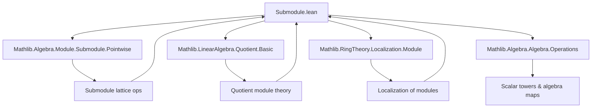

**Technical Brief: Localization of Submodules in Lean 4 (Submodule.lean)**  
*Based on the provided `Submodule.lean` file from Mathlib (2024, Andrew Yang)*

---

### 1. **Key Definitions & Theorems**

| Name | Type / Signature | Purpose |
|------|------------------|---------|
| `localized₀` | `Submodule R M → Submodule R N` | Localization of an $R$-submodule $M' \le M$ at $p$ as an $R$-submodule of the localized module $N = \mathrm{Loc}_p(M)$ via $f: M \to N$. |
| `localized'` | `Submodule R M → Submodule S N` | Same as `localized₀`, but viewed as an $S$-submodule where $S = R_p$ (localization of $R$ at $p$). |
| `localized` | `Submodule R M → Submodule (Localization p) (LocalizedModule p M)` | Canonical localization of $M'$ as an $R_p$-submodule of $M_p$. Noncomputable abbreviation using `localized'`. |
| `toLocalized₀` | `M' →ₗ[R] M'.localized₀ p f` | Localization map on submodule elements: $m \mapsto f(m)/1$. |
| `toLocalized'` | `M' →ₗ[R] M'.localized' S p f` | Same as `toLocalized₀`, but codomain is $S$-module. |
| `toLocalized` | `M' →ₗ[R] M'.localized p` | Localization map for `localized` (i.e., $R_p$-linear). |
| `toLocalizedQuotient'` | `M ⧸ M' →ₗ[R] N ⧸ M'.localized' S p f` | Localization map on quotient modules. |
| `toLocalizedQuotient` | `M ⧸ M' →ₗ[R] M_p ⧸ M'.localized p` | Quotient localization map for `localized`. |
| `localizedEquiv` | `M'.localized p ≃ₗ[R_p] (M')_p` | Canonical isomorphism between abstract localization of $M'$ and its concrete realization as a submodule of $M_p$. |
| `localizedQuotientEquiv` | `(M_p ⧸ M'.localized p) ≃ₗ[R_p] (M ⧸ M')_p` | Canonical isomorphism between localized quotient and quotient of localized modules. |
| `ker_localizedMap_eq_localized₀_ker` | `ker (map g) = (ker g).localized₀` | Localization commutes with kernels (concrete version). |
| `range_localizedMap_eq_localized₀_range` | `range (map g) = (range g).localized₀` | Localization commutes with ranges. |
| `localized'_eq_span` | `M'.localized' = span (f '' M')` | Describes localized submodule as span of image. |
| `localized₀FrameHom`, `localized'FrameHom` | `FrameHom (Submodule R M) (Submodule R N)` | Frame homomorphisms encoding preservation of meets, top, and sups under localization. |
| `localized'gi` | `GaloisInsertion (localized' S p f) (comap f ∘ restrictScalars R)` | Galois insertion showing localization is left adjoint to restriction of scalars. |
| `IsLocalizedModule.toLocalized₀`, `IsLocalizedModule.toLocalizedQuotient'` | Instances | Prove that `toLocalized₀` and `toLocalizedQuotient'` are localization maps (i.e., satisfy universal property). |

---

### 2. **Naming Conventions**

- **Prefixes**:
  - `localized₀`: localization as $R$-submodule (base ring).
  - `localized'`: localization as $S$-submodule ($S = R_p$).
  - `toLocalized*`: localization *map* (domain → codomain).
  - `localized*Equiv`: canonical isomorphisms between abstract and concrete localizations.
- **Suffixes**:
  - `₀`: base-ring version.
  - `'`: scalar-localized version.
  - `FrameHom`: frame homomorphism version.
  - `gi`: Galois insertion.
- **Other**:
  - `map`, `comap`, `restrictScalars`, `extendScalarsOfIsLocalization`: standard module-theoretic operations.
  - `mk'`, `mk_surjective`, `mk'_eq_zero`, etc.: standard localization notation.

---

### 3. **Tactic Stack**

Frequently used tactics in proofs:
- `simp` / `simp only` / `simp_rw`: simplification with localization lemmas (`mk'_add`, `mk'_smul`, `mk'_cancel`, etc.).
- `rw`: rewriting using `mk'_eq_mk'_iff`, `mem_localized₀`, `mem_localized'`, etc.
- `exact`, `refine`, `intro`, `rintro`, `obtain`: standard proof construction.
- `apply`, `apply_fun`, `convert`: for applying lemmas or constructing equalities.
- `ext`: extensionality for submodules and quotients.
- `grind`: used in `localized₀_inf` — likely a custom or `grind`-based automation tactic.
- `ring`, `abel`: for additive/multiplicative simplifications in commutative rings.
- `apply SetLike.ext'`, `apply SetLike.ext_iff.mp`: to prove submodule equality via element membership.
- `smul_induction_on`, `submodule.induction_on`: induction on submodule constructions.

---

### 4. **Proof Logic**

- **Structure**: Most proofs follow a standard pattern:
  1. **Extensionality**: `ext x` to reduce to membership.
  2. **Unfold definitions**: `simp [mem_localized₀]` or similar.
  3. **Existential witness construction**: e.g., for $x \in M'.localized₀$, find $m \in M'$, $s \in p$ such that $x = f(m)/s$.
  4. **Use localization properties**:
     - `mk'_eq_mk'_iff`: characterizes equality in localized module.
     - `mk'_cancel_left`, `mk'_cancel_right`: cancellation lemmas.
     - `mk'_surjective`: every element is of the form $f(m)/s$.
  5. **Induction principles** (e.g., `smul_induction_on`) for submodule operations like `•`.
  6. **Galois insertion machinery** for lattice-theoretic properties (`map_inf'`, `map_sSup'`).
  7. **Universal property verification** (`IsLocalizedModule` instances): show `map_units`, `surj`, `exists_of_eq`.

- **Induction patterns**:
  - Submodule membership: `smul_induction_on`, `Submodule.mem_sup_iff`, `Submodule.mem_iSup`.
  - Quotient elements: `quotient_induction`, `mk_surjective`.

- **Key logical flow**:
  > *Show $x \in LHS \iff x \in RHS$ by unfolding definitions, then constructing witnesses using localization surjectivity and cancellation.*

---

### 5. **Imports**

| Import | Purpose |
|--------|---------|
| `Mathlib.Algebra.Module.Submodule.Pointwise` | Basic submodule operations (`•`, `inf`, `iSup`, etc.). |
| `Mathlib.LinearAlgebra.Quotient.Basic` | Quotient modules, `mapQ`, `quotient.mk`. |
| `Mathlib.RingTheory.Localization.Module` | Localized modules, `LocalizedModule`, `mk'`, `IsLocalizedModule`. |
| `Mathlib.Algebra.Algebra.Operations` | Scalar tower, `algebraMap`, `smul_of_tower`, etc. |

---

### 6. **Mermaid Diagrams**

#### **Dependency Graph (Top-Level)**



#### **Overview of Theory Flow**

```mermaid
flowchart LR
  R[CommRing R] --> M[Module R M]
  R --> p[Submonoid p]
  p --> S[Localization S = R_p]
  M --> f[N = Loc_p(M)]
  M'["Submodule R M"] --> localized₀["localized₀ p f M' ≤ N"]
  M' --> localized'["localized' S p f M' ≤ N"]
  M' --> toLocalized["toLocalized : M' →ₗ[R] M'.localized"]
  M' --> localizedEquiv["M'.localized ≃ₗ M'_p"]
  M' --> toLocalizedQuotient["M ⧸ M' →ₗ M_p ⧸ M'.localized"]
  M' --> localizedQuotientEquiv["(M_p ⧸ M'.localized) ≃ₗ (M ⧸ M')_p"]

  subgraph Exactness
    ker[Kernel]
    range[Range]
    ker --> ker_localizedMap_eq_localized₀_ker
    range --> range_localizedMap_eq_localized₀_range
  end

  localized₀ --> localized₀FrameHom
  localized' --> localized'FrameHom
  localized'gi[localized'gi] --> GaloisInsertion
```

---

### 7. **Summary**

This file formalizes the **functoriality and exactness properties of localization** for submodules and quotient modules in the context of commutative algebra. It establishes:

- Concrete constructions (`localized₀`, `localized'`, `localized`) of localized submodules.
- Universal properties (`IsLocalizedModule` instances for `toLocalized`, `toLocalizedQuotient`).
- Canonical isomorphisms (`localizedEquiv`, `localizedQuotientEquiv`) between abstract and concrete localizations.
- Lattice-theoretic behavior (preservation of meets, sups, top) via `FrameHom` and `GaloisInsertion`.
- Commutation of localization with kernels and ranges (`ker_localizedMap_eq_localized₀_ker`, `range_localizedMap_eq_localized₀_range`).

It serves as a foundational step toward proving **flatness of localization** (`IsLocalization.flat`) and future work on **exactness of localization** (as noted in the `TODO`).

--- 

Let me know if you'd like a formalized summary in `lean`-style comment blocks or a dependency graph for specific lemmas.
