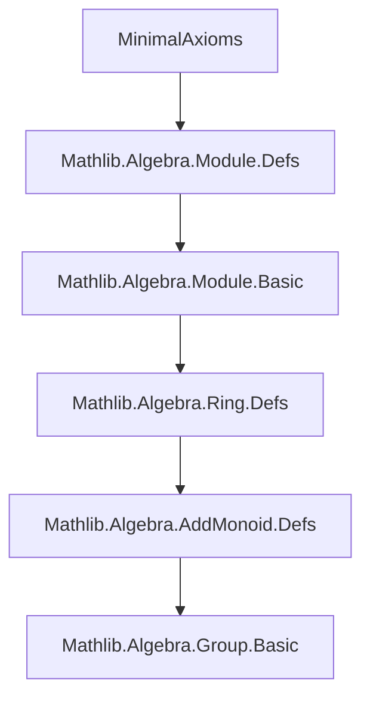
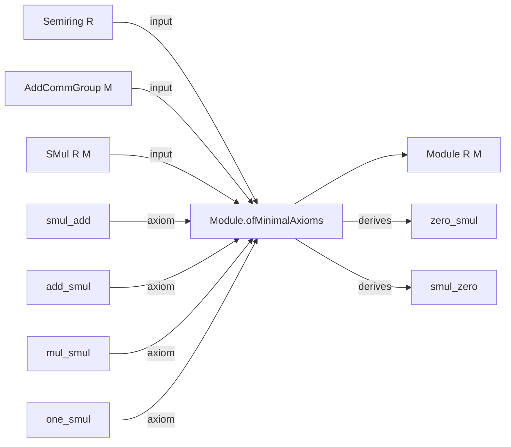

**Technical Brief: `MinimalAxioms.lean`**

---

### 1. **Key Definitions & Theorems**

| Name | Type / Signature | Purpose |
|------|------------------|---------|
| `Module.ofMinimalAxioms` | `{R : Type u} {M : Type v} [Semiring R] [AddCommGroup M] [SMul R M] → (smul_add → add_smul → mul_smul → one_smul → Module R M)` | Constructs a `Module R M` structure from a minimal axiomatization: left distributivity, right distributivity of scalar multiplication over ring addition, compatibility with ring multiplication, and unit action. The remaining module axioms (`zero_smul`, `smul_zero`) are derived using `AddMonoidHom.map_zero`. |

---

### 2. **Naming Conventions**

- **Prefixes**:  
  - `smul_`, `add_`, `mul_`, `one_`, `zero_`: denote operations or properties involving scalar multiplication (`•`), addition, multiplication, identity elements.
- **Suffixes**:  
  - `_add`, `_smul`, `_mul`: indicate which operation is being distributed over or composed with.
- **Pattern**: `op_arg` (e.g., `smul_add`, `add_smul`) — *operation applied to argument structure*.

---

### 3. **Tactic Stack**

- `fun` / `fun x => ...`: lambda abstraction for constructing functions.
- `AddMonoidHom.mk'`: constructs an additive monoid homomorphism from a function preserving addition (used twice).
- Implicit use of `rfl` or definitional equality via `:=` for field assignments in record construction.
- No explicit tactics like `aesop`, `ring`, or `simp` appear in the definition itself — proofs are *definitionally* or *structurally* derived.

---

### 4. **Proof Logic**

- **Strategy**: *Constructive definition via record initialization*.
- The `Module` structure is built by explicitly providing the four core axioms as inputs, and deriving the remaining two (`zero_smul`, `smul_zero`) using:
  - `AddMonoidHom.mk' (· • x) (add_smul r s x)` → shows $r \cdot (-)$ is additive in $r$, hence preserves $0$.
  - `AddMonoidHom.mk' (r • ·) (smul_add r x y)` → shows $(-) \cdot x$ is additive in the module element, hence preserves $0$.
- No induction or case analysis is needed — the derivation is *algebraic* and *homomorphic*.

---

### 5. **Imports**

- `Mathlib.Algebra.Module.Defs`: provides the core `Module` typeclass definition and basic infrastructure (`SMul`, `AddCommGroup`, etc.).

---

### 8. **Mermaid Diagrams**

#### **Dependency Graph (File-Level)**



#### **Overview of `MinimalAxioms.lean`**



#### **Axiom Structure (Logical Flow)**

```mermaid
graph LR
  A[AddCommGroup M] --> B[SMul R M]
  B --> C[smul_add]
  B --> D[add_smul]
  B --> E[mul_smul]
  B --> F[one_smul]
  C & D & E & F --> G[Module R M]
  G --> H[zero_smul]
  G --> I[smul_zero]
  H & I are derived via AddMonoidHom.map_zero
```

--- 

This file exemplifies *axiomatic minimality* in Lean: reducing the module axioms to a small, logically independent core, while leveraging algebraic structure (e.g., additive monoid homomorphisms) to derive the rest.
