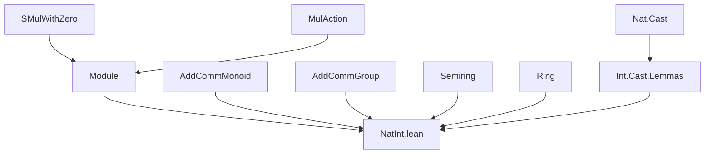
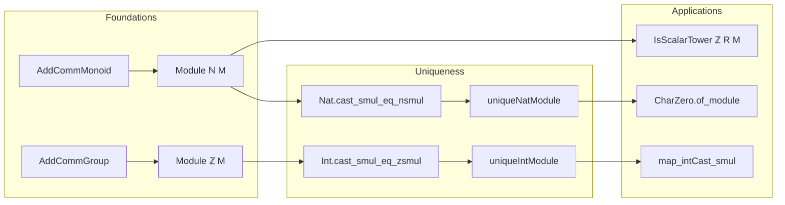

**Technical Brief: `NatInt.lean` Module Structure over `ℕ` and `ℤ`**

---

### 1. KEY DEFINITIONS & THEOREMS

| Name | Type / Signature | Purpose |
|------|------------------|---------|
| `AddCommMonoid.toNatModule` | `[AddCommMonoid M] → Module ℕ M` | Constructs the canonical `ℕ`-module structure on any `AddCommMonoid`. |
| `AddCommGroup.toIntModule` | `[AddCommGroup M] → Module ℤ M` | Constructs the canonical `ℤ`-module structure on any `AddCommGroup`. |
| `Module.addCommMonoidToAddCommGroup` | `[Ring R] [AddCommMonoid M] [Module R M] → AddCommGroup M` | Equips an `R`-module (with `R` a ring) with the canonical `AddCommGroup` structure via $-1$-scalar multiplication. |
| `Nat.cast_smul_eq_nsmul` | `(n : ℕ) (b : M) : (n : R) • b = n • b` | Shows that scalar multiplication by a natural number via ring cast coincides with `nsmul`. |
| `Int.cast_smul_eq_zsmul` | `(n : ℤ) (b : M) : (n : R) • b = n • b` | Analogous to above for integers and `zsmul`. |
| `nat_smul_eq_nsmul` | `(h : Module ℕ M) (n : ℕ) (x : M) : h.smul n x = n • x` | Proves uniqueness of `ℕ`-smul up to conversion. |
| `int_smul_eq_zsmul` | `(h : Module ℤ M) (n : ℤ) (x : M) : h.smul n x = n • zsmul` | Proves uniqueness of `ℤ`-smul up to conversion. |
| `AddCommMonoid.uniqueNatModule` | `Unique (Module ℕ M)` | States there is a *unique* `ℕ`-module structure on any `AddCommMonoid`. |
| `AddCommGroup.uniqueIntModule` | `Unique (Module ℤ M)` | States there is a *unique* `ℤ`-module structure on any `AddCommGroup`. |
| `CharZero.of_module` | `[Semiring R] [AddCommMonoidWithOne M] [CharZero M] [Module R M] → CharZero R` | If a module over `R` has characteristic zero, then so does `R`. |

---

### 2. NAMING CONVENTIONS

- **Prefixes**:
  - `to*`: constructs canonical instances (`toNatModule`, `toIntModule`, `addCommMonoidToAddCommGroup`)
  - `cast_smul_eq_*`: relates ring-cast scalar multiplication to canonical `nsmul`/`zsmul`
  - `*smul_eq_*`: equates exotic smul with canonical one (`nat_smul_eq_nsmul`, `int_smul_eq_zsmul`)
  - `map_*Cast_smul`: behavior of homomorphisms under scalar cast

- **Suffixes**:
  - `AddMonoidHom`: indicates equivalence to a homomorphism definition (`toAddMonoidHom_eq_nsmulAddMonoidHom`)
  - `IsScalarTower`: properties of nested scalar actions (`nat_isScalarTower`, `intIsScalarTower`)
  - `subsingleton*`: proves uniqueness up to propositional equality (`subsingletonNatModule`, `subsingletonIntModule`)

---

### 3. TACTIC STACK

Frequently used tactics in proofs:
- `simp` / `simp only`: simplification using lemmas like `zero_smul`, `one_smul`, `add_smul`, etc.
- `rw`: rewriting using equalities like `Nat.cast_succ`, `add_smul`, `zsmul_eq_mul`
- `induction`: structural induction on `ℕ` or `ℤ` (especially `ofNat`/`negSucc` cases)
- `convert`: for equational reasoning with typeclass inference
- `nth_rw`: for controlled rewriting at specific positions
- `ring`: for semiring/ring identities (e.g., `mul_one`, `add_comm`)
- `aesop`: not explicitly used here, but `simp` + `rw` suffice due to canonical structures

---

### 4. PROOF LOGIC

- **Canonical structure construction**: Define module axioms using known properties of `nsmul`/`zsmul`.
- **Uniqueness proofs**:
  - Show any smul operation equals the canonical one (`nat_smul_eq_nsmul`, `int_smul_eq_zsmul`)
  - Use `Module.ext'` to conclude equality of module structures.
- **Inductive arguments**:
  - For `ℕ`: base case `0`, step `n+1`
  - For `ℤ`: split into `ofNat n` and `negSucc n`, use `zsmul_neg'` or `add_smul`
- **Homomorphism compatibility**:
  - Use `map_nsmul`, `map_zsmul`, and cast lemmas to show homomorphisms commute with scalar multiplication.

---

### 5. IMPORTS

- `Mathlib.Algebra.Module.Defs`: foundational module definitions and axioms
- `Mathlib.Data.Int.Cast.Lemmas`: lemmas about integer casts and their interaction with algebraic operations

---

### 6. DEPENDENCY & THEORY OVERVIEW (Mermaid Diagrams)

#### Module Dependency Graph

#### Theory Flow Overview

---

### 7. SUMMARY

This file formalizes the foundational relationship between additive structures and scalar multiplication by `ℕ` and `ℤ`. It shows that:

- Every `AddCommMonoid` carries a *unique* `ℕ`-module structure.
- Every `AddCommGroup` carries a *unique* `ℤ`-module structure.
- These structures are compatible with ring/semiring scalars via cast maps.
- Homomorphisms preserve scalar multiplication under cast.
- Characteristic-zero properties lift from modules to base rings.

The design reflects Lean’s philosophy of *canonical structures*: uniqueness is built-in, avoiding redundant instances and promoting modularity.

--- 

Let me know if you'd like a formalized dependency graph in `leanpkg` format or a visualization of the `Module` hierarchy.
