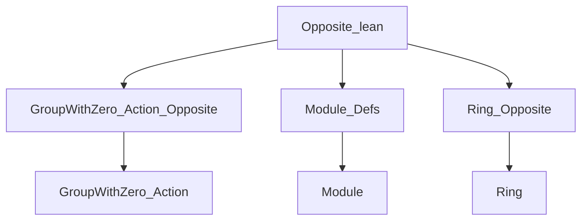
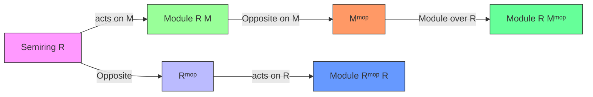

**Technical Brief: `Opposite.lean` Module Operations on `Mᵐᵒᵖ`**

---

### 1. **Key Definitions & Theorems**

| Name | Type / Signature | Purpose |
|------|------------------|---------|
| `Semiring.toOppositeModule` | `instance [Semiring R] : Module Rᵐᵒᵖ R` | Constructs a right module structure on `R` over its opposite semiring `Rᵐᵒᵖ`, i.e., scalar multiplication is defined as right multiplication in `R`. |
| `MulOpposite.instModule` | `instance [Semiring R] [AddCommMonoid M] [Module R M] : Module R Mᵐᵒᵖ` | Lifts a left `R`-module structure on `M` to a left `R`-module structure on the opposite additive monoid `Mᵐᵒᵖ`, using the opposite multiplication to ensure module axioms hold. |

> **Note**: Both instances rely on `unop_injective` to transport equalities through the `MulOpposite` coercion.

---

### 2. **Naming Conventions**

- **Prefixes**:
  - `toOppositeModule`: Indicates construction of a module over an opposite algebraic structure.
  - `instModule`: Standard Lean convention for instance definitions.
- **Suffixes**:
  - `Opposite`: Used in types (`Rᵐᵒᵖ`, `Mᵐᵒᵖ`) and namespaces (`MulOpposite`).
- **Pattern**:
  - `add_smul`, `zero_smul`: Module axioms explicitly verified in instance proofs.
  - `unop_injective`: Used to reduce proofs to known facts in the original module.

---

### 3. **Tactic Stack**

- `unop_injective`: Repeatedly used to reduce goals over `Mᵐᵒᵖ` to goals over `M`.
- `add_mul`, `mul_add`: Used in `Semiring.toOppositeModule` to prove `smul_add` and `add_smul`.
- Implicit `simp`/` rfl`/`exact` likely used in `unop_injective` applications (though not explicit in snippet).

---

### 4. **Proof Logic**

- **For `Semiring.toOppositeModule`**:
  - Define scalar multiplication as right multiplication: `r • x := x * r`.
  - Prove module axioms using ring distributivity:
    - `smul_add`: follows from `add_mul`.
    - `add_smul`: follows from `mul_add`.
  - No induction needed—direct algebraic verification.

- **For `MulOpposite.instModule`**:
  - Use the existing `MulAction`/`AddMonoid` structure on `Mᵐᵒᵖ`.
  - Prove module axioms by pulling back via `unop`:
    - `add_smul`: `unop (r • (m₁ + m₂)) = unop (r • m₁ + r • m₂)` reduces to `add_smul` in `M`.
    - `zero_smul`: similarly reduces via `zero_smul` in `M`.
  - Relies on injectivity of `unop` to conclude equality in `Mᵐᵒᵖ`.

---

### 5. **Imports**

| Import | Role |
|--------|------|
| `Mathlib.Algebra.GroupWithZero.Action.Opposite` | Provides `MulOpposite` and basic opposite action machinery. |
| `Mathlib.Algebra.Module.Defs` | Defines `Module`, `AddCommMonoid`, scalar multiplication axioms. |
| `Mathlib.Algebra.Ring.Opposite` | Defines `Rᵐᵒᵖ`, `MulOpposite`, and basic opposite ring/semiring structure. |

> **Scope**: This file sits at the intersection of ring theory, module theory, and opposite algebra constructions—specifically handling how module structures behave under opposite multiplication.

---

### 8. **Mermaid Diagrams**

#### **Dependency Graph (File-Level)**



#### **Conceptual Overview (Theory Flow)**



#### **Module Structure Lifting**

```mermaid
flowchart LR
  M[AddCommMonoid M] -->|MulOpposite| Mop[Mᵐᵒᵖ]
  R[Semiring R] -->|MulOpposite| Rop[Rᵐᵒᵖ]
  R -->|left action| M
  Rop -->|right action| R
  R -->|lifted action| Mop

  classDef source fill:#f9f,stroke:#333;
  classDef target fill:#bbf,stroke:#333;
  classDef lift fill:#9f9,stroke:#333;

  class R,M source;
  class Rop,Mop target;
  class R→M,R→Rop,R→Mop lift;
```

--- 

Let me know if you'd like the corresponding `Lean` proof sketch or a formalization of the lifting mechanism in category-theoretic terms.
