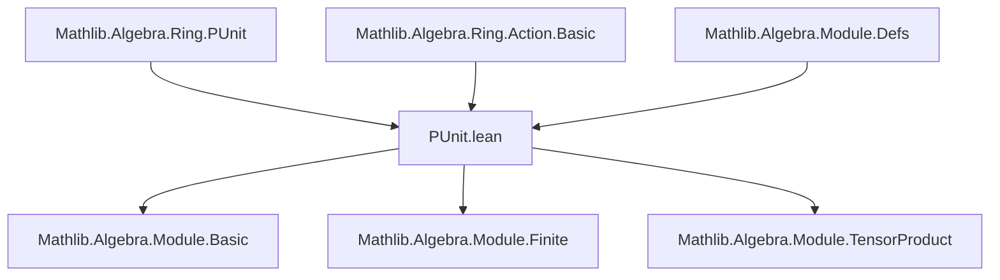
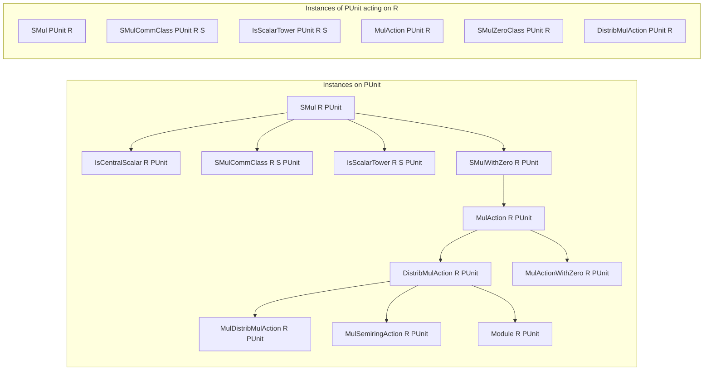

### Technical Brief: `PUnit.lean` — Module Structures on the One-Element Type

---

#### **1. Key Definitions & Theorems**

| Name | Type / Instance | Purpose |
|------|-----------------|---------|
| `PUnit.smul` | `SMul R PUnit` | Defines scalar multiplication of any `r : R` on the unique element `unit : PUnit` as `unit`. |
| `PUnit.smul_eq` | `r • y = unit` | States that any scalar multiple in `PUnit` is trivially `unit`. |
| `PUnit.IsCentralScalar` | `IsCentralScalar R PUnit` | Ensures scalar multiplication commutes with itself (trivially, since only one element). |
| `PUnit.SMulCommClass` | `SMulCommClass R S PUnit` | Any two scalar actions on `PUnit` commute. |
| `PUnit.IsScalarTower` | `IsScalarTower R S PUnit` | Scalar tower law holds trivially. |
| `PUnit.smulWithZero` | `SMulWithZero R PUnit` | Extends `SMul` to `SMulWithZero` when `R` has `Zero`. |
| `PUnit.mulAction` | `MulAction R PUnit` | Trivial multiplicative action of a monoid `R` on `PUnit`. |
| `PUnit.distribMulAction` | `DistribMulAction R PUnit` | Trivial distributive multiplicative action. |
| `PUnit.mulDistribMulAction` | `MulDistribMulAction R PUnit` | Trivial multiplicative distributive action. |
| `PUnit.mulSemiringAction` | `MulSemiringAction R PUnit` | Combines distributive and multiplicative distributive actions for semirings. |
| `PUnit.mulActionWithZero` | `MulActionWithZero R PUnit` | Extends `MulAction` to `MulActionWithZero` when `R` has `Zero`. |
| `PUnit.module` | `Module R PUnit` | `PUnit` carries a unique `R`-module structure for any semiring `R`. |
| `PUnit.smul` (reverse) | `SMul PUnit R` | `PUnit` acts trivially on any type `R` via `r • a = a`. |
| `PUnit.smul_eq'` | `r • a = a` | The action of `PUnit` on any `R` is identity. |
| `PUnit.SMulCommClass` (reverse) | `SMulCommClass PUnit R S` | `PUnit` commutes with any `R`-action on `S`. |
| `PUnit.IsScalarTower` (reverse) | `IsScalarTower PUnit R S` | Tower law holds when `PUnit` is the base. |
| `PUnit.mulAction` (reverse) | `MulAction PUnit R` | Trivial `PUnit`-action on any `R` (monoid under multiplication). |
| `PUnit.SMulZeroClass` | `SMulZeroClass PUnit R` | `PUnit` preserves zero under scalar multiplication. |
| `PUnit.distribMulAction` (reverse) | `DistribMulAction PUnit R` | `PUnit` acts distributively on additive monoids. |

---

#### **2. Naming Conventions**

- **Prefixes**:
  - `smul_`: for scalar multiplication definitions/lemmas (`smul`, `smul_eq`, `smul_eq'`, `smul_zero`, `zero_smul`).
  - `is_`: for structural properties (`isCentralScalar`, `isScalarTower`).
  - `mul_`: for multiplicative actions (`mulAction`, `mulDistribMulAction`, `mulSemiringAction`, `mulActionWithZero`).
  - `distrib_`: for distributivity (`distribMulAction`).
- **Suffixes**:
  - `_class`: for typeclass instances (e.g., `SMulCommClass`, `IsScalarTower`).
  - `_eq` / `_eq'`: for equality lemmas (e.g., `smul_eq`, `smul_eq'`).
- **`to_additive` attribute**: Used to generate additive analogues automatically (e.g., `to_additive` on `smul`, `smul_eq`, `smul_eq'`, etc.).

---

#### **3. Tactic Stack**

- **`subsingleton`**: Dominant tactic — used to prove equalities in `PUnit`, leveraging that `PUnit` is a subsingleton (all elements are equal).
- **`rfl`**: Used for definitional equalities (e.g., `smul_eq'`, `one_smul`, `smul_mul`, `smul_one`, `smul_add`).
- **`simp`**: Used in `SMulCommClass` and `IsScalarTower` reverse instances to simplify goals using `smul_eq'`.

---

#### **4. Proof Logic**

- **Structure**: All proofs rely on the fact that `PUnit` is a *subsingleton* (i.e., any two elements are equal), and often that `PUnit` is definitionally `Unit`.
- **Pattern**:
  1. Define scalar multiplication as constant function returning `unit`.
  2. Prove properties (e.g., distributivity, associativity) by `subsingleton`, since all terms live in `PUnit`.
  3. For reverse actions (`PUnit` acting on `R`), use `rfl` or `simp` with `smul_eq'`.
- **No induction or case analysis** is needed — all arguments are *definitional* or *subsingleton-based*.

---

#### **5. Imports**

| Module | Purpose |
|--------|---------|
| `Mathlib.Algebra.Module.Defs` | Core module theory definitions. |
| `Mathlib.Algebra.Ring.Action.Basic` | Multiplicative and distributive actions. |
| `Mathlib.Algebra.Ring.PUnit` | Basic facts about `PUnit` as a ring/monoid. |

---

#### **6. Theory Overview & Dependency Diagram**

##### **Conceptual Role**
- `PUnit` serves as the *terminal object* in the category of `R`-modules (for any semiring `R`).
- This file formalizes that **every semiring action on `PUnit` is trivial**, and **`PUnit` acts trivially on any module**.

##### **Mermaid Diagrams**

---

#### **7. Summary**

- **Core idea**: `PUnit` is the unique (up to unique isomorphism) *trivial module* over any semiring.
- **Proof technique**: Exploitation of subsingleness and definitional equality.
- **Use cases**: Used as a base case or terminal object in module-theoretic constructions (e.g., in proofs about finite generation, rank, tensor products, etc.).

--- 

Let me know if you'd like a formalized dependency graph in `leanpkg` format or a summary of how this interacts with `Module.ofIso` or `Module.ofFree`.
