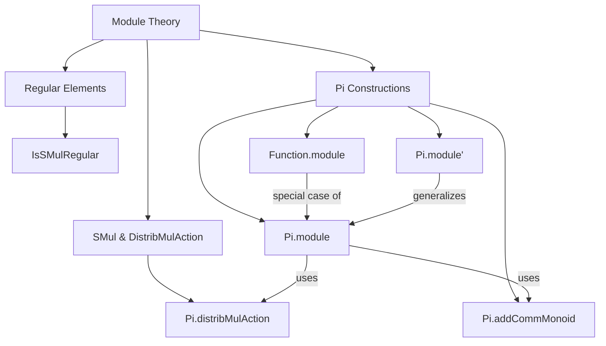
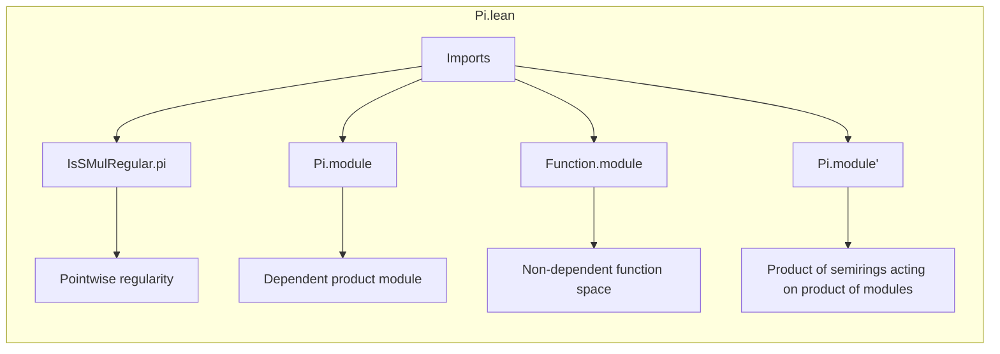

**Technical Brief: `Pi.lean` — Pi Instances for Modules**

---

### 1. **Key Definitions & Theorems**

| Name | Type / Signature | Purpose |
|------|------------------|---------|
| `IsSMulRegular.pi` | `∀ {α} [∀ i, SMul α (f i)] {k : α}, (∀ i, IsSMulRegular (f i) k) → IsSMulRegular (∀ i, f i) k` | Proves that if a scalar `k` acts regularly on each component `f i`, then it acts regularly on the product type `∀ i, f i`. |
| `Pi.module` | `@Module α (∀ i, f i) r (@Pi.addCommMonoid I f m)` | Constructs a module structure on dependent product types (`Π i, f i`) from componentwise module structures. |
| `Function.module` | `Module α (I → β)` | Special non-dependent case of `Pi.module`, crucial for typeclass inference (e.g., `X → β` as a module). |
| `Pi.module'` | `Module (∀ i, f i) (∀ i, g i)` | Constructs a module over a product of semirings acting on a product of modules. |

---

### 2. **Naming Conventions**

- **Prefixes**:
  - `is_`: for properties like `IsSMulRegular`.
  - `Pi.`: namespace for constructions on dependent products.
  - `_root_`: used to define top-level theorems inside the `Pi` namespace (e.g., `theorem _root_.IsSMulRegular.pi`).
- **Suffixes**:
  - `.pi`: for constructions/properties lifted pointwise over `Π`.
  - `.module`, `.module'`: for module instances, with prime indicating a more general (dependent) variant.

---

### 3. **Tactic Stack**

- `funext`: used repeatedly to extend pointwise equalities to function equality.
- `ext1`: used in `Pi.module'` to extend equality over dependent function types.
- `rw [zero_smul]`, `apply add_smul`: algebraic rewrites and applications.
- `congr_fun`: used in `IsSMulRegular.pi` to extract componentwise information from a function equality.

No heavy automation (e.g., `aesop`, `ring`, `simp`) is used—proofs are mostly direct algebraic reasoning.

---

### 4. **Proof Logic**

- **Structure**: The proofs follow a *pointwise lifting* strategy:
  1. For properties like regularity or module laws, reduce to each component.
  2. Apply the corresponding hypothesis/instance per component.
  3. Reassemble using `funext` (or `ext1`) to lift back to the product.
- **Example flow for `IsSMulRegular.pi`**:
  - Assume `h : k • x = k • y`.
  - Apply `congr_fun h i` to get `k • x i = k • y i` for each `i`.
  - Use `hk i` to deduce `x i = y i`.
  - Conclude `x = y` via `funext`.

---

### 5. **Imports**

| Import | Role |
|--------|------|
| `Mathlib.Algebra.GroupWithZero.Action.Pi` | Provides `Pi.distribMulAction`, used in `Pi.module`. |
| `Mathlib.Algebra.Module.Defs` | Defines `Module`, `SMul`, etc. |
| `Mathlib.Algebra.Regular.SMul` | Defines `IsSMulRegular`. |
| `Mathlib.Algebra.Ring.Pi` | Provides `Pi.addCommMonoid`, foundational for product structures. |

---

### 6. **Mermaid Diagrams**

#### Dependency Graph (Module Theory Context)

#### File Overview

---

### 7. **Key Insight**

This file formalizes the *algebraic closure* of the `Π` (dependent product) constructor under module structures. It ensures that standard module-theoretic constructions behave well under arbitrary products—critical for functional analysis (e.g., spaces of functions `X → β`) and dependent type-theoretic settings.

The `Function.module` instance is explicitly added to avoid typeclass inference failures, as noted in the comment referencing Zulip discussion.

--- 

Let me know if you'd like a formalization-level summary (e.g., for a Lean library documentation generator) or a proof sketch in natural deduction style.
