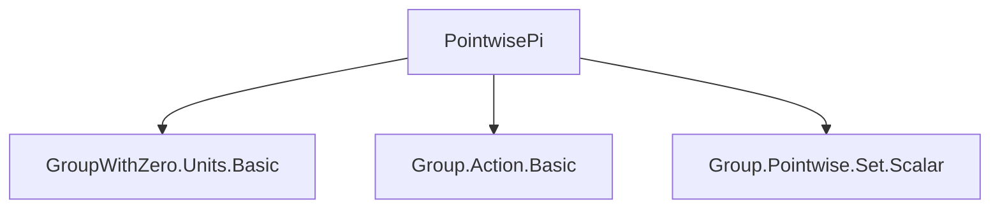
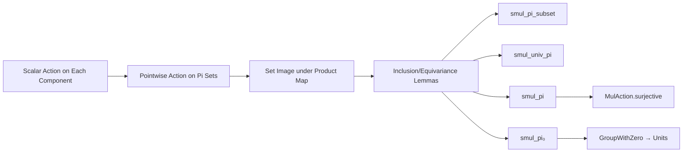

**Technical Brief: `PointwisePi.lean`**

---

### 1. **Key Definitions & Theorems**

| Name | Type | Purpose |
|------|------|---------|
| `smul_pi_subset` | `r • pi s t ⊆ pi s (r • t)` | Shows that scalar multiplication distributes over pointwise set image *up to inclusion* when acting on a subset `s ⊆ ι`. |
| `smul_univ_pi` | `r • pi (univ : Set ι) t = pi (univ : Set ι) (r • t)` | Equality version of scalar multiplication over full product sets (`univ = ι`). |
| `smul_pi` | `r • S.pi t = S.pi (r • t)` | Full equivariance of scalar multiplication over *arbitrary* index sets `S ⊆ ι`, assuming `K` is a group and acts on each component. |
| `smul_pi₀` | `r • S.pi t = S.pi (r • t)` under `r ≠ 0` | Extends `smul_pi` to `GroupWithZero K`, using `Units.mk0` to invert nonzero `r`. |

All theorems are about the interaction between scalar multiplication (`•`) and the `pi` operator (i.e., set-theoretic product over indices), in the context of pointwise actions.

---

### 2. **Naming Conventions**

- **Prefixes**:
  - `smul_`: scalar multiplication action.
  - `pi_`: refers to the `pi` operator (set-theoretic product over indices).
- **Suffixes**:
  - `_subset`: inclusion version (non-strict).
  - `_univ_pi`: special case where the index set is `univ`.
  - `_pi`: general case over arbitrary `S ⊆ ι`.
  - `_₀`: variant for `GroupWithZero` (handles zero via `≠ 0` condition).

- **Pattern**: `smul_[variant]`, where variant encodes domain of index set (`univ`, `S`, or subset condition) and algebraic assumptions (`Group`, `GroupWithZero`).

---

### 3. **Tactic Stack**

- `piMap_image_pi_subset` — used in `smul_pi_subset`
- `piMap_image_univ_pi` — used in `smul_univ_pi`
- `piMap_image_pi` — used in `smul_pi`, with proof argument `(fun _ _ => MulAction.surjective _)`
- `Units.mk0` — used in `smul_pi₀` to lift nonzero element to a unit.

No explicit tactic calls (`aesop`, `simp`, `ring`, etc.) appear in the proofs — they are *definitionally* or *library-proved* via `piMap_image_*` lemmas.

---

### 4. **Proof Logic**

- **Structure**: All proofs are *one-liners* applying pre-existing lemmas about `piMap` and image under functions.
- **Key idea**: Use the fact that scalar multiplication by `r` corresponds to the function `λ x i, r • x i`, and then apply general set-theoretic lemmas about images under product maps.
- For `smul_pi`, surjectivity of the action (from `MulAction`) ensures equality (not just inclusion).
- For `smul_pi₀`, reduce to the group case via units: nonzero `r` in `GroupWithZero` gives a unit, and units act invertibly.

---

### 5. **Imports**

| Import | Role |
|--------|------|
| `Mathlib.Algebra.GroupWithZero.Units.Basic` | Provides `Units.mk0`, used to embed nonzero elements of `GroupWithZero` into units. |
| `Mathlib.Algebra.Group.Action.Basic` | Provides `MulAction`, needed for scalar multiplication structure on each `R i`. |
| `Mathlib.Algebra.Group.Pointwise.Set.Scalar` | Provides `Pointwise` namespace and `piMap_image_*` lemmas used in proofs. |

---

### 6. **Mermaid Diagrams**

#### **Dependency Graph (File-Level)**

#### **Theoretical Overview (Conceptual Flow)**

#### **Module Scope**

- **Domain**: Set theory + algebraic structures on dependent products (`Π i, R i`).
- **Focus**: Interaction of scalar multiplication with *pointwise* set operations (specifically, `pi` = Cartesian product over index sets).
- **Applications**: Likely used in analysis/geometry over product spaces (e.g., convexity, topology, measure theory) where scaling sets coordinate-wise matters.

--- 

Let me know if you'd like the corresponding `additive` versions or a formalization sketch of the underlying `piMap_image_*` lemmas.
