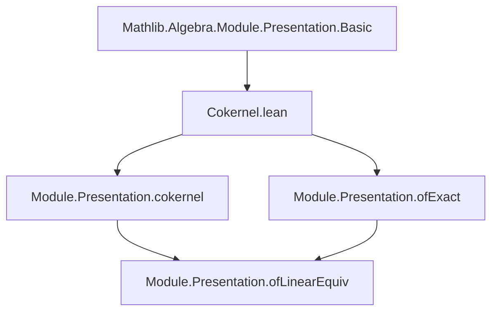
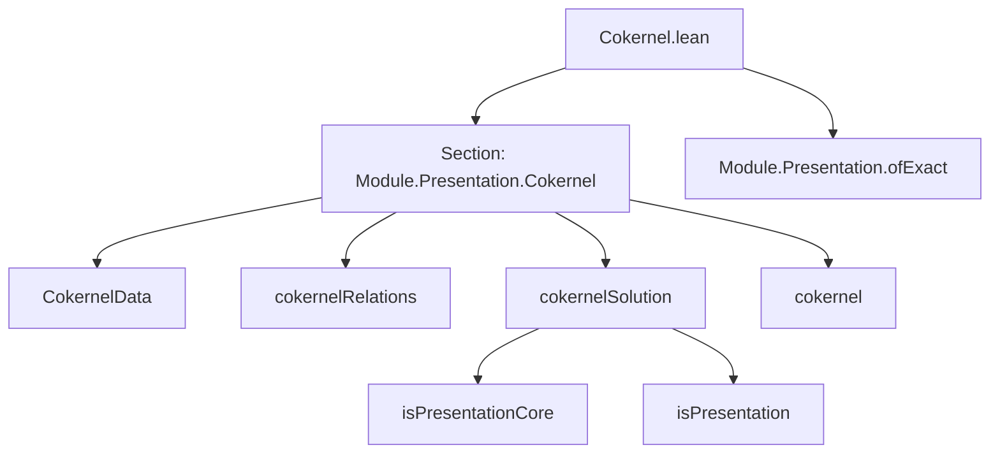

### Technical Brief: Cokernel Presentation in Lean 4 (Mathlib)

---

#### **1. Key Definitions & Theorems**

| Name | Type / Structure | Purpose |
|------|------------------|---------|
| `CokernelData` | `structure` | Provides liftings of `f (g₁ i)` to the generators of `pres₂`, i.e., elements of `pres₂.G →₀ A` whose image under `pres₂.π` is `f (g₁ i)`. |
| `CokernelData.ofSection` | `def` | Constructs `CokernelData` using a set-theoretic section `s` of `pres₂.π`. |
| `nonempty_cokernelData` | `instance` | Proves existence of `CokernelData` using surjectivity of `π` (via `hasRightInverse`). |
| `cokernelRelations` | `def` | Defines the relations for the cokernel presentation: original relations from `pres₂` plus new ones encoding `f(g₁ i) ~ lift i`. |
| `cokernelSolution` | `def` | Gives a solution to `cokernelRelations` in the cokernel module `M₂ ⧸ range f`. |
| `cokernelSolution.isPresentationCore` | `def` | Shows the solution is a *core presentation*, i.e., satisfies universal property up to isomorphism. |
| `cokernelSolution.isPresentation` | `lemma` | Upgrades `isPresentationCore` to full `IsPresentation`. |
| `cokernel` | `def` | The final presentation of the cokernel `M₂ ⧸ range f`. |
| `ofExact` | `def` | Constructs a presentation of `M₃` from an exact sequence `M₁ → M₂ → M₃ → 0`. |

---

#### **2. Naming Conventions**

- **Prefixes**:
  - `cokernel_`: for constructions related to cokernel presentations.
  - `of_`: for constructors derived from additional data (e.g., `ofSection`, `ofExact`).
  - `isPresentation`: for properties/lemmas about being a presentation.

- **Suffixes**:
  - `_Data`: for structures encoding auxiliary data needed to build a construction.
  - `_Solution`: for solutions to a system of relations.
  - `_Relations`: for relation systems.

- **Other patterns**:
  - `π_lift`: relation between `lift` and projection `π`.
  - `hg₁`: hypothesis that `g₁` generates `M₁`.

---

#### **3. Tactic Stack**

Frequently used tactics in proofs:

| Tactic | Usage |
|--------|-------|
| `aesop` | Automated reasoning for simple goals (e.g., `postcomp_desc`). |
| `rw`, `erw` | Rewriting using definitions and lemmas (e.g., `π_lift`, `linearCombination_var_relation`). |
| `simp`, `dsimp` | Simplification using `@[simps]` and definitional equalities. |
| `ext` | Extensionality for proving equality of functions/morphisms. |
| `obtain` / `rintro` | Destructuring existential or product hypotheses. |
| `apply`, `exact` | Applying lemmas or hypotheses directly. |
| `rfl` | Reflexivity for definitional equalities. |

---

#### **4. Proof Logic**

The logical flow follows a standard pattern for constructing presentations via generators and relations:

1. **Existence of lifting data**:
   - Use surjectivity of `π : pres₂.G →₀ A → M₂` to get a section `s`.
   - Define `CokernelData` via `s ∘ f ∘ g₁`.

2. **Define relations**:
   - Combine original relations of `pres₂` with new ones encoding `f(g₁ i) = lift i`.

3. **Construct a solution**:
   - Map each generator `g` to its class in the cokernel.
   - Verify that relations hold using `π_lift` and properties of quotient modules.

4. **Show it's a presentation**:
   - Prove `isPresentationCore`: universal property of solution.
   - Use `isPresentationCore.isPresentation` to conclude it's a presentation.

5. **Generalize to exact sequences**:
   - Use `ofLinearEquiv` with `linearEquivOfSurjective` from exactness.

---

#### **5. Imports**

- `Mathlib.Algebra.Module.Presentation.Basic`: Core theory of presentations, relations, solutions, and `IsPresentation`.

This module builds on the foundational presentation machinery to handle cokernels and exact sequences.

---

#### **6. Mermaid Diagrams**

##### **Dependency Graph (Module-Level)**



##### **Overview of File Structure**



##### **Data Flow for `cokernel` Construction**

```mermaid
graph LR
  pres₂[Presentation A M₂] -->|+| f[M₁ →ₗ M₂] -->|+| g₁[ι → M₁] -->|+| data[CokernelData] -->|+| hg₁[span(range g₁) = ⊤] --> cokernel[Presentation A (M₂ ⧸ range f)]
```

---

#### **7. Summary**

This file formalizes the classical construction of a presentation of a cokernel in terms of presentations of the codomain and generators of the domain. It leverages the existing `Presentation` infrastructure in Mathlib to build a new presentation via generators and relations, and extends it to handle exact sequences. The key insight is that the cokernel can be presented using the same generators as `M₂`, with relations coming from both the original relations in `M₂` and the images of generators of `M₁` under `f`.
