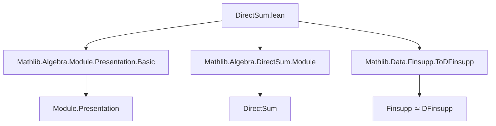

### Technical Brief: `DirectSum.lean`

---

#### **1. Key Definitions & Theorems**

| Name | Type / Signature | Purpose |
|------|------------------|---------|
| `Relations.directSum` | `Relations A` | Constructs a presentation (generators + relations) for the direct sum of modules from a family of presentations. Generators and relations are `Sigma`-types over the index `ι`. |
| `Relations.Solution.directSumEquiv` | `≃` | Equivalence between solutions of the combined presentation and families of solutions indexed by `ι`. |
| `Relations.Solution.directSum` | `Solution (⨁ i, M i)` | Canonical solution in the direct sum module, induced by a family of solutions in each component. |
| `Relations.Solution.IsPresentation.directSum` | `IsPresentation` | Theorem: if each `solution i` is a presentation, then `directSum solution` is a presentation of the direct sum. |
| `Presentation.directSum` | `Presentation A (⨁ i, M i)` | Constructs a presentation of the direct sum from a family of presentations of each `M i`. |
| `Presentation.finsupp` | `Presentation A (ι →₀ N)` | Derives a presentation of the finitely supported function module `ι →₀ N` from a presentation of `N`. |

---

#### **2. Naming Conventions**

- **Prefixes**:
  - `directSum_`: for constructions and lemmas about direct sums of relations/solutions/presentations.
  - `isRepresentationCore`: internal helper for proving `IsPresentation`.
- **Suffixes**:
  - `_var`: lemmas about the `var` component of a solution/presentation.
  - `_equiv`: equivalences (e.g., `directSumEquiv`).
- **Structure fields**:
  - `G`, `R`, `relation`: standard for `Relations`.
  - `var`, `linearCombination_var_relation`: for `Solution`.

---

#### **3. Tactic Stack**

Frequent tactics used in proofs:
- `rw`, `symm`, `apply`, `ext`, `simp`, `rfl`
- `Finsupp.linearCombination_embDomain`, `Finsupp.embDomain`
- `exact`, `congr`, `intro`, `cases`
- `erw` (extended rewrite) for simplifications involving definitional equalities.

No heavy automation (e.g., `aesop`, `linarith`, `ring`) — proofs are mostly structural and rely on `simp`-based simplification and definitional reasoning.

---

#### **4. Proof Logic**

- **Inductive structure over `ι`**: Proofs often proceed by:
  1. Unfolding definitions (`directSum`, `directSumEquiv`, etc.).
  2. Using `ext` to reduce to component-wise equalities.
  3. Leveraging `simp` with `@[simps]` lemmas (e.g., `directSum_var`).
  4. Applying induction or extensionality on `Σ`-types (e.g., `⟨i, r⟩`).
- **Key logical pattern**:
  - Show equivalence of solution spaces (`directSumEquiv`).
  - Lift component-wise presentations to the sum via `directSum.isRepresentationCore`.
  - Use `IsPresentationCore.isPresentation` to conclude.

---

#### **5. Imports & Dependencies**

| Import | Role |
|--------|------|
| `Mathlib.Algebra.Module.Presentation.Basic` | Core theory of presentations (`Presentation`, `Solution`, `IsPresentation`, etc.). |
| `Mathlib.Algebra.DirectSum.Module` | Direct sum of modules (`⨁`, `lof`, `toModule`, etc.). |
| `Mathlib.Data.Finsupp.ToDFinsupp` | Equivalence `ι →₀ M ≃ Σ i, M`-like structures; used for `finsupp` presentation. |

---

#### **6. Mermaid Diagrams**

##### **Dependency Graph (Module-Level)**



##### **Theory Overview (Data Flow)**

```mermaid
flowchart LR
  subgraph Relations
    R1[relations : ι → Relations A]
    R2[directSum relations]
  end

  subgraph Solutions
    S1[solution : ∀ i, (relations i).Solution (M i)]
    S2[directSum solution]
    S3[directSumEquiv]
  end

  subgraph Presentations
    P1[pres : ∀ i, Presentation A (M i)]
    P2[directSum pres]
  end

  subgraph Applications
    A1[ι →₀ N]
    A2[finsupp pres]
  end

  R1 --> R2
  S1 --> S2
  S2 -->|IsPresentation| P2
  P1 --> P2
  R2 --> S3
  A1 <-->|finsuppLequivDFinsupp| A2
```

##### **Presentation Construction Pipeline**

```mermaid
flowchart LR
  M[i]:::module
  Pres[i]:::pres
  PresSum:::pres
  DirectSum:::module

  classDef module fill:#f9f,stroke:#333;
  classDef pres fill:#9cf,stroke:#333;

  M1[M i] --> Pres1[Pres A (M i)]
  M2[M j] --> Pres2[Pres A (M j)]
  M3[M k] --> Pres3[...]

  Pres1 & Pres2 & Pres3 -->|directSum| PresSum[Pres A (⨁ i, M i)]

  PresSum --> DirectSum[⨁ i, M i]
```

---

#### **7. Summary**

This file formalizes how presentations (in the sense of generators and relations) behave under direct sums and finitely supported function modules. It constructs:
- A presentation of `⨁ i, M i` from presentations of each `M i`.
- A presentation of `ι →₀ N` from a presentation of `N`.

The proofs rely on:
- The equivalence `Relations.directSum.Solution N ≃ ∀ i, Relations (relations i).Solution N`.
- The universal property of direct sums (`toModule`, `lof`).
- Finsupp/DFinsupp equivalence for the `ι →₀ N` case.

The code is highly structured, with `@[simps]` and `@[simps!]` annotations ensuring that projections and constructions behave as expected on components.
