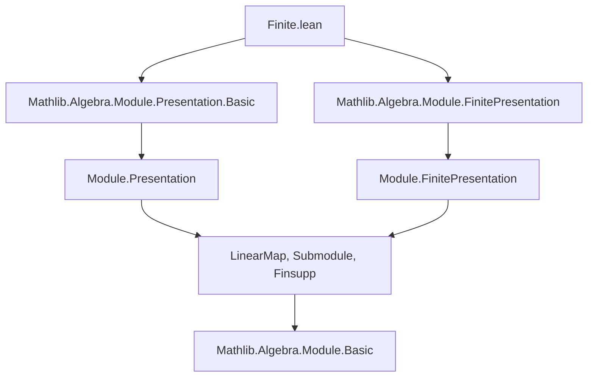
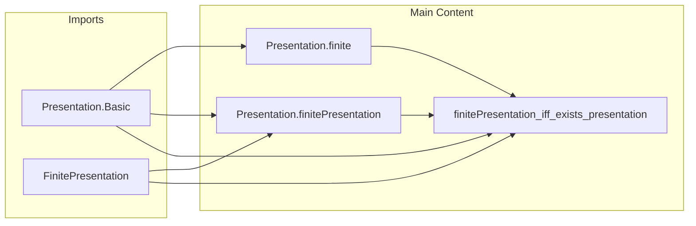

**Technical Brief: `Finite.lean` — Characterization of Finitely Presented Modules**

---

### 1. **Key Definitions & Theorems**

| Name | Type / Signature | Purpose |
|------|------------------|---------|
| `Presentation` | `Structure` (implicit in context) | Represents a presentation of an $A$-module $M$: a surjection $A^{(G)} \twoheadrightarrow M$ with kernel generated by relations $R$. |
| `finite` | `lemma finite [Finite pres.G] : Module.Finite A M` | Shows that if the generator type `pres.G` is finite, then $M$ is finitely generated. |
| `finitePresentation` | `lemma finitePresentation [Finite pres.G] [Finite pres.R] : Module.FinitePresentation A M` | Shows that if both generators and relations are finite, then $M$ is finitely presented. |
| `finitePresentation_iff_exists_presentation` | `lemma` | **Main theorem**: $M$ is finitely presented iff there exists a presentation with finite generators and finite relations. |

---

### 2. **Naming Conventions**

- **Prefixes**:
  - `finite*`: e.g., `finite`, `finitePresentation` — indicate properties of modules or presentations.
  - `pres.*`: e.g., `pres.G`, `pres.R`, `pres.surjective_π`, `pres.ker_π` — accessors for components of a `Presentation`.
- **Suffixes**:
  - `_iff_*`: used for biconditional characterizations (`finitePresentation_iff_exists_presentation`).
- **Variables**:
  - `G`, `R`: standard for generators and relations.
  - `var`: the universal map $G \to M$ (or its lift to $A^{(G)}$).
  - `relation`: the map $R \to A^{(G)}$ defining relations.

---

### 3. **Tactic Stack**

- `rw [...]`: used repeatedly to rewrite definitions (e.g., `pres.ker_π`, `Submodule.ext_iff`, `Relations.Solution.isPresentation_iff`).
- `exact`: to close goals directly from assumptions.
- `inferInstance`: used to synthesize `AddCommGroup`/`Module` instances.
- `by` blocks with `rw`, `exact`, and `simp`-like reasoning (though `simp` not explicitly used here).
- `obtain ⟨...⟩ := ...`: destructuring existential quantifiers using `Submodule.fg_iff_exists_finite_generating_family`.

No heavy automation (e.g., `aesop`, `ring`, `linarith`) appears — proofs are mostly structural and definition-driven.

---

### 4. **Proof Logic**

- **Forward direction** (`→`):
  - Assume $M$ is finitely presented.
  - Use `Submodule.fg_iff_exists_finite_generating_family` to extract finite generating families for:
    - $M$ itself (giving finite $G$),
    - $\ker(\pi)$ (giving finite $R$).
  - Construct a `Presentation` from these families, verifying the required properties (e.g., `linearCombination_var_relation`, `toIsPresentation`).
- **Reverse direction** (`←`):
  - Given a presentation with finite $G$ and $R$, apply `pres.finitePresentation`, which itself uses:
    - `finite` (for finite generation),
    - `Submodule.fg_span` + `Set.finite_range` (to show kernel is finitely generated).

Induction or case analysis is *not* used — the proof is purely algebraic and constructive.

---

### 5. **Imports**

- `Mathlib.Algebra.Module.Presentation.Basic`: defines `Presentation`, its components (`G`, `R`, `var`, `relation`, `π`, `ker_π`, etc.).
- `Mathlib.Algebra.Module.FinitePresentation`: defines `Module.FinitePresentation`, `fg_ker`, `finitePresentation_of_surjective`, etc.

These imports encode the categorical and submodule-theoretic foundations needed for module presentations.

---

### 6. **Mermaid Diagrams**

#### **Dependency Graph (Module-Level)**

#### **Overview of File Structure**

---

### 7. **Summary**

This file establishes the equivalence between the abstract notion of a *finitely presented module* (via finite generation of $M$ and $\ker(\pi)$) and the concrete existence of a *finite presentation* (finite sets of generators and relations). It leverages the `Presentation` structure to bridge model-theoretic and categorical perspectives, and is foundational for homological algebra in Lean (e.g., for derived functors, coherent rings, etc.).
