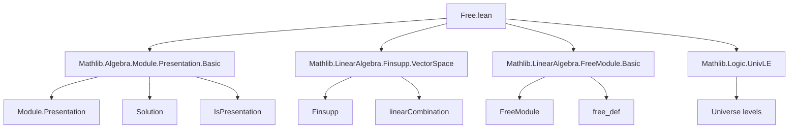
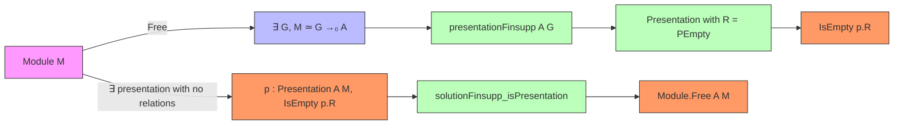

**Technical Brief: `Free.lean` — Presentation of Free Modules in Lean 4**

---

### 1. **Key Definitions & Theorems**

| Name | Type / Signature | Purpose |
|------|------------------|---------|
| `solutionFinsupp` | `relations.Solution (relations.G →₀ A)` | Constructs a solution to a relation system with no relations (`IsEmpty relations.R`) over the finitely supported functions module `G →₀ A`. |
| `solutionFinsupp.isPresentationCore` | `Solution.IsPresentationCore relations.solutionFinsupp` | Shows that `solutionFinsupp` satisfies the universal property of a presentation (i.e., it is initial among solutions). |
| `solutionFinsupp_isPresentation` | `relations.solutionFinsupp.IsPresentation` | Upgrades `isPresentationCore` to a full presentation (i.e., a solution that is both initial and surjective). |
| `Relations.Solution.IsPresentation.free` | `solution.IsPresentation → Module.Free A M` | If a module `M` admits a presentation with no relations, then `M` is free. |
| `presentationFinsupp` | `Presentation.{w₀, w₁} A (G →₀ A)` | The canonical presentation of the free module `G →₀ A` with generators indexed by `G` and *no relations* (using `PEmpty` for relations). |
| `free_iff_exists_presentation` | `Free A M ↔ ∃ p : Presentation A M, IsEmpty p.R` | Main theorem: a module is free iff it admits a presentation with no relations. |

---

### 2. **Naming Conventions**

- **Prefixes**:
  - `solutionFinsupp_`: pertains to solutions over `finsupp` (finitely supported functions).
  - `isPresentation`: indicates satisfaction of the universal property (core or full).
  - `presentationFinsupp`: canonical presentation for free modules via `finsupp`.
- **Suffixes**:
  - `_core`: for the weaker universal property (initiality only).
  - `_isPresentation`: full presentation (initial + surjective).
- **Structure fields**:
  - `var`, `relation`, `linearCombination_var_relation`: standard in `Solution`/`Presentation`.

---

### 3. **Tactic Stack**

| Tactic | Usage Frequency | Role |
|--------|-----------------|------|
| `aesop` | Medium | Used in `postcomp_desc` to discharge simple algebraic equalities. |
| `ext` + `apply ...congr_var` | Medium | In `postcomp_injective`, to prove extensionality and uniqueness of maps. |
| `intro` / `rintro` | High | For destructuring hypotheses and constructing proofs. |
| `dsimp` | Low | In `free_iff_exists_presentation`, to simplify definitions. |
| `infer_instance` | Low | To fill in typeclass arguments (e.g., `IsEmpty`). |
| `exact` | Medium | To conclude proofs by matching goal exactly. |

No heavy automation (`linarith`, `ring`, `simp` with large lemmas) — proofs are mostly structural.

---

### 4. **Proof Logic**

- **Structure**:  
  - **Forward direction** (`→`) of `free_iff_exists_presentation`:  
    - Assume `Free A M`, i.e., `∃ G, M ≃ₗ[A] G →₀ A`.  
    - Use `presentationFinsupp A G` (presentation of `G →₀ A`) and transport it along the linear equivalence to get a presentation of `M`.  
    - Show relations are empty via `PEmpty.{w₁ + 1}`.

  - **Reverse direction** (`←`):  
    - Assume `∃ p : Presentation A M, IsEmpty p.R`.  
    - Then `p.toIsPresentation` gives a presentation with no relations.  
    - Apply `Relations.Solution.IsPresentation.free` to conclude `Module.Free A M`.

- **Core lemmas**:
  - `solutionFinsupp_isPresentation` is built via `isPresentationCore`, which constructs the unique map via `Finsupp.linearCombination`.
  - Uniqueness of presentations (`uniq`) is used implicitly via `Free.of_equiv`.

- **Induction**: Not used — proofs rely on universal properties and equivalence of presentations.

---

### 5. **Imports & Dependencies**

| Import | Role |
|--------|------|
| `Mathlib.Algebra.Module.Presentation.Basic` | Core theory of modules defined by generators and relations (`Presentation`, `Solution`, `IsPresentation`). |
| `Mathlib.LinearAlgebra.Finsupp.VectorSpace` | Finitely supported functions as modules (especially over rings, not necessarily fields). |
| `Mathlib.LinearAlgebra.FreeModule.Basic` | Free modules (though here `finsupp` is used directly). |
| `Mathlib.Logic.UnivLE` | Universe level comparisons (e.g., `w₀`, `w₁`, `v`, `u`). |

> **Note**: No `Mathlib.LinearAlgebra.FreeModule.EquivFun` is imported — the equivalence `M ≃ G →₀ A` is handled via `free_def` and `ofLinearEquiv`.

---

### 6. **Mermaid Diagrams**

#### **Dependency Graph (Module-Level)**

#### **Overview of Theory Flow**

---

### 7. **Summary**

This file formalizes the equivalence between *freeness* of a module and the existence of a *relation-free presentation*. It leverages the `finsupp` construction (`G →₀ A`) as the canonical free module and uses the universal property of presentations to bridge between algebraic and categorical viewpoints. The proofs are concise and rely on structural properties of `finsupp` and the uniqueness of presentations up to isomorphism.

No advanced homological algebra is needed — only basic module theory and category-theoretic universal properties.
