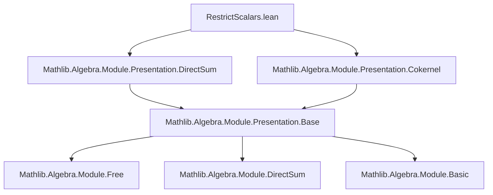

**Technical Brief: `RestrictScalars.lean`**

---

### 1. KEY DEFINITIONS & THEOREMS

| Name | Type / Signature | Purpose |
|------|------------------|---------|
| `RestrictScalarsData` | `abbrev RestrictScalarsData : Type _ := (presB.finsupp presM.G).CokernelData ...` | Encodes the *extra data* needed to construct a presentation of `M` as an `A`-module, using the cokernel of a map between free `A`-modules built from `presB` and `presM`. |
| `restrictScalars` | `noncomputable def restrictScalars : Presentation A M := ofExact ...` | Constructs a presentation of `M` as an `A`-module (i.e., `M` viewed via restriction of scalars along `A → B`) from `presM`, `presB`, and `data`. Relies on `ofExact` to produce an exact presentation. |

**Key auxiliary maps involved**:
- `LinearMap.restrictScalars A presM.map` : the `A`-linear map underlying the `B`-linear presentation map of `M`.
- `LinearMap.restrictScalars A presM.π` : the `A`-linear projection in the target presentation.
- `fun (⟨g, g'⟩ : presB.G × presM.R) ↦ presB.var g • Finsupp.single g' (1 : B)` : the map whose cokernel data is used to define `RestrictScalarsData`.

**Theorem (implicit)**:  
If `presM : Presentation B M` and `presB : Presentation A B` are given, and `data : RestrictScalarsData presM presB`, then `restrictScalars presM presB data` is a *presentation* of `M` as an `A`-module — i.e., an exact sequence  
$$
F_1 \xrightarrow{d_1} F_0 \xrightarrow{\pi} M \to 0
$$  
of $A$-modules, with $F_0 = A^{(presM.G)}$, $F_1 = A^{(presB.G \times presM.R)} / \text{relations}$.

---

### 2. NAMING CONVENTIONS

- **Prefixes**:
  - `restrictScalars_`: for definitions/lemmas related to restriction of scalars on modules.
  - `pres_`: for presentation-related components (e.g., `presM`, `presB`).
  - `map`, `π`, `var`, `single`, `smul`: standard module/presentation notation.

- **Suffixes**:
  - `Data`: for auxiliary data required to construct a structure (e.g., `RestrictScalarsData`).
  - `finsupp`: for constructions involving finite support functions (e.g., `presB.finsupp presM.G`).

- **Variable naming**:
  - `presM`, `presB`: presentations of `M` and `B`.
  - `data`: the extra cokernel data.
  - `g`, `g'`, `r`, `b`, `β`, `f`, `w`: standard metavariables for generators, relations, scalars, etc.

---

### 3. TACTIC STACK

- **Core tactics used**:
  - `ext`: extensionality for functions/morphisms.
  - `dsimp`, `simp`, `simp only`: simplification with definitional equalities and custom lemmas.
  - `apply`: to apply lemmas or constructors.
  - `rw`: rewriting using equations (e.g., `map_smul`, `smul_assoc`).
  - `obtain ⟨β, rfl⟩ := ...`: destructuring existential hypotheses.
  - `refine`: constructing terms with holes (e.g., `Submodule.add_mem _ ?_ hw`).
  - `induction` (via `Finsupp.induction`): structural induction on finite support functions.

- **No heavy automation** (e.g., no `linarith`, `ring`, `aesop`), indicating this is a *manual* verification of exactness, relying on module-theoretic properties.

---

### 4. PROOF LOGIC

The proof of exactness for `restrictScalars` proceeds as follows:

1. **Goal**: Show that the sequence defined by `ofExact` is exact — i.e., $\operatorname{im}(d_1) = \ker(\pi)$.
2. **Input data**:
   - `presM.exact`: exactness of the original $B$-presentation.
   - `presM.surjective_π`: surjectivity of the projection.
3. **Main argument**:
   - Use `ofExact`’s requirement: verify that the kernel of the $A$-linear projection equals the image of the cokernel data map.
   - Reduce to checking inclusion both ways (via `Submodule.mem_top`, `iff_true`, etc.).
   - Use `Finsupp.induction` twice:
     - First to reduce to singletons.
     - Second to handle sums of generators.
   - Use algebraic identities:
     - `map_smul`, `smul_assoc`, `Relations.Solution.π_single`, `Finsupp.smul_single_one`.
   - Use `presB.surjective_π` to lift elements $b : B$ to combinations of generators of `presB`.

The logic is *constructive* and *explicit*, leveraging the universal property of presentations and the compatibility of restriction of scalars with direct sums and cokernels.

---

### 5. IMPORTS & DEPENDENCIES

| Module | Purpose |
|--------|---------|
| `Mathlib.Algebra.Module.Presentation.DirectSum` | Provides `Presentation`, `ofExact`, `finsupp`, and basic operations on presentations (e.g., direct sums as free modules). |
| `Mathlib.Algebra.Module.Presentation.Cokernel` | Supplies `CokernelData`, used to encode the relations in the new presentation. |

**Key underlying structures**:
- `DecidableEq B`, `DecidableEq presM.G`: needed for finite support functions and quotient constructions.
- `IsScalarTower A B M`: ensures the $A$- and $B$-module structures on $M$ are compatible.

---

### 6. MERMAID DIAGRAMS

#### Dependency Graph (Module-Level)



#### Overview of `restrictScalars` Construction

```mermaid
graph LR
  presB[Presentation A B] --> presB_finsupp[A^(presB.G)]
  presM[Presentation B M] --> presM_G[M generators]
  presM --> presM_R[M relations]
  presB_finsupp --> F0[A^(presM.G)]
  presB_finsupp × presM_R --> F1[A^(presB.G × presM.R)]
  data[CokernelData] --> F1 --> F0 --> M
  data -->|exact| M
```

#### Logical Flow of Exactness Proof

```mermaid
graph TD
  A[Start: want im(d₁) = ker(π)] --> B[Use presM.exact & presM.surjective_π]
  B --> C[Reduce to Finsupp single elements]
  C --> D[Lift b ∈ B via presB.surjective_π]
  D --> E[Apply algebraic identities: map_smul, smul_assoc, etc.]
  E --> F[Conclude inclusion both ways]
  F --> G[Exactness holds]
```

---

### 7. TODO & Future Work

- **Finitely presented modules**: As noted in the comment, the next step is to deduce:
  > If $B$ is finitely presented as an $A$-module and $M$ is finitely presented as a $B$-module, then $M$ is finitely presented as an $A$-module.

This will likely require:
- Defining `finitelyPresented` in terms of finite presentations.
- Showing that `restrictScalars` preserves finiteness conditions on generators and relations.

---

### 8. SUMMARY

This file formalizes the *presentation functoriality* of restriction of scalars: given presentations of $B$ over $A$ and $M$ over $B$, one can explicitly construct a presentation of $M$ over $A$. The construction is nontrivial due to the need to encode how $B$-scalars act on $M$ in terms of $A$-linear data, and the proof relies on careful manipulation of finite support functions and module relations.
