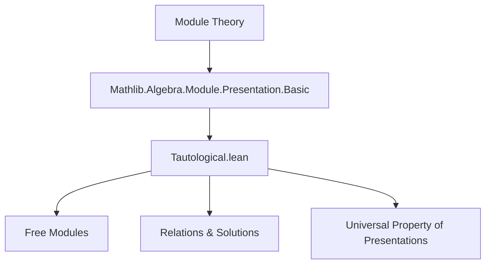
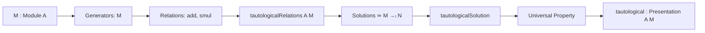

**Technical Brief: Tautological Presentation of a Module (Lean 4)**  
*Based on `Tautological.lean` (2024, Joël Riou)*

---

### 1. KEY DEFINITIONS & THEOREMS

| Name | Type / Signature | Purpose |
|------|------------------|---------|
| `tautological.R` | `inductive tautological.R : Type v` | Parametrizes formal relations: `add m₁ m₂` and `smul a m`. |
| `tautologicalRelations` | `Relations A` | Encodes the system of linear relations over generators indexed by `M`, using `Finsupp`. |
| `tautologicalRelationsSolutionEquiv` | `(tautologicalRelations A M).Solution N ≃ (M →ₗ[A] N)` | Establishes a natural equivalence between solutions of the tautological relations in `N` and linear maps `M →ₗ N`. |
| `tautologicalSolution` | `(tautologicalRelations A M).Solution M` | The canonical solution sending each generator `[m]` to `m ∈ M`. |
| `tautologicalSolutionIsPresentationCore` | `Relations.Solution.IsPresentationCore` | Shows `tautologicalSolution` satisfies the universal property of a presentation core. |
| `tautologicalSolution_isPresentation` | `(tautologicalSolution A M).IsPresentation` | Concludes that `tautologicalSolution` is a presentation (i.e., a cokernel of a map between free modules). |
| `tautological` | `Presentation A M` | The *tautological presentation* of `M`, constructed via `ofIsPresentation`. |

---

### 2. NAMING CONVENTIONS

- **Prefixes**:
  - `tautological.`: Namespacing for the construction.
  - `tautologicalRelations.`: For the relations system and its solutions.
- **Suffixes**:
  - `Solution`: For objects in the solution category of a relations system.
  - `isPresentation`: Predicate or proof that a solution is a presentation.
  - `Equiv`: For equivalences (bijections with structure).
- **Notation**:
  - `[m]` is *implicit* in the solution’s `var` component: a generator is represented by `Finsupp.single m 1`.

---

### 3. TACTIC STACK

Frequently used tactics in proofs:

| Tactic | Role |
|--------|------|
| `simp` / `simpa` | Simplify using `@[simps]` lemmas and definitions (e.g., `tautologicalRelations`, `tautologicalSolution`). |
| `rw [← sub_eq_zero]` | Convert additive relations to zero-sum form for linear combination usage. |
| `symm` | Flip equality to match goal orientation. |
| `intro (_ | _)` | Case analysis on inductive type `tautological.R`. |
| `ext m` | Extensionality proof for functions, pointwise. |
| `congr` (via `congr_var`) | Use congruence of solutions to deduce equality of underlying functions. |

---

### 4. PROOF LOGIC

**High-level proof strategy**:

1. **Define relations** (`tautological.R`) encoding additivity and scalar compatibility.
2. **Construct relations system** (`tautologicalRelations`) mapping each relation to a linear combination in the free module on `M`.
3. **Show solution ↔ linear map**:
   - `toFun`: A solution gives a linear map by checking preservation of `+` and `•` using the relation equations.
   - `invFun`: A linear map defines a solution by construction; verification uses `simp`.
4. **Prove universal property**:
   - `tautologicalSolutionIsPresentationCore` shows that for any solution `s`, there exists a unique linear map `M → N` factoring through `tautologicalSolution`.
   - Uses `tautologicalRelationsSolutionEquiv` for existence/uniqueness.
5. **Lift to presentation**:
   - `tautologicalSolution_isPresentation` upgrades the core to a full presentation.
   - `tautological` is defined via `ofIsPresentation`, giving a concrete `Presentation A M`.

---

### 5. IMPORTS & DEPENDENCIES

| Module | Role |
|--------|------|
| `Mathlib.Algebra.Module.Presentation.Basic` | Provides `Presentation`, `Relations`, `Solution`, `IsPresentation`, and foundational lemmas. |

This module builds on the *presentation theory* of modules: objects are cokernel diagrams $F_1 \to F_0 \to M \to 0$ with $F_i$ free.

---

### 6. MERMAID DIAGRAMS

#### Dependency Graph (Module-Level)



#### Overview of Tautological Construction



#### Categorical View (Presentation as Cokernel)

```mermaid
graph LR
  F[R] -->|∂| F[G] -->|π| M --> 0
  style F[R] fill:#f9f,stroke:#333
  style F[G] fill:#bbf,stroke:#333
  style M fill:#cfc,stroke:#333
  classDef rel fill:#f9f,stroke:#333;
  classDef gen fill:#bbf,stroke:#333;
  classDef mod fill:#cfc,stroke:#333;
  class R rel;
  class G gen;
  class M mod;
```

Where:
- $F[G] = \bigoplus_{m \in M} A$ (free module on $M$),
- $F[R] = \bigoplus_{\text{relations}} A$,
- $\partial$ encodes the relations $[m_1] + [m_2] - [m_1 + m_2]$, $a \cdot [m] - [a \cdot m]$.

---

### 7. SUMMARY

This file formalizes the *tautological presentation* of any module $M$ over a ring $A$: a canonical presentation where generators correspond bijectively to elements of $M$, and relations enforce module axioms. It is foundational for constructing free resolutions and derived functors (e.g., $\operatorname{Tor}, \operatorname{Ext}$). The Lean formalization emphasizes constructivity and explicit equivalence with linear maps, leveraging `Finsupp` for free modules and `Relations` for a uniform presentation framework.
