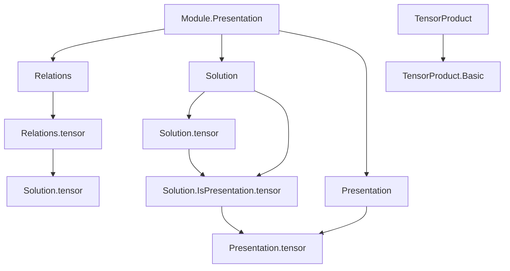
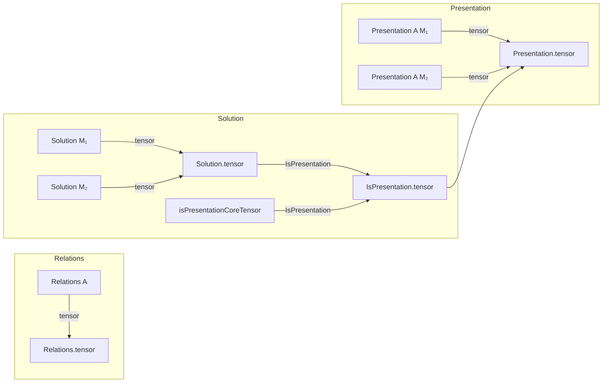
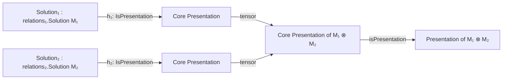

### Technical Brief: Tensor Product of Module Presentations in Lean 4

---

#### **1. Key Definitions & Theorems**

| Name | Type / Signature | Purpose |
|------|------------------|---------|
| `Relations.tensor` | `Relations A → Relations A → Relations A` | Constructs the tensor product of two systems of linear equations (i.e., relations), combining generators and relations via sum and product. |
| `Solution.tensor` | `relations₁.Solution M₁ → relations₂.Solution M₂ → (relations₁.tensor relations₂).Solution (M₁ ⊗[A] M₂)` | Given solutions to two systems, produces the induced solution on the tensor product module using the elementary tensor of values. |
| `Solution.isPresentationCoreTensor` | `solution₁.IsPresentation → solution₂.IsPresentation → (solution₁.tensor solution₂).IsPresentationCore` | Proves that the tensor product of two *presentations-as-solutions* yields a *core presentation* (i.e., satisfies the universal property of a presentation up to equivalence). |
| `Solution.IsPresentation.tensor` | `solution₁.IsPresentation → solution₂.IsPresentation → (solution₁.tensor solution₂).IsPresentation` | Main theorem: tensor product of presentations (as solutions) is again a presentation. |
| `Presentation.tensor` | `Presentation A M₁ → Presentation A M₂ → Presentation A (M₁ ⊗[A] M₂)` | Lifts the solution-level construction to full presentations: constructs a presentation of the tensor product module from presentations of the factors. |

---

#### **2. Naming Conventions**

- **Prefixes**:
  - `tensor`: used for constructions and lemmas involving tensor products of relations/solutions/presentations.
  - `isPresentationCore`: internal core version of the presentation property (before quotienting to full `IsPresentation`).
  - `postcomp`, `curry`, `uncurry`: standard categorical operations used in universal properties.

- **Suffixes**:
  - `_tensor`: applied to constructions derived from tensoring (e.g., `tensor`, `isPresentationCoreTensor`).
  - `embDomain`: from `Finsupp.embDomain`, used to extend functions along embeddings (e.g., `sectL`, `sectR`).

- **Notable patterns**:
  - `sectL`, `sectR`: embeddings of one factor into a product (left/right section).
  - `curry_injective`, `postcomp_injective`: lemmas about injectivity of induced maps.

---

#### **3. Tactic Stack**

- **Core tactics**:
  - `intro`, `rintro`, `ext`: for introducing and extending hypotheses/variables.
  - `rw`, `erw`: rewriting using definitional equalities or propositional equalities (especially with `Finsupp` lemmas).
  - `dsimp`, `simp`: simplification, especially around `@[simps]`-generated projections.
  - `convert`: for partial equality proofs where some subgoals match definitionally.
  - `aesop`: used in `postcomp_desc` to close simple goals involving universal properties.
  - `exact`, `apply`: for direct proof application.

- **Domain-specific lemmas**:
  - `Finsupp.linearCombination_embDomain`
  - `Finsupp.apply_linearCombination`
  - `curry_injective`, `TensorProduct.comm.toLinearMap`

---

#### **4. Proof Logic**

The logical flow follows a standard pattern for constructing universal objects from components:

1. **Define tensor product of relations**:
   - Generators: product of generator sets.
   - Relations: sum of left/right "partial" relations (to enforce bilinearity).
   - Verified via `Finsupp.embDomain` to lift relations across embeddings.

2. **Define tensor product of solutions**:
   - Assigns to each generator pair $(g_1, g_2)$ the elementary tensor $s_1(g_1) \otimes s_2(g_2)$.
   - Verifies linearity using properties of `linearCombination` and `embDomain`.

3. **Prove presentation property**:
   - Construct `isPresentationCoreTensor`: shows the tensor solution satisfies the universal property of a *core* presentation.
     - `desc`: uses currying and universal properties of both input presentations.
     - `postcomp_desc`, `postcomp_injective`: use injectivity of curried maps and `curry_injective`.
   - Conclude full `IsPresentation` via `isPresentationCore.isPresentation`.

4. **Lift to presentations**:
   - `Presentation.tensor` packages the solution-level tensor with its presentation property.

---

#### **5. Imports**

- `Mathlib.Algebra.Module.Presentation.Basic`: defines `Relations`, `Solution`, `Presentation`, and their properties.
- `Mathlib.LinearAlgebra.TensorProduct.Basic`: defines tensor product of modules and basic properties (e.g., `TensorProduct.comm`).

These imports define the foundational structures used: presentations as generators-and-relations data, and tensor products as universal bilinear constructions.

---

#### **6. Mermaid Diagrams**

##### **Dependency Graph (Module-Level)**

##### **Overview of File Structure**

##### **Universal Property Flow**

---

#### **7. Summary**

This file formalizes the classical algebraic result: *the tensor product of two finitely presented modules over a commutative ring is finitely presented*, and explicitly constructs the presentation from those of the factors. It leverages the `Relations`/`Solution`/`Presentation` hierarchy in Mathlib to ensure correctness of the universal property, using careful manipulation of `Finsupp`-based linear combinations and tensor product structure. The proof is constructive and fully verified in Lean 4.
