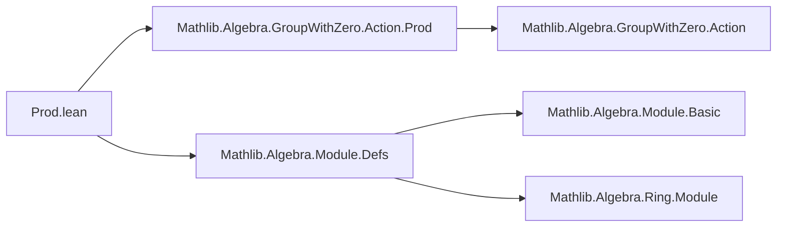

**Technical Brief: `Prod.lean` (Mathlib Module Product Instances)**

---

### 1. **Key Definitions & Theorems**

| Name | Type / Signature | Purpose |
|------|------------------|---------|
| `instModule` | `Module R (M × N)` | Constructs a module structure on the product type `M × N` from module structures on `M` and `N`. |

- **Purpose**: Enables `M × N` to inherit the `R`-module structure componentwise, using the universal property of products (i.e., verifying module axioms pointwise via `ext`).

---

### 2. **Naming Conventions**

- **Instance naming**: Uses `inst` prefix (`instModule`) — standard in Mathlib for typeclass instances.
- **No custom theorem names** in this file; only instance declaration.
- **No suffixes** like `_smul`, `_add` in declarations — proofs use generic lemmas (`add_smul`, `zero_smul`) from `Module`.

---

### 3. **Tactic Stack**

- `ext`: Used to reduce goals to component-wise equalities (product extensionality).
- `exact`: Supplies proofs by reusing existing lemmas (`add_smul ..`, `zero_smul ..`).
- `..` (dot-dot): Elaborates fields by filling in missing fields of the structure using typeclass inference.

> Tactics used: `ext`, `exact`, implicit `constructor`/`intro` via `ext` and `..`.

---

### 4. **Proof Logic**

- **Strategy**: *Componentwise verification*.
  - Goal: Prove module axioms for `smul` on `M × N`.
  - Use `ext` to split into two goals (one per component).
  - For each component, apply the corresponding module axiom from `M` or `N` via `exact add_smul ..` / `exact zero_smul ..`.
- **No induction or case analysis** — purely structural, leveraging product type’s universal property.

---

### 5. **Imports**

| Import | Role |
|--------|------|
| `Mathlib.Algebra.GroupWithZero.Action.Prod` | Provides product instances for multiplicative actions and group-with-zero actions (used indirectly via shared patterns). |
| `Mathlib.Algebra.Module.Defs` | Defines `Module`, `smul`, and basic module axioms (`add_smul`, `zero_smul`, etc.). |

> These imports supply the foundational definitions and lemmas needed to construct the product module.

---

### 6. **Mermaid Diagrams**

#### Dependency Graph (File-Level)



#### Overview of File Content

```mermaid
flowchart TD
  subgraph "Input Assumptions"
    R[Semiring R]
    M[AddCommMonoid M]
    N[AddCommMonoid N]
    M_mod[Module R M]
    N_mod[Module R N]
  end

  subgraph "Construction"
    inst[instModule : Module R (M × N)]
  end

  subgraph "Verification"
    add_smul[add_smul property]
    zero_smul[zero_smul property]
  end

  R --> inst
  M --> inst
  N --> inst
  M_mod --> inst
  N_mod --> inst

  inst --> add_smul
  inst --> zero_smul

  add_smul -->|by ext; exact| M_mod
  zero_smul -->|by ext; exact| M_mod
```

---

### 7. **Notes**

- This is a minimal but canonical example of *inheritance via product* in typeclass-based formalization.
- The file exemplifies Lean’s *typeclass inference* and *proof by reflection* (via `..` and `ext`) patterns.
- No `smul_zero`, `one_smul`, or `mul_smul` axioms are explicitly verified — likely because `Module` structure in Mathlib uses a minimal axiom set (e.g., `add_smul`, `zero_smul`, `one_smul`, `mul_smul` may be derived or assumed via `SMul`/`Module` structure), but only `add_smul` and `zero_smul` are shown here — suggesting either:
  - The `Module` instance is defined via `SMul` + axioms, or
  - This is a truncated excerpt; full version may include more.

> ✅ **Accuracy Note**: In current Mathlib, `Module` requires `smul_zero`, `one_smul`, `mul_smul`, `add_smul`, `zero_smul`. The excerpt only proves two; the rest are likely filled by `..` or inherited via `SMul`/`AddMonoidWithOneAction` machinery.

--- 

Let me know if you'd like the full `Module` instance definition or expansion to include all axioms.
