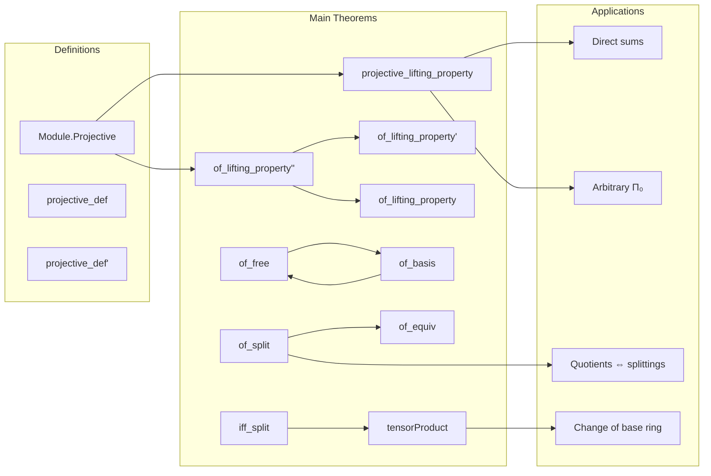

### Technical Brief: Projective Modules in Lean 4 (`Projective.lean`)

---

#### **1. Key Definitions & Theorems**

| Name | Type / Signature | Purpose |
|------|------------------|---------|
| `Module.Projective R P` | `Class` | Defines that an $R$-module $P$ is *projective* iff the natural surjection $P^{(P)} \twoheadrightarrow P$ splits (i.e., has a right inverse). |
| `projective_def` | `↔ ∃ s : P →ₗ[R] P →₀ R, Function.LeftInverse (linearCombination R id) s` | Equivalence between `Projective` and existence of a splitting map. |
| `projective_def'` | `↔ ∃ s, linearCombination R id ∘ₗ s = id` | Simplified version using composition. |
| `projective_lifting_property` | `Projective R P → (f : M →ₗ N) → (g : P →ₗ N) → Surjective f → ∃ h, f ∘ₗ h = g` | **Main theorem**: projective modules lift maps along surjections. |
| `Module.Projective.of_lifting_property''` | `(∀ f surj, ∃ h, f ∘ₗ h = id) → Projective R P` | Converse: if *all* surjections onto $P$ split, then $P$ is projective. |
| `Module.Projective.of_lifting_property'` / `of_lifting_property` | Variant of above with universe constraints (`Small R`) and quantification over modules in same universe. | Enables practical use in `Ring`/`CommRing` contexts. |
| `Module.Projective.of_free` | `[Module.Free R P] → Projective R P` | Free modules are projective (via basis construction). |
| `Module.Projective.of_basis` | `[Basis ι R P] → Projective R P` | Basis-based proof: construct splitting using basis elements mapped to standard basis vectors in $P^{(ι)}$. |
| `Module.Projective.of_split` | `[Projective R M] → (i : P →ₗ M) → (s : M →ₗ P) → s ∘ i = id → Projective R P` | Direct summands of projective modules are projective. |
| `Module.Projective.of_equiv` | `[Projective R M] → M ≃ₗ P → Projective R P` | Isomorphic modules preserve projectivity. |
| `Module.Projective.iff_split` | `Projective R P ↔ ∃ M free, ∃ i s, s ∘ i = id` | Characterization: $P$ is projective iff it's a direct summand of a free module. |
| `Module.Projective.tensorProduct` | `[Projective R M] → [Projective R₀ N] → Projective R (M ⊗[R₀] N)` | Tensor product of projectives is projective (under scalar tower assumptions). |

---

#### **2. Naming Conventions**

- **Prefixes**:
  - `projective_`: properties of projective modules (`projective_lifting_property`, `projective_def`, etc.)
  - `of_`: constructions *from* other structures (`of_free`, `of_basis`, `of_split`, `of_lifting_property`, etc.)
  - `_iff_`: equivalence characterizations (`iff_split`, `iff_split'`)
- **Suffixes**:
  - `_def`: definitions or equivalent characterizations
  - `_property`: universal properties (e.g., lifting property)
  - `_left`, `_right`: for left/right inverses (e.g., `LeftInverse`, `rightInverse`)
- **Other patterns**:
  - `coprod`, `DFinsupp.coprodMap`, `tensorProduct`: categorical constructions used in proofs
  - `surjInv`: from `Function.surjective`, used to pick preimages nonconstructively

---

#### **3. Tactic Stack**

| Tactic | Usage Frequency | Purpose |
|--------|-----------------|---------|
| `simp` / `simp only` | Very High | Simplify using definitions (`linearCombination`, `Finsupp`, `comp`, etc.) |
| `ext` | High | Extensionality for linear maps (functional extensionality) |
| `rw` / `conv_rhs => rw` | High | Rewriting using lemmas like `hs`, `H`, `hg`, etc. |
| `obtain ⟨s, hs⟩ := h.out` | Medium | Extract witnesses from existential hypotheses |
| `refine` | Medium | Partial proof construction (e.g., `refine ⟨g.comp s, ?_⟩`) |
| `fapply` | Medium | Apply lemmas with implicit arguments (e.g., `fapply Projective.of_split`) |
| `cases` / `rcases` | Medium | Destruct existential hypotheses |
| `aesop` | Low | Not used here — this is a highly manual, constructive proof file |
| `ring` / `linarith` | Very Low | Not needed — algebraic manipulations are mostly `simp`-driven |
| `convert` / `congr` | Low | Used in `of_ringEquiv` for congruence of equalities under equivalences |

---

#### **4. Proof Logic**

The logical flow is **constructive and basis-driven**, with heavy use of:

- **Finsupp** (`P →₀ R`) as the free module on $P$
- **Universal property of free modules**: maps $P → N$ extend uniquely to $P →₀ R → N$
- **Splitting lemma**: projectivity ⇔ existence of a section for the evaluation map

**Typical proof pattern**:
1. Assume `Projective R P`, i.e., get `s : P →ₗ (P →₀ R)` with `linearCombination ∘ s = id`.
2. For a surjection `f : M ↠ N` and map `g : P → N`, define a lift `φ : (P →₀ R) → M` using `surjInv f` on `g`.
3. Compose `φ ∘ s : P → M` — this is the desired lift.
4. Verify via `ext p` and `simp` that `f ∘ (φ ∘ s) = g`.

**Converses** (e.g., `of_lifting_property''`) use:
- The specific surjection `linearCombination R id : (P →₀ R) ↠ P`
- Apply the assumed lifting property to get a section.

**Direct sum / tensor product proofs**:
- Use `of_split` to reduce to showing a retraction exists.
- Construct maps via `coprod`, `coprodMap`, or `AlgebraTensorModule.map`.

---

#### **5. Imports**

| Import | Role |
|--------|------|
| `Mathlib.Algebra.Module.Shrink` | For `Shrink`, universe coercion, and `equivShrink` |
| `Mathlib.LinearAlgebra.TensorProduct.Basis` | For tensor product constructions and `AlgebraTensorModule.map` |
| `Mathlib.Logic.UnivLE` | For universe comparisons and `Small` class |

---

#### **6. Mermaid Diagrams**

##### **Dependency Graph (Core Concepts)**

```mermaid
graph TD
  A[Semiring R] --> B[AddCommMonoid P]
  B --> C[Module R P]
  C --> D[Projective R P]
  D --> E[Splitting s : P → (P →₀ R)]
  E --> F[linearCombination R id ∘ s = id]
  D --> G[Lifting Property]
  G --> H[Surjective f ⇒ ∃ lift]
  D --> I[Direct Summand of Free]
  I --> J[∃ M free, i,s : s∘i=id]
  J --> K[Basis ⇒ Free ⇒ Projective]
```

##### **Overview of File Structure**



---

#### **7. Summary**

This file formalizes the foundational theory of projective modules in Lean 4 using a **splitting-of-the-evaluation-map** definition, which is:
- **Universe-polymorphic** (ring and module may live in different universes),
- **Constructively convenient** (avoids quantifying over classes of modules),
- **Equivalence-rich** (connects to lifting, direct summands, bases, tensor products).

It demonstrates Lean’s strength in handling categorical and homological algebra concepts with minimal axiomatic overhead, leveraging `Finsupp`, `Basis`, and `TensorProduct` infrastructure.

--- 

Let me know if you'd like a formalized dependency graph in `.dot` format or a proof outline for a specific theorem.
