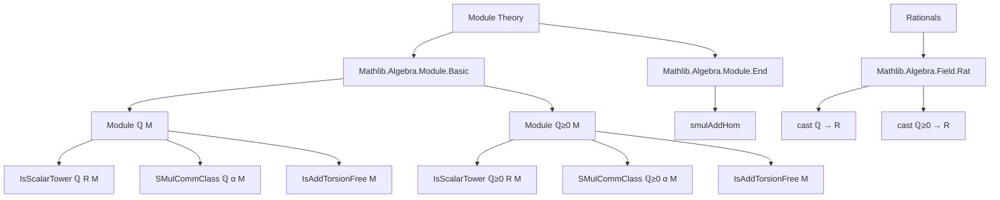
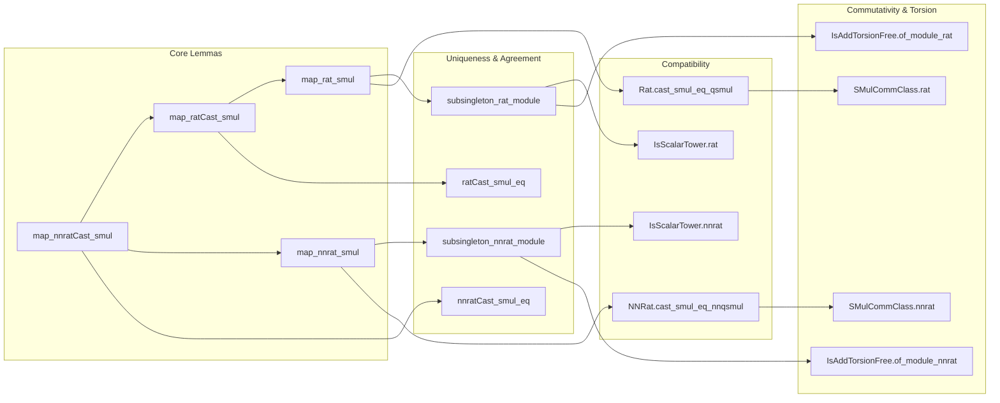

**Technical Brief: `Rat.lean` — Modules over ℚ and ℚ≥₀**

---

### 1. **Key Definitions & Theorems**

| Name | Type / Signature | Purpose |
|------|------------------|---------|
| `map_nnratCast_smul` | `f ((c : R) • x) = (c : S) • f x` | Shows that additive monoid homomorphisms commute with scalar multiplication by non-negative rationals, when scalars are cast from ℚ≥₀ into division semirings `R`, `S`. |
| `map_ratCast_smul` | `f ((c : R) • x) = (c : S) • f x` | Same as above, but for full rationals ℚ and division rings. |
| `map_nnrat_smul` | `f (c • x) = c • f x` | Special case of `map_nnratCast_smul` where both target semirings are ℚ≥₀ itself. |
| `map_rat_smul` | `f (c • x) = c • f x` | Special case of `map_ratCast_smul` where both target rings are ℚ itself. |
| `subsingleton_nnrat_module` | `Subsingleton (Module ℚ≥0 E)` | Uniqueness of ℚ≥₀-module structure on an additive commutative monoid. |
| `subsingleton_rat_module` | `Subsingleton (Module ℚ E)` | Uniqueness of ℚ-module structure on an additive commutative group. |
| `nnratCast_smul_eq` | `(r : R) • x = (r : S) • x` | Scalar multiplication by ℚ≥₀ agrees across two module structures over division semirings. |
| `ratCast_smul_eq` | `(r : R) • x = (r : S) • x` | Same as above for ℚ and division rings. |
| `IsScalarTower.nnrat` / `IsScalarTower.rat` | `IsScalarTower ℚ≥0 R M` / `IsScalarTower ℚ R M` | Ensures compatibility of scalar multiplication when ℚ≥₀ (resp. ℚ) acts on `R`, and `R` acts on `M`. |
| `NNRat.cast_smul_eq_nnqsmul` | `(q : R) • x = q • x` | Shows that the canonical ℚ≥₀-action coincides with the one induced via casting into `R`. |
| `Rat.cast_smul_eq_qsmul` | `(q : R) • x = q • x` | Same for ℚ and division rings. |
| `SMulCommClass.nnrat` / `SMulCommClass.rat` | `SMulCommClass ℚ≥0 α M` / `SMulCommClass ℚ α M` | ℚ≥₀ (resp. ℚ) scalars commute with any other scalar action `α`. |
| `IsAddTorsionFree.of_module_nnrat` | `IsAddTorsionFree M` | Any ℚ≥₀-module is torsion-free as an additive monoid. |
| `IsAddTorsionFree.of_module_rat` | `IsAddTorsionFree M` | Any ℚ-module is torsion-free as an additive group. |

---

### 2. **Naming Conventions**

- **Prefixes**:
  - `map_`: Indicates a theorem about preservation of structure under a map (e.g., `map_nnrat_smul`, `map_ratCast_smul`).
  - `nnrat`: Refers to non-negative rationals ℚ≥₀.
  - `rat`: Refers to full rationals ℚ.
  - `cast_`: Indicates casting from ℚ or ℚ≥₀ into another structure (e.g., `cast_smul_eq_qsmul`).
- **Suffixes**:
  - `_smul`: Pertains to scalar multiplication.
  - `_eq`: Indicates equality of two constructions.
  - `subsingleton_`: Indicates uniqueness of structure.
  - `of_module_`: Derives a property from the existence of a module structure.

---

### 3. **Tactic Stack**

- `rw`: Rewriting using definitions (`cast_def`, `div_eq_mul_inv`, `mul_smul`, etc.).
- `simp`: Simplification, especially with `one_smul`, `smul_assoc`.
- `congr`: Congruence rule for applying functions to equal arguments.
- `simpa`: Simplify and discharge goal using assumptions.
- `exact` / `assumption`: Implicitly used via `by` and `simp`.
- `Module.ext'`: Extensionality for module structures.

No heavy automation (e.g., `linarith`, `ring`, `aesop`) is used — proofs are mostly direct algebraic manipulations.

---

### 4. **Proof Logic**

- **Structure**: Proofs are largely *definition-chasing*:
  1. Expand definitions of rational casts (`Rat.cast_def`, `NNRat.cast_def`).
  2. Rewrite division as multiplication by inverse (`div_eq_mul_inv`).
  3. Use associativity of scalar multiplication (`mul_smul`, `smul_assoc`).
  4. Apply known lemmas for natural/integer casts (`map_natCast_smul`, `map_inv_natCast_smul`, `map_intCast_smul`).
- **Uniqueness proofs** (`subsingleton_*`) use `Module.ext'` and reduce to showing `f(c • x) = c • f x` for identity map.
- **Torsion-freeness** uses existence of inverses in ℚ≥₀ or ℚ to cancel `n • x = 0`.

---

### 5. **Imports**

- `Mathlib.Algebra.Module.Basic`: Core module theory.
- `Mathlib.Algebra.Module.End`: Endomorphism monoids and related constructions (e.g., `smulAddHom`).
- `Mathlib.Algebra.Field.Rat`: Definitions and basic properties of ℚ, ℚ≥₀, their casts, and ring/semiring structures.

---

### 6. **Mermaid Diagrams**

#### **Dependency Graph (Module Scope)**

#### **Overview of File Structure**

---

### 7. **Domain-Specific AI Agent Insights**

- **Focus**: Formal reasoning about rational scalar multiplication and module uniqueness.
- **Key Patterns**:
  - Use of `map_*` lemmas to lift properties through homomorphisms.
  - Exploitation of `Subsingleton` to avoid structure coherence issues.
  - Torsion-freeness derived from invertibility of natural numbers in ℚ.
- **Automation Potential**:
  - High potential for `simp`-based automation in `map_*` lemmas.
  - `Module.ext'` + `congr` + `simpa` pattern is highly reusable.
- **Common Pitfalls**:
  - Confusing ℚ≥₀ (semiring) vs ℚ (ring) assumptions.
  - Forgetting `AddCommMonoid` vs `AddCommGroup` distinctions.

--- 

Let me know if you'd like a **proof sketch generator** or **tactic recommendation engine** for similar files.
