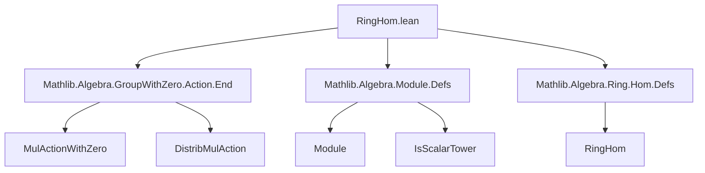

**Technical Brief: `RingHom.lean` (Lean 4)**  
*Domain: Algebra — Ring Homomorphisms and Module Structures*

---

### 1. KEY DEFINITIONS & THEOREMS

| Name | Type / Signature | Purpose |
|------|------------------|---------|
| `Function.Surjective.moduleLeft` | `{R S M : Type*} [Semiring R] [AddCommMonoid M] [Module R M] [Semiring S] [SMul S M] → (f : R →+* S) → Function.Surjective f → (∀ c x, f c • x = c • x) → Module S M` | Pushes forward an `R`-module structure along a *surjective* ring homomorphism `f : R →+* S`, assuming compatibility of the action. |
| `Module.compHom` | `[Semiring S] → (f : S →+* R) → Module S M` | Composes a module `M` over `R` with a ring hom `f : S →+* R`, yielding an `S`-module structure via `s • m := f s • m`. |
| `RingHom.toModule` | `(f : R →+* S) → Module R S` | Special case of `Module.compHom`: a ring hom `f : R →+* S` equips the codomain `S` with an `R`-module structure via `r • s = f r * s`. |
| `RingHom.smulOneHom` | `[Semiring R] [NonAssocSemiring S] [Module R S] [IsScalarTower R S S] → R →+* S` | Constructs a ring hom `R →+* S` from an `R`-module structure on `S` (with scalar tower), sending `r ↦ r • 1`. |
| `ringHomEquivModuleIsScalarTower` | `(R →+* S) ≃ {_inst : Module R S // IsScalarTower R S S}` | Equivalence between ring homs `R →+* S` and module structures on `S` making `R → S → S` a scalar tower. |

---

### 2. NAMING CONVENTIONS

- **Prefixes**:
  - `compHom`: indicates composition of algebraic structure with a homomorphism (e.g., `Module.compHom`, `MulAction.compHom`).
  - `toModule`: encodes a construction *from* a homomorphism *to* a module structure.
  - `smulOneHom`: encodes a homomorphism *defined* by evaluating the action at `1`.
- **Suffixes**:
  - `Hom`: for homomorphism-like constructions (`smulOneHom`).
  - `Left`: for left-action pushforwards (`moduleLeft`).
- **General pattern**: `Structure.toStructure` or `Structure.compHom` for transport along homs.

---

### 3. TACTIC STACK

Frequent tactics used in proofs and definitions:

| Tactic | Usage |
|--------|-------|
| `simp` / `simp only` | Simplifying goals using `smul`, `add_smul`, `map_zero`, `map_add`, etc. |
| `rw` | Rewriting using lemmas like `← f.map_add`, `hsmul`, `zero_smul`. |
| `show` | Explicitly stating intermediate goals (e.g., `show f (r + s) • x = f r • x + f s • x`). |
| `ext` / `funext` / `funext₂` | Proving extensionality of functions/modules/ring homs. |
| `cases` / `hf.forall₂.mpr` | Handling surjectivity hypotheses. |
| `mul_one`, `zero_smul`, `add_smul` | Used as lemmas directly in proofs. |

No heavy automation (e.g., `aesop`, `linarith`) — proofs are mostly direct and structural.

---

### 4. PROOF LOGIC

- **Structure transport**: Most constructions follow a *transport-of-structure* pattern:
  - Given `f : S →+* R` and `M` an `R`-module, define `s • m := f s • m`.
  - Verify module axioms using properties of `f` (e.g., `f(r + s) = f r + f s`) and the original module structure.
- **Equivalence proofs**:
  - Use `RingHom.ext` (extensionality for ring homs) and `Module.ext` (extensionality for scalar actions).
  - `left_inv`/`right_inv` proofs rely on `mul_one`, `smul_one`, and scalar tower assumptions.
- **Induction is not used** — all arguments are algebraic and pointwise.

---

### 5. IMPORTS (PRIMARY DEPENDENCIES)

| Module | Role |
|--------|------|
| `Mathlib.Algebra.GroupWithZero.Action.End` | Provides `MulActionWithZero`, `DistribMulAction`, and their `compHom` variants. |
| `Mathlib.Algebra.Module.Defs` | Core module definitions (`Module`, `SMul`, `IsScalarTower`, etc.). |
| `Mathlib.Algebra.Ring.Hom.Defs` | Ring hom definitions (`→+*`, `map_zero`, `map_add`, etc.). |

Also uses:
- `Function`, `Set`, `universe` declarations.
- `@[simps!]` for automatic simplifier generation of structure projections.

---

### 6. MERMAID DIAGRAMS

#### Dependency Graph (Top-Level)



#### Conceptual Overview of `RingHom.lean`

```mermaid
flowchart LR
  R[Semiring R] -->|f : R →+* S| S[Semiring S]
  S -->|Module.compHom S f| M[M is R-module ⇒ S-module]
  R -->|RingHom.toModule f| S[S gets R-module structure]
  R -->|Module R S + IsScalarTower| RingHom.smulOneHom
  RingHom.smulOneHom -->|inverse| R →+* S
  R →+* S <-->|ringHomEquivModuleIsScalarTower| Module R S & IsScalarTower
```

#### Key Equivalence

```mermaid
flowchart LR
  R →+* S <===> ⟨Module R S, IsScalarTower R S S⟩
  left[RingHom.smulOneHom] -->|invFun| right[Module.compHom]
  right -->|toFun| left
```

---

### 7. NOTES & CONTEXT

- **Reducible non-instances**: Both `Module.compHom` and `RingHom.toModule` are marked `abbrev`, meaning they are *reducible* and *not* typeclass instances — to avoid performance issues and ambiguity in typeclass inference.
- **Scalar tower**: `IsScalarTower R S S` ensures `(r • s) • x = r • (s • x)` for `r ∈ R`, `s, x ∈ S`, crucial for `RingHom.smulOneHom` to be a ring hom.
- **Surjectivity**: `moduleLeft` requires `f` surjective to lift the action uniquely; otherwise, the action may not be well-defined.

--- 

*End of Technical Brief.*
