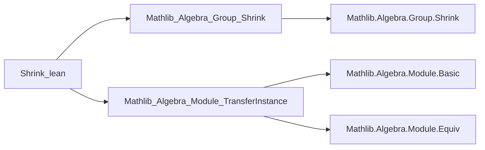

**Technical Brief: `Shrink.lean`**

---

### 1. **Key Definitions & Theorems**

| Name | Type | Purpose |
|------|------|---------|
| `instance : Module R (Shrink.{v} α)` | `Module R (Shrink.{v} α)` | Transfers the `R`-module structure on `α` to `Shrink α` via the equivalence `equivShrink α`. |
| `linearEquiv (R α)` | `Shrink.{v} α ≃ₗ[R] α` | Constructs a linear equivalence between `Shrink α` and `α`, showing the transferred module structure is *isomorphic* to the original. |

- **`equivShrink α`**: A canonical equivalence `Shrink.{v} α ≃ α` (from `Mathlib.Algebra.Group.Shrink`), used to transport structures.
- **`linearEquiv`**: Defined as `(equivShrink α).symm.linearEquiv _`, i.e., the linear equivalence induced by the inverse of `equivShrink`.

---

### 2. **Naming Conventions**

- **Prefixes**:
  - `equivShrink`: Standard name for the equivalence `Shrink α ≃ α`.
  - `linearEquiv`: Standard suffix for linear equivalences (`≃ₗ`).
- **Suffixes**:
  - `module`: Used for module instances.
  - `simps!`: Attribute indicating `simps`-friendly definition (auto-generates projection lemmas).
- **Universe annotations**: `.{v}` explicitly tracks universe levels (e.g., `Shrink.{v} α`).

---

### 3. **Tactic Stack**

- **No explicit tactics** appear in definitions or proofs in this file.
- Relies on:
  - `instance` resolution (via `.module` coercion via `equivShrink`).
  - `@[simps!]` attribute (triggers `simps` machinery).
  - Implicit use of `rfl`, `refl`, `congr` via Lean’s typeclass inference and definitional equality.

---

### 4. **Proof Logic**

- **No proofs required**: The file is *definitionally* complete.
- The module instance is defined *via transport* along `equivShrink α`:
  - `equivShrink α : Shrink α ≃ α`
  - `.symm.module R` uses `Equiv.symm.module` (from `Mathlib.Algebra.Module.TransferInstance`) to pull back the `R`-module structure along the equivalence.
- `linearEquiv` is defined directly using `linearEquiv_ofEquiv` (implicit in `.linearEquiv _`), again via transport.

---

### 5. **Imports**

| Import | Role |
|--------|------|
| `Mathlib.Algebra.Group.Shrink` | Provides `Shrink`, `equivShrink`, and universe-shrinking machinery. |
| `Mathlib.Algebra.Module.TransferInstance` | Provides `Equiv.symm.module`, `Equiv.linearEquiv`, etc., for transferring module/algebra structures along equivalences. |

---

### 6. **Dependency & Theory Overview**

#### Mermaid Diagram: Module Structure Transfer

```mermaid
graph TD
    A[Module R α] -->|equivShrink α : Shrink α ≃ α| B[Module R (Shrink α)]
    B -->|linearEquiv| A
    A -->|equivShrink.symm| B
```

#### Mermaid: File Dependencies



#### Theory Context

- **Goal**: Show that shrinking a type `α` to a smaller universe (via `Shrink α`) preserves its `R`-module structure.
- **Key idea**: Use the equivalence `Shrink α ≃ α` to *transport* algebraic structures (here, module structure) along it.
- **Broader theory**: Part of a *universe minimization* strategy in Lean’s mathlib: represent large structures (e.g., modules over large types) by equivalent small ones, enabling better typeclass inference and avoiding universe polymorphism overhead.

--- 

Let me know if you'd like the corresponding `algebra` transfer version or a formalized lemma about `linearEquiv` properties (e.g., `linearEquiv.smul`).
