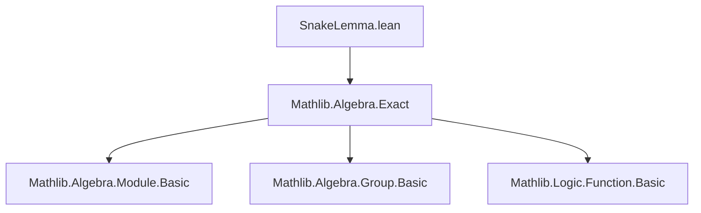
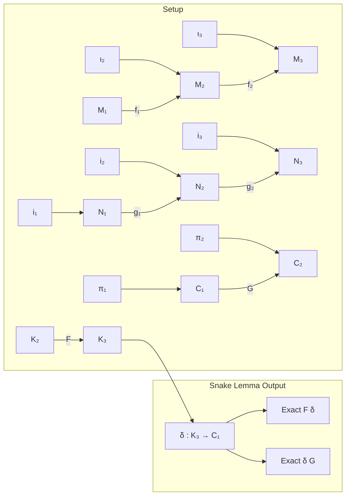
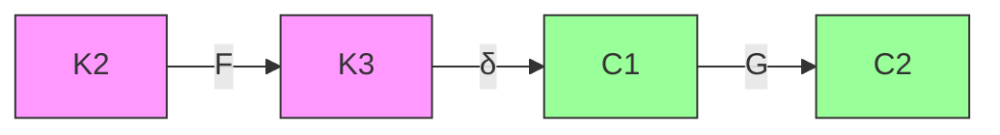

### Technical Brief: `SnakeLemma.lean`

---

#### **1. Key Definitions & Theorems**

| Name | Type | Purpose |
|------|------|---------|
| `SnakeLemma.δ` | `K₃ →ₗ[R] C₁` | The **connecting homomorphism** in the snake lemma, constructed using explicit section `σ` and retraction `ρ`. |
| `SnakeLemma.δ'` | `K₃ →ₗ[R] C₁` | Noncomputable version of `δ`, avoiding explicit `σ`, `ρ` by using `surjInv` and `invFun`. |
| `SnakeLemma.δ_aux` | `lemma` | Technical lemma showing $g₁(ρ(i₂(σ(ι₃ x)))) = i₂(σ(ι₃ x))$, used to ensure `δ` is well-defined. |
| `SnakeLemma.eq_of_eq` | `lemma` | Proves independence of the definition of `δ(x)` from choices of lifts `y` and `z`. |
| `SnakeLemma.δ_eq` | `lemma` | Describes the value of `δ(x)` in terms of any compatible lifts `y`, `z`. |
| `SnakeLemma.exact_δ_right` | `lemma` | Shows **exactness at `K₃`**: $\operatorname{im} F = \ker δ$, assuming `ι₃` injective. |
| `SnakeLemma.exact_δ_left` | `lemma` | Shows **exactness at `C₁`**: $\operatorname{im} δ = \ker G$, assuming `π₁` surjective. |
| `SnakeLemma.exact_δ'_right` | `lemma` | Analog of `exact_δ_right` for `δ'`, under surjectivity of `f₂`, injectivity of `g₁`, and `ι₃`. |
| `SnakeLemma.exact_δ'_left` | `lemma` | Analog of `exact_δ_left` for `δ'`, under surjectivity of `f₂`, injectivity of `g₁`, and `π₁`. |

---

#### **2. Naming Conventions**

- **Prefixes**:
  - `δ`, `δ'`: Main connecting maps.
  - `exact_δ_*`: Exactness lemmas for `δ`.
  - `eq_of_eq`, `δ_eq`, `δ_aux`: Technical helper lemmas.
- **Suffixes**:
  - `_right`, `_left`: Indicate which part of the long exact sequence is being verified.
  - `'` (prime): Noncomputable variant (e.g., `δ'`).
- **Variable naming**:
  - `ι₂`, `ι₃`: Inclusions of kernels.
  - `π₁`, `π₂`: Projections to cokernels.
  - `σ`: Section of `f₂`.
  - `ρ`: Retraction of `g₁`.
  - `F`: Map $K₂ → K₃$.
  - `G`: Map $C₁ → C₂$.

---

#### **3. Tactic Stack**

| Tactic | Usage |
|--------|-------|
| `rw` | Rewriting hypotheses and definitions (e.g., exactness, commutativity). |
| `obtain ⟨x, hx⟩` | Existential elimination (e.g., from exactness: $x ∈ \operatorname{range} f$). |
| `simp only [...]` | Simplification with specific lemmas (e.g., `map_add`, `map_smul`, `H₁`, `H₂`). |
| `congr` | Congruence reasoning (e.g., `congr($h₁ y)`). |
| `exact` / `rfl` | Immediate proof steps. |
| `funext` | Extensionality for functions (used in `δ'` definition). |
| `sub_eq_zero.mpr`, `eq_sub_iff_eq_add` | Algebraic rewriting in additive groups. |
| `injective_iff_eq_iff` (via `HasLeftInverse.injective`) | Using injectivity from left inverse. |
| `ring` / `linarith` | Not used — arithmetic handled via explicit algebraic manipulation. |

---

#### **4. Proof Logic**

- **Well-definedness of `δ`**:
  - Use `δ_aux` to show the candidate expression lands in $\ker π₂$, i.e., in $\operatorname{coker} i₁$.
  - Use `eq_of_eq` to show independence of lifts.

- **Linearity of `δ`**:
  - Prove additivity and scalar multiplication using `eq_of_eq` with carefully chosen lifts (e.g., sums/scalars of sections).

- **Exactness proofs**:
  - **Right exactness (`im F = ker δ`)**:
    - *⊆*: Lift $x ∈ K₃$ with $δ(x) = 0$ to $y ∈ M₂$, $z ∈ N₁$, use exactness of rows and injectivity of `ι₃` to find $k ∈ K₂$ mapping to $x$.
    - *⊇*: Direct computation using `δ_eq` and exactness of $K₂ → K₃ → M₂$.
  - **Left exactness (`im δ = ker G`)**:
    - *⊆*: Given $δ(x) ∈ \ker G$, lift $x$ via surjectivity of `π₁`, use exactness of $N₁ → N₂ → C₂$ to find preimage in $\operatorname{im} δ$.
    - *⊇*: Use `δ_eq` and exactness of $M₂ → M₃ → N₃$.

- **Noncomputable `δ'`**:
  - Derives from `δ` by substituting canonical section/retraction via `surjInv` and `invFun`.

---

#### **5. Imports & Dependencies**

- **Core dependency**:
  ```lean
  import Mathlib.Algebra.Exact
  ```
- **Implicit dependencies** (via `AddCommGroup`, `Module`, `LinearMap`):
  - `Mathlib.Algebra.Module.Basic`
  - `Mathlib.Algebra.Module.LinearMap.Basic`
  - `Mathlib.Algebra.Group.Defs` (for `AddCommGroup`)
  - `Mathlib.Logic.Function.Basic` (for `Function.comp`, `id`, etc.)

---

#### **6. Mermaid Diagrams**

##### **Dependency Graph (Module-Level)**



##### **Overview of Diagram & Flow**



##### **Long Exact Sequence**



---

#### **7. Summary**

This file formalizes the **snake lemma for modules over a commutative ring**, with two versions of the connecting map (`δ`, `δ'`) and proofs of the two key exactness properties. It avoids homological algebra machinery (e.g., derived functors) by working concretely with lifts, sections, and retractions—leveraging Lean’s typeclass inference for algebraic structures. The proofs are constructive where possible (`δ`) and noncomputable where canonical inverses suffice (`δ'`).
