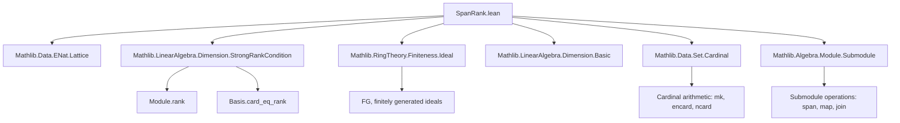
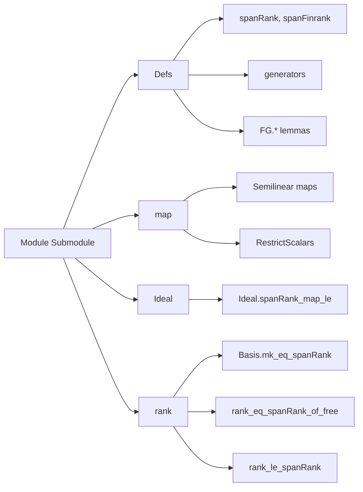

**Technical Brief: SpanRank.lean**

---

### 1. KEY DEFINITIONS & THEOREMS

| Name | Type | Purpose |
|------|------|---------|
| `spanRank` | `Submodule R M → Cardinal` | Minimum cardinality of a generating set of a submodule (as a cardinal). |
| `spanFinrank` | `Submodule R M → ℕ` | Minimum cardinality of a finite generating set (as a natural number); `0` if no finite generating set exists. |
| `generators` | `Submodule R M → Set M` | A canonical generating set of minimal cardinality (classical choice). |
| `FG.generators_ncard` | `p.FG → (generators p).ncard = p.spanFinrank` | For finitely generated submodules, `generators` has cardinality equal to `spanFinrank`. |
| `exists_span_set_card_eq_spanRank` | `∃ s, #s = p.spanRank ∧ span R s = p` | Every submodule has a minimal generating set (cardinality = `spanRank`). |
| `rank_eq_spanRank_of_free` | `[Free R M] → [StrongRankCondition R] → Module.rank R M = ⊤.spanRank` | For free modules over rings with `StrongRankCondition`, rank equals `spanRank` of the full module. |
| `rank_le_spanRank` | `[StrongRankCondition R] → Module.rank R M ≤ ⊤.spanRank` | For any module over a ring with `StrongRankCondition`, rank ≤ `spanRank`. |
| `spanRank_finite_iff_fg` | `p.spanRank < ℵ₀ ↔ p.FG` | `spanRank` is finite iff the submodule is finitely generated. |
| `spanRank_eq_zero_iff_eq_bot` | `p.spanRank = 0 ↔ p = ⊥` | Minimal generating set size zero iff submodule is trivial. |
| `spanRank_sup_le_sum_spanRank` | `(p ⊔ q).spanRank ≤ p.spanRank + q.spanRank` | Subadditivity of `spanRank` over join (sum) of submodules. |
| `spanRank_map_le` | `[RingHomSurjective σ] → (p.map f).spanRank ≤ p.spanRank` | `spanRank` does not increase under surjective semilinear maps. |
| `spanRank_restrictScalars_eq` | `[Surjective (algebraMap R S)] → (N.restrictScalars R).spanRank = N.spanRank` | `spanRank` invariant under scalar restriction along surjective algebra maps. |

---

### 2. NAMING CONVENTIONS

- **Prefixes**:
  - `spanRank_`, `spanFinrank_`: for lemmas/defs about the rank functions.
  - `FG.`: for results specific to *finitely generated* submodules.
  - `Ideal.`: for lemmas specialized to ideals (viewed as submodules of `R` over itself).
- **Suffixes**:
  - `_le`: inequality lemmas (e.g., `spanRank_sup_le_sum_spanRank`).
  - `_iff_`: equivalence lemmas (e.g., `spanRank_eq_zero_iff_eq_bot`).
  - `_of_`: conditional versions (e.g., `spanFinrank_map_le_of_fg`).
  - `_card`, `_encard`, `_ncard`: distinguish between cardinality notions (`#s`, `s.encard`, `s.ncard`).
- **Function names**:
  - `generators`: canonical minimal generating set.
  - `map`, `restrictScalars`: standard module-theoretic operations.

---

### 3. TACTIC STACK

Frequently used tactics in proofs:
- `rw`, `simp`, `simp_rw`: for rewriting and simplification (especially with `←`, `symm`, `congrFun`, etc.).
- `apply`, `exact`, `refine`: for constructing proofs via typeclass inference and definitional equality.
- `le_antisymm`: central for proving equalities of cardinals/naturals via double inequality.
- `ciInf_le'`, `le_ciInf`: for reasoning about infima over sets of cardinals.
- `Classical.choose`, `Classical.choose_spec`: to extract minimal generating sets.
- `rcases`, `obtain`, `have`: for destructuring existential hypotheses.
- `grw`: guarded rewriting (from `Mathlib.Tactic.GuardedRewrite`), used for rewriting under binders like `span`.
- `convert`, `nth_rw`: for precise control over rewriting.
- `by_contra!`: for contradiction arguments.
- `ring`, `linarith`: occasionally used for arithmetic in `ℕ`, `ℕ∞`, ` Cardinal`.

---

### 4. PROOF LOGIC

The logical flow across most proofs follows this pattern:

1. **Reduction to infima**: Express `spanRank` or `spanFinrank` as an infimum over generating sets (via `spanRank` def or lemmas like `spanRank_toENat_eq_iInf_finset_card`).
2. **Double inequality**: Prove equality by bounding above (using a specific generating set, often `generators`) and below (using linear independence or basis properties).
3. **Cardinal arithmetic**: Use properties like `mk_range_eq`, `mk_image_eq`, `mk_union_le`, `ofENat_toENat`, `toNat_toENat`, and monotonicity of `toENat`, `encard`, `ncard`.
4. **Case analysis**: On finiteness (`Finite s`), nontriviality (`m ≠ 0`), or existence of finite generating sets (`p.FG`).
5. **Use of structural assumptions**:
   - `StrongRankCondition R`: ensures basis cardinalities are well-defined and injective linear maps preserve rank.
   - `RingHomSurjective σ`: enables lifting generating sets along surjective maps.
   - `IsScalarTower R S M`: needed for scalar restriction lemmas.

Induction is *not* used — proofs rely on set-theoretic and categorical properties of modules and cardinals.

---

### 5. IMPORTS (PRIMARY DEPENDENCIES)

| Module | Role |
|--------|------|
| `Mathlib.Data.ENat.Lattice` | For `toENat`, `ofENat`, `encard`, arithmetic on `ℕ∞`. |
| `Mathlib.LinearAlgebra.Dimension.StrongRankCondition` | For `StrongRankCondition`, `RankCondition`, basis rank uniqueness. |
| `Mathlib.RingTheory.Finiteness.Ideal` | For `FG`, `Ideal.FG`, finitely generated ideals/modules. |
| `Mathlib.LinearAlgebra.Dimension.Basic` (implicit via `Module.rank`, `Basis`) | For module rank, bases, linear independence. |
| `Mathlib.Data.Set.Cardinal` | For `#s`, `s.encard`, `s.ncard`, `mk_image`, `mk_union`. |
| `Mathlib.Algebra.Module.Submodule` | For `Submodule`, `span`, `map`, `restrictScalars`, `span_union`, etc. |

---

### 6. MERMAID DIAGRAMS

#### Dependency Graph (High-Level)

#### Overview of File Structure

---

### 7. DOMAIN-SPECIFIC INSIGHTS

- **Asymmetry with `Module.rank`**: `Module.rank` is defined only for modules (not submodules), while `spanRank`/`spanFinrank` work uniformly for submodules. This motivates the `FG.*` API and careful handling of finite generation.
- **Classical choice**: `generators` uses `Classical.choose`, so it is noncomputable — consistent with Lean’s mathlib philosophy for existence results.
- **Cardinal vs. natural-number ranks**: `spanRank` (cardinal) is more general; `spanFinrank` (natural) is convenient for algorithmic or finite-combinatorics contexts.
- **Strong Rank Condition (SRC)**: Critical for comparing basis size and minimal generating set size. SRC holds for all commutative rings and many noncommutative ones (e.g., division rings, Noetherian rings).
- **Surjectivity vs. injectivity**: `spanRank` is monotone under surjective maps (`spanRank_map_le`) but *invariant* under injective maps with surjective scalar map (`spanRank_map_eq_of_injective`).

---

This file formalizes a foundational invariant of submodules — the minimal size of a generating set — and connects it to classical module-theoretic invariants like rank and basis size, under minimal structural assumptions (SRC, surjectivity).
