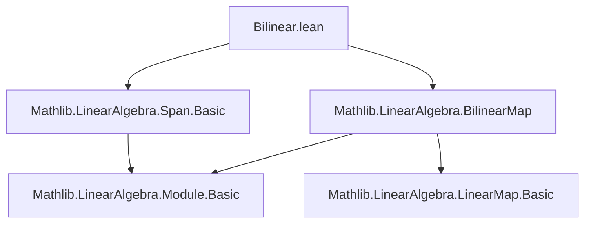
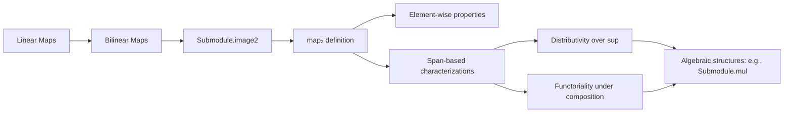

**Technical Brief: `Bilinear.lean` — Submodule Bilinear Image Construction**

---

### 1. **Key Definitions & Theorems**

| Name | Type / Signature | Purpose |
|------|------------------|---------|
| `map₂` | `def map₂ (f : M →ₗ[R] N →ₗ[R] P) (p : Submodule R M) (q : Submodule R N) : Submodule R P` | Maps a pair of submodules under a bilinear map `f`, generalizing `Set.image2`. Defined as a supremum over `q.map (f s)` for `s ∈ p`. |
| `apply_mem_map₂` | `∀ m ∈ p, n ∈ q → f m n ∈ map₂ f p q` | Membership witness: bilinear image of elements lies in `map₂`. |
| `map₂_le` | `map₂ f p q ≤ r ↔ ∀ m ∈ p, n ∈ q, f m n ∈ r` | Universal property: characterizes inclusion into `map₂` via element-wise containment. |
| `map₂_span_span` | `map₂ f (span s) (span t) = span (image2 (f · ·) s t)` | Core structural theorem: `map₂` of spans equals span of pairwise images. |
| `map₂_eq_span_image2` | `map₂ f p q = span (image2 (f · ·) ↑p ↑q)` | Final simplification: `map₂` is always the span of pairwise bilinear images of underlying sets. |
| `map₂_bot_left`, `map₂_bot_right` | `map₂ f ⊥ q = ⊥`, `map₂ f p ⊥ = ⊥` | Annihilation by zero submodule. |
| `map₂_sup_left`, `map₂_sup_right` | Distributivity over sup (sum) of submodules in each argument. |
| `map₂_flip` | `map₂ f.flip q p = map₂ f p q` | Symmetry under flipping the bilinear map. |
| `map₂_iSup_left`, `map₂_iSup_right` | `map₂ f (⨆ s i) t = ⨆ i, map₂ f (s i) t` (and symmetric) | Preservation of arbitrary suprema in each argument. |
| `map₂_span_singleton_eq_map` | `map₂ f (span {m}) = map (f m)` | Reduces to linear map when one argument is a cyclic submodule. |
| `map₂_map_left`, `map₂_map_right`, `map₂_map_map`, `map_map₂` | Functoriality lemmas for composition with linear maps. | Ensure `map₂` behaves well under pre- and post-composition. |

---

### 2. **Naming Conventions**

- **Prefixes**:
  - `map₂_`: for operations on `map₂`.
  - `map_`: for standard linear map image (`map f p`).
- **Suffixes**:
  - `_left`, `_right`: indicate argument position (first or second).
  - `_sup_left`, `_sup_right`: indicate distributivity over sup in left/right argument.
  - `_bot_left`, `_bot_right`: annihilation by bottom (zero submodule).
  - `_span_*`: relate to `span`.
  - `_singleton_*`: specialize to cyclic submodules.
  - `_flip`: symmetry under swapping arguments.
  - `_iSup_*`: preservation of indexed suprema.
- **`compr₂`, `compl₂`, `compl₁₂`**: composition helpers for bilinear maps (curried composition).

---

### 3. **Tactic Stack**

- `rw`, `simp`, `simp_rw`: for rewriting and simplification (especially with `span_eq`, `map_comp`, `image2_*`).
- `apply`, `intro`, `intros`: standard intro/apply for element-chasing.
- `exact`, `refine`, `let ... in`: for constructing witnesses (e.g., in `apply_mem_map₂`, `mem_sup` elimination).
- `le_antisymm`: central for equality proofs of submodules.
- `iSup_congr`, `iSup_le`, `le_iSup`: for reasoning about suprema over submodules.
- `span_induction`: used in `map₂_span_span` to reduce to generators.
- `rfl`, `rfl`-based congruences: for definitional equalities (e.g., `Set.image2_swap`, `map₂_flip`).
- `aesop` not used — proofs are mostly manual and structural.

---

### 4. **Proof Logic**

- **Inductive/structural style**: proofs often proceed by:
  1. Reducing to spans via `map₂_span_span` or `span_eq`.
  2. Using `span_induction` to handle generators.
  3. Applying `map₂_le` to reduce to element-wise reasoning.
  4. Using `mem_sup`, `mem_bot`, `mem_iSup` to decompose submodule membership.
- **Element-chasing**: many proofs (e.g., `map₂_sup_left`, `map₂_le_map₂`) use `mem_*` elimination and introduction rules.
- **Symmetry & functoriality**: proven via composition lemmas (`map_comp`, `map₂_flip`) and rewriting.
- **No heavy automation**: reliance on `simp` and `rw` with lemmas like `map_zero`, `map_add`, `smul_mem`, etc.

---

### 5. **Imports & Dependencies**

- `Mathlib.LinearAlgebra.Span.Basic`: for `span`, `span_induction`, `span_eq`, `subset_span`, `mem_span`.
- `Mathlib.LinearAlgebra.BilinearMap`: for `→ₗ[R]`, `→ₗ[R] →ₗ[R]`, `flip`, `compr₂`, `compl₂`, `compl₁₂`, `map`, `LinearMap.map_zero`, etc.

---

### 6. **Mermaid Diagrams**

#### **Dependency Graph (Module-Level)**



#### **Overview of Theory Flow**



#### **Data Flow in `map₂` Construction**

```mermaid
graph LR
  p:Submodule M -->|↑p: Set M| A[Set.image2 (f · ·)]
  q:Submodule N -->|↑q: Set N| A
  A -->|span R| B[map₂ f p q]
  s:span s ⊆ p -->|iSup over s| B
  t:span t ⊆ q -->|iSup over t| B
```

---

### 7. **Notes & Future Work**

- **TODO**: Generalize to *semilinear* maps (currently only linear).
- **Design note**: Mirrors `Set.image2`, `NAry` filter theory — intended for consistency across `Set`, `Submodule`, and `Filter`.
- **Usage**: `map₂` is foundational for defining `Submodule.mul` (product of submodules in an algebra), and more generally for bilinear operations on subobjects.

--- 

Let me know if you'd like a formalized dependency graph (e.g., for `leanpkg`), or a comparison with `Set.image2`/`NAry` lemmas.
