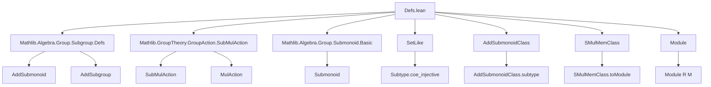

### Technical Brief: `Defs.lean` — Submodules of a Module in Lean 4

---

#### **1. Key Definitions & Theorems**

| Name | Type / Signature | Purpose |
|------|------------------|---------|
| `Submodule R M` | `structure` extending `AddSubmonoid M`, `SubMulAction R M` | Bundled submodule: subset of `M` closed under `0`, `+`, and `R`-scalar multiplication. |
| `Submodule.toAddSubmonoid` | `Submodule R M → AddSubmonoid M` | Forgets scalar action, keeps additive structure. |
| `Submodule.toSubMulAction` | `Submodule R M → SubMulAction R M` | Forgets additive group structure, keeps scalar action. |
| `Submodule.ofClass` | `{S : Type*} [SetLike S M] [AddSubmonoidClass S M] [SMulMemClass S R M] → S → Submodule R M` | Embeds elements of a class satisfying closure properties into a submodule. |
| `Submodule.ofLinearComb` | `C : Set M → C.Nonempty → (∀ x y ∈ C, ∀ a b : R, a • x + b • y ∈ C) → Submodule R M` | Constructs submodule from nonempty set closed under 2-term linear combinations. |
| `Submodule.copy` | `p : Submodule R M → s : Set M → s = ↑p → Submodule R M` | Rebuilds a submodule with definitional equality on carrier (for proof engineering). |
| `Submodule.ext` | `(∀ x, x ∈ p ↔ x ∈ q) → p = q` | Extensionality: two submodules equal iff same elements. |
| `Submodule.mem_toAddSubmonoid` | `x ∈ p.toAddSubmonoid ↔ x ∈ p` | Carrier equivalence with underlying set. |
| `Submodule.toAddSubgroup` | `Submodule R M → AddSubgroup M` (when `R` is a ring) | Bundled additive subgroup underlying a submodule. |
| `Submodule.toModule` | `Module R p` (for `p : Submodule R M`) | Induced module structure on the subtype. |
| `Submodule.addCommMonoid` / `addCommGroup` | `AddCommMonoid p` / `AddCommGroup p` | Induced additive structure on `p`. |
| `Submodule.module'` / `module` | `Module S p` / `Module R p` | Induced module structure over base or scalar tower. |

**Notable lemmas (selected):**
- `zero_mem`, `add_mem`, `smul_mem`: closure properties.
- `neg_mem`, `sub_mem`: group-theoretic closure (when `R` is a ring).
- `smul_mem_iff''`, `smul_mem_iff_of_isUnit`: invertible/scalar action preserves membership.
- `coe_add`, `coe_zero`, `coe_smul`: coercion commutes with operations.

---

#### **2. Naming Conventions**

- **Prefixes:**
  - `to*`: forgetful functors (e.g., `toAddSubmonoid`, `toSubMulAction`, `toAddSubgroup`).
  - `of*`: construction from a class or property (e.g., `ofClass`, `ofLinearComb`).
  - `copy`: definitional rebalancing.
  - `coe*`: coercion lemmas (e.g., `coe_add`, `coe_zero`, `coe_smul`).
  - `mem_*`: membership characterizations (e.g., `mem_toAddSubmonoid`, `mem_mk`).
  - `*_iff_*`: equivalence lemmas (e.g., `smul_mem_iff''`, `add_mem_iff_left`).

- **Suffixes:**
  - `'` (prime): variants (e.g., `module'`, `smul_mem_iff'`).
  - `Class`: typeclass-related (e.g., `AddSubmonoidClass`, `SMulMemClass`, `SubmoduleClass`).

- **Structure fields:**
  - `carrier`, `zero_mem'`, `add_mem'`, `smul_mem'`: standard for bundled substructures.

---

#### **3. Tactic Stack**

Frequently used tactics in proofs and definitions:
- `simp` / `simp_rw`: simplification with `@[simp]` lemmas (e.g., `smul_mem_iff''`, `coe_add`).
- `ext`: extensionality (for equality of submodules, sets, functions).
- `cases`: destructuring proofs/structures.
- `congr`: congruence closure.
- `exact`, `refine`, `intro`: basic proof scripting.
- `fast_instance%`: optimized typeclass inference (e.g., for `Module`, `AddCommMonoid` on subtype).
- `by aesop` / `aesop`: automated reasoning (used implicitly in `fast_instance%`).
- `rw`, `convert`: rewriting and conversion.
- `norm_cast`: normalization of coerced terms.

---

#### **4. Proof Logic**

- **Structure definitions** rely on `@[simps]` to automatically generate projection lemmas.
- **Inductive constructions** (`ofLinearComb`, `ofClass`) use:
  - `obtain ⟨x, hx⟩` for nonemptiness,
  - `simpa` to discharge membership using closure axioms.
- **Subtype module structures** use `fast_instance%` + `Subtype.coe_injective.module` to lift structures via injective coercion.
- **Equivalence proofs** (`ext`, `toAddSubmonoid_inj`, etc.) reduce to set equality via `SetLike.ext`.
- **Scalar tower & invertible/unit arguments** use `smul_mem_iff''` and `smul_mem_iff_of_isUnit` with `invertible`/`isUnit` instances.

---

#### **5. Imports & Dependencies**

**Primary imports:**
```lean
Mathlib.Algebra.Group.Subgroup.Defs
Mathlib.GroupTheory.GroupAction.SubMulAction
Mathlib.Algebra.Group.Submonoid.Basic
```

**Key dependencies:**
- `AddSubmonoid`, `SubMulAction`, `Submonoid`: foundational bundled substructures.
- `SetLike`, `AddSubmonoidClass`, `SMulMemClass`: abstraction for bundled subsets.
- `Module`, `AddCommMonoid`, `Semiring`, `Ring`, `AddCommGroup`: algebraic typeclasses.
- `MulAction`, `SMul`, `IsScalarTower`: scalar action infrastructure.

---

#### **6. Theory Overview & Dependency Diagram**

##### **Module Scope**
This file defines the core theory of **submodules** as bundled subsets closed under:
- additive structure (`AddSubmonoid` / `AddSubgroup`),
- scalar multiplication (`SubMulAction`).

It bridges:
- **Additive group theory** (`AddSubmonoid`, `AddSubgroup`),
- **Module theory** (`Module`, `SubMulAction`),
- **Typeclass-based coercion** (`SetLike`, `SMulMemClass`).

##### **Mermaid Diagrams**

**A. Dependency Graph (Top-Level)**



**B. Overview of Submodule Construction**

```mermaid
graph LR
  M[Module R M] -->|carrier| S[Set M]
  S -->|0 ∈ S| Z[Zero closure]
  S -->|closed under +| A[Additive closure]
  S -->|closed under •| Ml[Scalar closure]

  Z & A & Ml -->|together| Sub[Submodule R M]

  Sub -->|toAddSubmonoid| AddM[AddSubmonoid M]
  Sub -->|toSubMulAction| MulA[SubMulAction R M]
  Sub -->|toAddSubgroup| AddG[AddSubgroup M]  %% when R is Ring

  Sub -->|subtype| p[Subtype p]
  p -->|induced| Mod[Module R p]
```

---

#### **7. Summary**

This file formalizes the foundational theory of submodules in Lean 4, emphasizing:
- **Bundling** (via `structure Submodule` extending `AddSubmonoid` and `SubMulAction`),
- **Typeclass abstraction** (`SetLike`, `Class` instances),
- **Induced algebraic structures** on the subtype (`Module`, `AddCommMonoid`, `AddCommGroup`),
- **Proof engineering tools** (`copy`, `ext`, `simps`, `fast_instance%`).

It serves as the base for higher-level developments (e.g., quotient modules, dual modules, exact sequences) in `Mathlib.Algebra.Module.*`.

--- 

Let me know if you'd like a formalized dependency graph (e.g., `.dot` format) or a summary of related files (e.g., `Quotient.lean`, `LinearMap.lean`).
