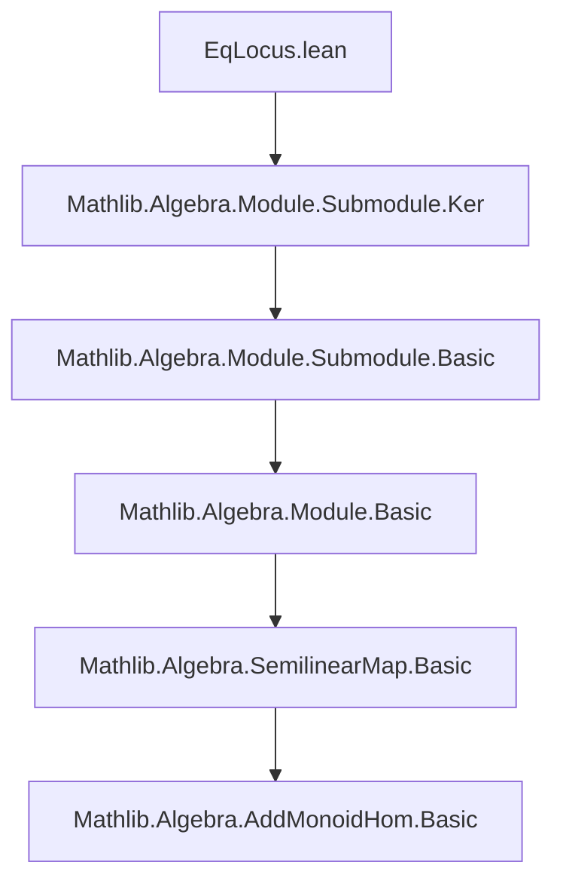

**Technical Brief: `EqLocus.lean`**

---

### 1. Key Definitions & Theorems

| Name | Type | Purpose |
|------|------|---------|
| `eqLocus` | `def eqLocus (f g : F) : Submodule R M` | Constructs the submodule of elements $x \in M$ where two semilinear maps $f, g : M \to_{\tau_{12}} M_2$ agree. |
| `mem_eqLocus` | `theorem mem_eqLocus {x : M} {f g : F}` | Characterizes membership: $x \in \text{eqLocus}(f,g) \iff f(x) = g(x)$. |
| `eqLocus_eq_top` | `theorem eqLocus_eq_top {f g : F}` | States $\text{eqLocus}(f,g) = \top \iff f = g$. |
| `eqLocus_same` | `theorem eqLocus_same (f : F)` | Special case: $\text{eqLocus}(f,f) = \top$. |
| `le_eqLocus` | `theorem le_eqLocus {f g : F} {S : Submodule R M}` | Relates submodule inclusion to pointwise equality on a submodule: $S \le \text{eqLocus}(f,g) \iff f = g \text{ on } S$. |
| `eqOn_sup` | `theorem eqOn_sup {f g : F} {S T : Submodule R M}` | If $f = g$ on $S$ and on $T$, then $f = g$ on $S \sqcup T$. |
| `ext_on_codisjoint` | `theorem ext_on_codisjoint {f g : F} {S T : Submodule R M}` | If $S$ and $T$ are codisjoint (i.e., $S \cap T = 0$, $S + T = M$) and $f = g$ on both, then $f = g$ globally. |
| `eqLocus_eq_ker_sub` | `theorem eqLocus_eq_ker_sub (f g : M →ₛₗ[τ₁₂] M₂)` | In the ring case, $\text{eqLocus}(f,g) = \ker(f - g)$. |

---

### 2. Naming Conventions

- **Prefixes**:
  - `eqLocus_`: core definition and properties of the equalizer submodule.
  - `mem_`, `le_`, `eqOn_`: standard submodule membership/inclusion/equality-on-submodule terminology.
- **Suffixes**:
  - `_same`: identity case.
  - `_eq_top`: characterization of global equality.
  - `_toAddSubmonoid`: conversion to underlying additive structure.
- **Typeclass-based naming**:
  - `FunLike`, `SemilinearMapClass`, `AddCommMonoid`, `Ring`, `Module`: used to parameterize generality.

---

### 3. Tactic Stack

Frequent tactics used in proofs:

- `simp` / `simpa`: simplification using lemmas like `map_smulₛₗ`, `sub_eq_zero`.
- `rw`: rewriting using equivalences like `le_eqLocus`, `eqLocus_eq_top`.
- `exact`, `intro`, `apply`, `congr_arg`: basic proof construction.
- `SetLike.ext_iff`, `DFunLike.ext_iff`, `DFunLike.ext`: extensionality lemmas for maps/submodules.
- `sup_le`, `hST.eq_top.symm ▸ trivial`: lattice-theoretic reasoning in `Submodule`.

No heavy automation (e.g., `linarith`, `ring`, `aesop`) is used—proofs are mostly direct and rely on algebraic properties and extensionality principles.

---

### 4. Proof Logic

- **Structure**: Most proofs follow a pattern of:
  1. Unfolding definitions (`eqLocus`, `mem_eqLocus`, `eqOn`).
  2. Applying extensionality (`DFunLike.ext`, `SetLike.ext`).
  3. Using algebraic properties (e.g., semilinearity: `map_smulₛₗ`).
  4. Leveraging lattice properties of submodules (`sup_le`, `Codisjoint`).
- **Key reasoning steps**:
  - For `eqLocus_eq_ker_sub`: reduce to $f(x) - g(x) = 0 \iff f(x) = g(x)$.
  - For `ext_on_codisjoint`: combine local agreement on codisjoint submodules using `eqOn_sup` and codisjointness implying $S \sqcup T = M$.

Induction is not used; proofs are mostly algebraic and categorical.

---

### 5. Imports & Dependencies

- **Core imports**:
  ```lean
  import Mathlib.Algebra.Module.Submodule.Ker
  ```
- **Implicit dependencies** (via `FunLike`, `SemilinearMapClass`, `Submodule`):
  - `Mathlib.Algebra.Module.Basic`
  - `Mathlib.Algebra.Module.Submodule.Basic`
  - `Mathlib.Algebra.Module.Submodule.Ker`
  - `Mathlib.Algebra.SemilinearMap.Basic`
  - `Mathlib.Algebra.AddMonoidHom.Basic` (for `eqLocusM`)

---

### 6. Mermaid Diagrams

#### Dependency Graph (Module-Level)



#### Overview of Theory Flow

```mermaid
flowchart LR
  A[Semilinear Maps f,g : M →ₗ[τ] M₂] --> B[eqLocus f g]
  B --> C[Submodule of M]
  C --> D{Membership: x ∈ eqLocus ⇔ f x = g x}
  C --> E{Global Equality: eqLocus = ⊤ ⇔ f = g}
  C --> F{Ring case: eqLocus = ker(f - g)}
  C --> G{Codisjoint extension: f=g on S,T & Codisjoint ⇒ f=g}
```

---

### 7. Summary

This module formalizes the **equalizer submodule** of two semilinear maps, generalizing the classical linear algebra concept of the kernel of $f - g$. It provides foundational properties for reasoning about where two maps agree, especially useful in contexts like descent theory, gluing, or uniqueness arguments. The ring case connects directly to kernels, while the additive/multiplicative setup supports codisjoint decomposition arguments.
