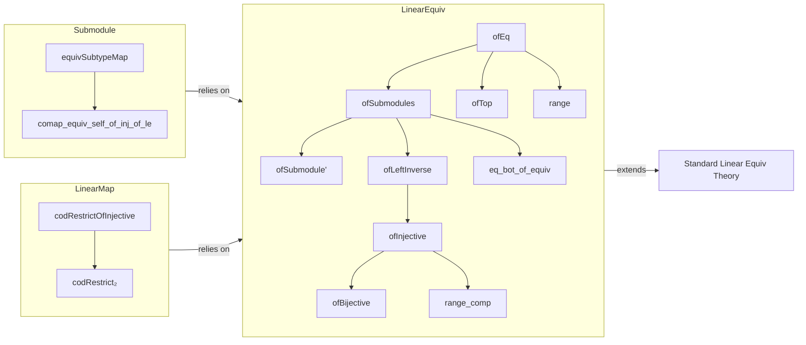

### Technical Brief: `Equiv.lean` — Linear Equivalences Involving Submodules

---

#### **1. Key Definitions & Theorems**

| Name | Type | Purpose |
|------|------|---------|
| `ofEq` | `p = q → p ≃ₗ[R] q` | Constructs a linear equivalence between equal submodules via set congruence. |
| `ofSubmodules` | `p.map e = q → p ≃ₛₗ[σ₁₂] q` | Restricts a semilinear equivalence `e : M ≃ₛₗ[σ₁₂] M₂` to submodules `p ⊆ M`, `q ⊆ M₂` when `e[p] = q`. |
| `ofSubmodule'` | `U.comap f ≃ₛₗ[σ₁₂] U` | Pulls back a submodule `U ⊆ M₂` along a semilinear equivalence `f : M ≃ₛₗ[σ₁₂] M₂`. |
| `ofTop` | `p = ⊤ → p ≃ₗ[R] M` | Identifies the top submodule (entire module) with the module itself. |
| `ofLeftInverse` | `LeftInverse g f → M ≃ₛₗ[σ₁₂] range f` | Builds a linear equivalence from a map with a left inverse to its range. |
| `ofInjective` | `Injective f → M ≃ₛₗ[σ₁₂] range f` | Noncomputable equivalence from injective linear map to its range (uses choice). |
| `ofBijective` | `Bijective f → M ≃ₛₗ[σ₁₂] M₂` | Converts a bijective linear map into a linear equivalence. |
| `equivSubtypeMap` | `q ≃ₗ[R] q.map p.subtype` | Natural equivalence between a submodule `q` of `p` and its image under the inclusion `p ↪ M`. |
| `comap_equiv_self_of_inj_of_le` | `Injective f → p ≤ range f → p.comap f ≃ₗ[R] p` | Equivalence between preimage and submodule when submodule lies in the range. |
| `codRestrictOfInjective` | `M₁ →ₗ[R] M₃` | Restricts target of `f : M₁ →ₗ[R] M₂` to submodule `range i ⊆ M₂` via injective `i : M₃ ↪ M₂`. |
| `codRestrict₂` | `M₁ →ₗ[R] M₂ →ₗ[R] M₃` | Restricts a bilinear map to a submodule of the codomain. |

**Theorems (selected):**
- `ofEq_rfl`: `ofEq p p rfl = refl`
- `ofSubmodules_apply`, `ofSubmodules_symm_apply`: Behavior of `ofSubmodules` and its inverse.
- `ofTop_apply`, `coe_ofTop_symm_apply`: Identity behavior of `ofTop`.
- `range`: `range e = ⊤` for any linear equivalence `e`.
- `eq_bot_of_equiv`: If a submodule is equivalent to `⊥`, then it is `⊥`.
- `range_comp`: `range(h ∘ e) = range(h)` when `e` is surjective (i.e., `range e = ⊤`).
- `codRestrictOfInjective_comp`: `i ∘ codRestrictOfInjective f i hi hf = f`
- `codRestrict₂_apply`: `i (codRestrict₂ f i hi hf x y) = f x y`

---

#### **2. Naming Conventions**

- **Prefixes:**
  - `ofEq`, `ofSubmodules`, `ofSubmodule'`, `ofTop`, `ofLeftInverse`, `ofInjective`, `ofBijective`: Construct equivalences from structural properties (`eq`, `injective`, `bijective`, etc.).
  - `codRestrict`, `codRestrictOfInjective`, `codRestrict₂`: Restrict codomain of maps to submodules.
  - `equivSubtypeMap`, `comap_equiv_self_of_inj_of_le`: Natural equivalences involving subtype maps and preimages.

- **Suffixes:**
  - `_apply`, `_symm_apply`: Simplification lemmas for application and inverse application.
  - `_toLinearMap`: Relates equivalence to underlying linear map.

- **Notable patterns:**
  - `ofX` for constructions from properties (`X ∈ {Eq, Submodules, Submodule', Top, LeftInverse, Injective, Bijective}`).
  - `comap_`/`map_` for preimage/image under maps.
  - `equiv_` for canonical equivalences.

---

#### **3. Tactic Stack**

Frequent tactics used in proofs:
- `rfl`: For definitional equalities (e.g., `ofEq`, `ofTop`, `equivSubtypeMap`).
- `ext`: Extensionality for functions/subtypes.
- `simp` / `simp_rw`: To simplify using `@[simp]` lemmas.
- `rw`: Rewriting using lemmas like `mem_range_self`, `Subtype.ext_iff`.
- `rcases`, `obtain`, `cases'`: To unpack existential quantifiers or subtype elements.
- `exact`, `assumption`: For straightforward goals.
- `classical`: Implicitly via `Classical.choose_spec` in `ofInjective`.
- `aesop`: Not explicitly used here, but `simp` + `rw` suffices.

---

#### **4. Proof Logic**

- **Inductive/constructive style**: Most equivalences are defined directly (e.g., `ofEq`, `ofTop`, `equivSubtypeMap`) with proofs of inverses by extensionality (`ext`) and simplification.
- **Case analysis on equalities**: `ofEq` uses `congr_arg` and `setCongr`; `ofTop` uses `h : p = ⊤`.
- **Use of injectivity/surjectivity**: For `ofInjective`, `ofBijective`, `ofLeftInverse`, proofs rely on classical choice to get a left inverse.
- **Subtype reasoning**: Heavy use of `Subtype.ext`, `mem_range`, `mem_comap`, `range_eq_top`.
- **Composition of equivalences**: `ofSubmodules` uses `.trans`, `ofBijective` composes `ofInjective` and `ofTop`.
- **Bidirectional reasoning**: `ofLeftInverse` proves both `left_inv` and `right_inv` explicitly.

---

#### **5. Imports**

- `Mathlib.Algebra.Module.Submodule.Range`: Core module theory, especially submodule range and subtype maps.

Other implicit dependencies (via `Semiring`, `Module`, `AddCommMonoid`, `RingHomCompTriple`, etc.):
- `Mathlib.Algebra.Module.Basic`
- `Mathlib.Algebra.Module.LinearMap.Basic`
- `Mathlib.Algebra.Module.LinearEquiv.Basic`
- `Mathlib.Algebra.Ring.Hom.Basic`
- `Mathlib.Data.Set.Subtype`
- `Mathlib.Logic.Function.Basic`

---

#### **6. Mermaid Diagrams**

##### **Dependency Graph (Module-Level)**

```mermaid
graph TD
  A[LinearEquiv] --> B[ofEq]
  A --> C[ofSubmodules]
  A --> D[ofSubmodule']
  A --> E[ofTop]
  A --> F[ofLeftInverse]
  A --> G[ofInjective]
  A --> H[ofBijective]
  A --> I[range]
  A --> J[eq_bot_of_equiv]
  A --> K[range_comp]

  L[Submodule] --> M[equivSubtypeMap]
  L --> N[comap_equiv_self_of_inj_of_le]

  O[LinearMap] --> P[codRestrictOfInjective]
  O --> Q[codRestrict₂]

  B -->|uses| R[Equiv.setCongr]
  C -->|uses| S[LinearEquiv.trans]
  D -->|uses| T[LinearEquiv.symm]
  G -->|uses| U[Classical.choice]
  H -->|uses| G, E
  M -->|uses| V[Subtype.subtype]
  N -->|uses| H
  P -->|uses| G
  Q -->|uses| G
```

##### **Overview of File Structure**



---

#### **7. Theory Scope**

This file formalizes **how linear (and semilinear) equivalences interact with submodules**, especially:
- Transporting structure along equivalences (`ofSubmodules`, `ofSubmodule'`)
- Characterizing equivalences via injectivity/surjectivity (`ofInjective`, `ofBijective`)
- Canonical equivalences between submodules and their images/preimages (`equivSubtypeMap`, `comap_equiv_self_of_inj_of_le`)
- Restricting maps to submodules (`codRestrictOfInjective`, `codRestrict₂`)

It serves as a foundational bridge between module theory and equivalence-based reasoning, especially useful in contexts like:
- Quotient modules (via `ofTop`, `ofEq`)
- Exact sequences (via `ofInjective`, `ofLeftInverse`)
- Base change and pullbacks (via `comap_equiv_self_of_inj_of_le`)

--- 

Let me know if you'd like a formalization roadmap or a list of lemmas for automation (e.g., `simp` set suggestions).
