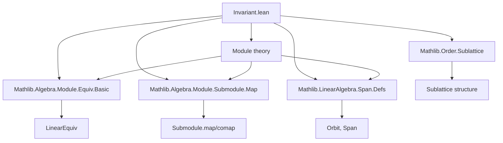

**Technical Brief: `Invariant.lean` — Lattice of Invariant Submodules**

---

### 1. KEY DEFINITIONS & THEOREMS

| Name | Type / Signature | Purpose |
|------|------------------|---------|
| `invtSubmodule` | `def invtSubmodule : Sublattice (Submodule R M)` | Constructs the *sublattice* of all $f$-invariant submodules of $M$, where $f : \mathrm{End}_R(M)$. |
| `mem_invtSubmodule` | `p ∈ f.invtSubmodule ↔ p ≤ p.comap f` | Characterizes membership in the invariant sublattice via inclusion into the comap. |
| `mem_invtSubmodule_iff_map_le` | `p ∈ f.invtSubmodule ↔ p.map f ≤ p` | Equivalent condition using *map* instead of *comap* (via adjunction). |
| `mem_invtSubmodule_iff_mapsTo` | `p ∈ f.invtSubmodule ↔ Set.MapsTo f p p` | Invariance ⇔ $f$ maps $p$ into itself (set-theoretic). |
| `mem_invtSubmodule_iff_forall_mem_of_mem` | `p ∈ f.invtSubmodule ↔ ∀ x ∈ p, f x ∈ p` | Pointwise invariance condition. |
| `mem_invtSubmodule_symm_iff_le_map` | For $f : M \simeq_R M$, $p ∈ f^{-1}\text{-inv} ↔ p ≤ p.map f$ | Invariance under inverse linear equivalence. |
| `inf_mem`, `sup_mem` | `hp hq ⇒ p ⊓ q ∈ f.invtSubmodule`, `p ⊔ q ∈ f.invtSubmodule` | Closure under meet/join in the sublattice. |
| `top_mem`, `bot_mem` | `⊤, ⊥ ∈ f.invtSubmodule` | Trivial invariant submodules always exist. |
| `zero`, `id`, `one` | `(0 : End R M).invtSubmodule = ⊤`, etc. | Full module is invariant under zero, identity, or unit endomorphisms. |
| `map_subtype_mem_of_mem_invtSubmodule` | Restriction + map preserves invariance | If $q$ is invariant under `restrict f hp`, then its image in $M$ is $f$-invariant. |
| `comp` | $p$ invariant under $f$ and $g$ ⇒ $p$ invariant under $f \circ g$ | Closure under composition of commuting endomorphisms. |
| `map_mem_invtSubmodule_conj_iff` | $p.map\ e ∈ (e.conj\ f).invtSubmodule ↔ p ∈ f.invtSubmodule$ | Invariance is preserved under linear equivalence conjugation. |
| `span_orbit_mem_invtSubmodule` | `span (orbit G x) ∈ (DistribSMul.toLinearMap g).invtSubmodule` | Orbit spans under monoid action are invariant under the associated linear map. |

---

### 2. NAMING CONVENTIONS

- **Prefixes**:
  - `invtSubmodule_`: for lemmas about the invariant sublattice.
  - `mem_invtSubmodule_`: for membership characterizations.
  - `map_mem_invtSubmodule_`, `disjoint_mk_iff`, `isCompl_mk_iff`: properties lifted to the subtype/lattice.
- **Suffixes**:
  - `_iff`: equivalence (↔) statements.
  - `_mem`: membership in the invariant sublattice.
  - `_subtype`, `_mk`: about elements of the subtype `f.invtSubmodule`.
- **Aliases**:
  - `⟨_, _root_.Set.Mapsto.mem_invtSubmodule⟩` — connects `Set.MapsTo` to membership.

---

### 3. TACTIC STACK

| Tactic | Frequency | Role |
|--------|-----------|------|
| `simp` | Very high | Simplifies using definitional equalities, `invtSubmodule`, `Submodule.map_le_iff_le_comap`, etc. |
| `rw` | High | Rewriting using equivalences (`iff` lemmas), especially `mem_invtSubmodule_iff_*`. |
| `intro` / `rintro` | Medium | Introducing hypotheses and destructing existentials. |
| `ext` | Low | Extensionality for linear maps (e.g., in `map_mem_invtSubmodule_conj_iff`). |
| `exact` / `assumption` | Medium | Direct proof steps after simplification. |
| `cases` | Low | Rarely needed due to subtype structure. |
| `apply` | Low | Used in `span_orbit_mem_invtSubmodule` to apply `Submodule.subset_span`. |

---

### 4. PROOF LOGIC

- **Structure**: Proofs are largely *definition-driven* and *equational*, leveraging:
  - Adjointness: `Submodule.map_le_iff_le_comap`.
  - Lattice-theoretic properties: `supClosed'`, `infClosed'` verified via monotonicity and lattice operations.
  - Subtype reasoning: `Subtype.mk_eq_bot_iff`, `disjoint_iff`, etc.
- **Common pattern**:
  1. Unfold `invtSubmodule` via `mem_invtSubmodule`.
  2. Apply `Submodule.map_le_iff_le_comap` to switch between map/comap.
  3. Use `Set.MapsTo` or pointwise quantifiers for element-wise reasoning.
  4. For conjugation lemmas: use `LinearEquiv` identities (`conj`, `map_equiv_eq_comap_symm`, `comap_comp`).
- **Induction**: Not used — all proofs are algebraic/structural.

---

### 5. IMPORTS & DEPENDENCIES

| Module | Purpose |
|--------|---------|
| `Mathlib.Algebra.Module.Equiv.Basic` | Linear equivalences (`≃ₗ`), conjugation, `conj`. |
| `Mathlib.Algebra.Module.Submodule.Map` | `map`, `comap`, monotonicity, adjunction. |
| `Mathlib.LinearAlgebra.Span.Defs` | `span`, `subset_span`, orbit definitions. |
| `Mathlib.Order.Sublattice` | `Sublattice`, `supClosed'`, `infClosed'`, `Sublattice.mk_inf_mk`, etc. |

**Core ambient theory**:  
Modules over semirings, submodule lattice, linear maps, monoid actions, orbit-span constructions.

---

### 6. MERMAID DIAGRAMS

#### Dependency Graph (High-Level)



#### Overview of `Invariant.lean`

```mermaid
flowchart LR
  A[End R M] --> B[invtSubmodule f]
  B --> C[Sublattice of Submodule R M]
  C --> D[carrier = {p | p ≤ p.comap f}]
  D --> E[Closed under ⊔, ⊓]
  D --> F[Top/Bottom elements]
  D --> G[Disjointness, Complement, Codisjointness preserved]

  B --> H[Equivalence with p.map f ≤ p]
  B --> I[Equivalence with Set.MapsTo f p p]
  B --> J[Orbit-span invariance]
  B --> K[Conjugation invariance]
```

---

### 7. THEORY SCOPE

- **Primary domain**: Module theory with endomorphisms and invariant substructures.
- **Secondary connections**:
  - Group/monoid representations (via `DistribMulAction`, `orbit`).
  - Linear algebra over semirings (no division assumed).
  - Lattice theory (sublattice of invariant submodules).
- **Intended use**: To support decomposition arguments (e.g., primary decomposition, cyclic submodules), especially where lattice structure of invariant submodules is needed (e.g., in representation theory or module classification).

---

### 8. RELATION TO OTHER FILES

- **Related**: `Mathlib/Algebra/Polynomial/Module/AEval.lean` (mentioned in docstring) — uses `invtSubmodule` for action of `X` (multiplication by indeterminate).
- **Complements**:
  - `Module.End.MinPoly`, `CharPoly`: where invariant submodules help define cyclic vectors.
  - `Module.TorsionSubmodule`, `PrimaryDecomposition`: rely on invariant submodule lattices.

--- 

**End of Brief**
