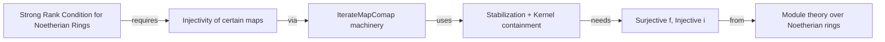

### Technical Brief: `IterateMapComap.lean`

---

#### **1. Key Definitions & Theorems**

| Name | Type / Signature | Purpose |
|------|------------------|---------|
| `iterateMapComap` | `def iterateMapComap (n : ℕ) := (fun K ↦ K.map i .comap f)^[n]` | Iteratively applies `map i` then `comap f`, $n$ times, starting from a submodule $K \leq N$. |
| `iterateMapComap_le_succ` | `K.map f ≤ K.map i → f.iterateMapComap i n K ≤ f.iterateMapComap i (n+1) K` | Monotonicity: if $f(K) \subseteq i(K)$, then the sequence is non-decreasing. |
| `iterateMapComap_eq_succ` | `f.iterateMapComap i m K = f.iterateMapComap i (m+1) K → (∀ n, f.iterateMapComap i n K = f.iterateMapComap i (n+1) K)` | Stabilization: under surjectivity of $f$ and injectivity of $i$, equality at one step implies equality at all steps. |
| `ker_le_of_iterateMapComap_eq_succ` | `f.iterateMapComap i m K = f.iterateMapComap i (m+1) K → ker f ≤ K` | Key consequence: kernel of $f$ lies in $K$, especially yielding injectivity of $f$ when $K = 0$. |

---

#### **2. Naming Conventions**

- **Prefixes**:
  - `iterateMapComap_`: for definitions and theorems about the iterated map-comap construction.
- **Suffixes**:
  - `_le_succ`: monotonicity (inequality with successor).
  - `_eq_succ`: stabilization (equality with successor).
  - `_of_...`: derived consequences (e.g., `ker_le_of_...`).
- **Function names**:
  - `map`, `comap`: standard module homomorphism image/preimage operations.
  - `iterateMapComap`: compound name reflecting the alternating application of `map i` and `comap f`.

---

#### **3. Tactic Stack**

- **Core tactics**:
  - `rw`, `nth_rw`, `simp_rw`: for rewriting using definitions and equalities.
  - `induction`: structural induction on natural numbers.
  - `gcongr`, `calc`: for chaining inequalities.
  - `contrapose!`: for proof by contradiction.
  - `exact`, `intro`, `apply`: basic proof scripting.
- **Library lemmas used**:
  - `map_comap_le`, `le_comap_map`, `map_injective_of_injective`, `comap_injective_of_surjective`, `ker_le_comap`.

---

#### **4. Proof Logic**

- **Monotonicity (`iterateMapComap_le_succ`)**:
  - Induction on $n$.
  - Base case uses hypothesis $f(K) \le i(K)$.
  - Inductive step uses properties of `map` and `comap` (e.g., $A \subseteq B \Rightarrow A.map f \subseteq B.map f$, and adjointness $A.map f \subseteq B \iff A \subseteq B.comap f$).

- **Stabilization (`iterateMapComap_eq_succ`)**:
  - Induction on $n$.
  - Base case uses injectivity/surjectivity to lift equality backwards through iterations.
  - Inductive step uses previous equality and functional composition properties.

- **Kernel containment (`ker_le_of_iterateMapComap_eq_succ`)**:
  - Uses `iterateMapComap_eq_succ` at $n = 0$ to reduce to $f^{-1}(i(K)) = K$, then applies `ker_le_comap`.

- **Overall strategy**:
  - Leverage categorical adjunction between `map` and `comap`.
  - Use induction and functional iteration properties.
  - Exploit injectivity/surjectivity to invert or lift inclusions/equalities.

---

#### **5. Imports**

- `Mathlib.Algebra.Module.Submodule.Ker`: provides foundational lemmas about kernels and their relation to `comap`, especially `ker_le_comap`.

---

#### **6. Mermaid Diagrams**

##### **Dependency Graph (Module-Level)**

```mermaid
graph TD
  A[IterateMapComap.lean] --> B[Mathlib.Algebra.Module.Submodule.Ker]
  A --> C[Mathlib.Algebra.Module.Submodule.MapComap]  %% implicit via `map`, `comap`
  A --> D[Mathlib.Algebra.Module.Module] %% for `AddCommMonoid`, `Module` instances
```

##### **Theoretical Flow Overview**

```mermaid
flowchart LR
  K[Submodule K ≤ N] -->|map i| iK[i(K) ≤ M]
  iK -->|comap f| f⁻¹iK[f⁻¹(i(K)) ≤ N]
  f⁻¹iK -->|map i| i(f⁻¹iK)
  i(f⁻¹iK) -->|comap f| f⁻¹i(f⁻¹iK)
  style f⁻¹iK fill:#f9f,stroke:#333
  style iK fill:#bbf,stroke:#333
  classDef step fill:#ddf,stroke:#333;
  class K,f⁻¹iK,i(f⁻¹iK) step;

  subgraph Iteration
    K --> f⁻¹iK --> f⁻¹i(f⁻¹iK) --> ⋯
  end

  Monotonicity[Monotonicity: f(K) ≤ i(K)] -->|⇒| NonDec[Sequence non-decreasing]
  Stabilize[Stabilization: f surj, i inj, equality at m] -->|⇒| AllEqual[Equality at all n]
  AllEqual -->|n=0| KerIn[Ker f ≤ K]
  KerIn -->|K=0| Injective[f injective]
```

##### **Role in Strong Rank Condition (SRC)**



---

#### **7. Summary**

This module formalizes a key technical construction used in proving the **strong rank condition** for Noetherian rings, following Djoković’s argument. It defines an iterated construction combining image and preimage along two linear maps, analyzes its monotonicity and stabilization behavior, and derives injectivity of $f$ under suitable conditions. The formalization is clean, modular, and leverages Lean’s `map`/`comap` interface for submodule operations.
