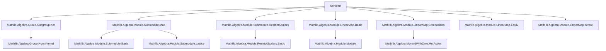
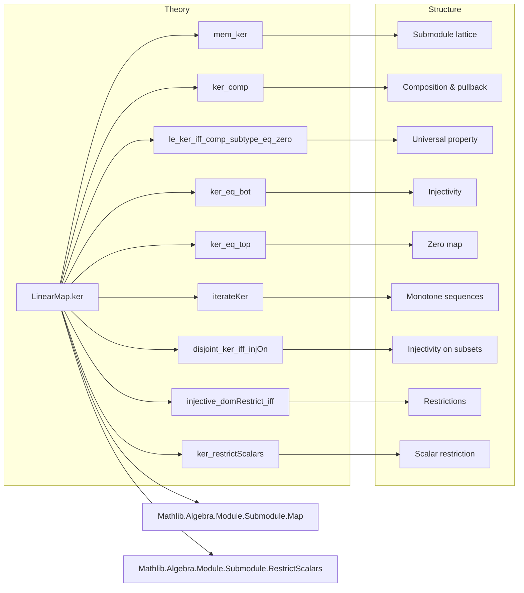

### Technical Brief: `Ker.lean` — Kernel of a Linear Map in Mathlib

---

#### **1. Key Definitions & Theorems**

| Name | Type | Purpose |
|------|------|---------|
| `LinearMap.ker` | `f : M →ₛₗ[τ₁₂] M₂ ↦ Submodule R M` | Defines the kernel of a semilinear map as `comap f ⊥`, i.e., the preimage of the zero submodule. |
| `mem_ker` | `y ∈ ker f ↔ f y = 0` | Characterizes membership in the kernel. |
| `ker_id` | `ker (id : M →ₗ[R] M) = ⊥` | Identity map has trivial kernel. |
| `ker_comp` | `ker (g.comp f) = comap f (ker g)` | Kernel of composition pulls back kernel of second map. |
| `ker_le_ker_comp` | `ker f ≤ ker (g.comp f)` | Inclusion of kernels under composition. |
| `ker_sup_ker_le_ker_comp_of_commute` | `ker f ⊔ ker g ≤ ker (f ∘ₗ g)` if `f, g` commute | Relates sup of kernels to kernel of product. |
| `le_ker_iff_comp_subtype_eq_zero` | `N ≤ ker f ↔ f ∘ₛₗ N.subtype = 0` | Universal property of kernel as largest submodule killed by `f`. |
| `ker_eq_bot'` / `ker_eq_bot` | `ker f = ⊥ ↔ ∀ m, f m = 0 → m = 0` / ↔ `Injective f` | Kernel trivial iff map is injective. |
| `ker_eq_top` | `ker f = ⊤ ↔ f = 0` | Kernel is full module iff map is zero. |
| `ker_zero` | `ker (0 : M →ₛₗ[τ₁₂] M₂) = ⊤` | Zero map has full kernel. |
| `iterateKer` | `ℕ →o Submodule R M` | Monotone sequence of kernels of iterates: `n ↦ ker(fⁿ)`. |
| `disjoint_ker_iff_injOn` | `Disjoint p (ker f) ↔ Set.InjOn f p` | Kernel disjoint from submodule `p` iff `f` injective on `p`. |
| `injective_domRestrict_iff` | `Injective (f.domRestrict S) ↔ S ⊓ ker f = ⊥` | Restriction to submodule is injective iff intersection with kernel is trivial. |
| `injective_restrict_iff_disjoint` | `Injective (f.restrict hf) ↔ Disjoint p (ker f)` | Restriction to invariant submodule is injective iff kernel disjoint from submodule. |
| `LinearEquiv.ker` | `ker (e : M ≃ₛₗ[σ₁₂] M₂) = ⊥` | Linear equivalence has trivial kernel (injective). |
| `ker_restrictScalars` | `ker (f.restrictScalars R) = (ker f).restrictScalars R` | Kernel commutes with restriction of scalars. |

---

#### **2. Naming Conventions**

- **Prefixes**:
  - `ker_`: kernel-related lemmas (e.g., `ker_comp`, `ker_eq_bot`, `ker_zero`)
  - `comap_`: preimage under map (e.g., `comap_bot`, `comap_smul`)
  - `map_`: image under map (e.g., `map_coe_ker`)
  - `disjoint_`: disjointness lemmas (e.g., `disjoint_ker`, `disjoint_ker_iff_injOn`)
  - `le_`: inclusion lemmas (e.g., `le_ker_iff_comp_subtype_eq_zero`, `ker_le_ker_comp`)
  - `injective_`: injectivity ↔ kernel conditions (e.g., `injective_domRestrict_iff`, `injective_restrict_iff_disjoint`)
  - `exists_ne_zero_of_sSup_eq_top`: existential lemmas for nonzero behavior.

- **Suffixes**:
  - `_of_ker_eq_bot`: conditional on trivial kernel.
  - `_iff_*`: biconditional characterizations.
  - `_subtype`, `_inclusion`, `_domRestrict`, `_codRestrict`, `_restrict`, `_restrictScalars`: structural operations on maps.

---

#### **3. Tactic Stack**

Frequent tactics used in proofs:

- `rw` / `simp`: for rewriting using `mem_ker`, `ker_*`, `comap_*`, `Submodule` lemmas.
- `rfl`: for definitional equalities (`ker_id`, `ker_zero`, etc.).
- `exact`, `intro`, `apply`, `have`, `obtain`: standard intro/elimination.
- `ext`: extensionality for maps (`LinearMap.ext`).
- `simp only`, `simp_rw`: targeted simplification (e.g., `simp_rw [← ker_eq_top]`).
- `cases'`, `obtain ⟨c, rfl⟩`: decomposition (e.g., `Nat.exists_eq_add_of_le`).
- `monotone*`, `exact h`, `refine`: monotonicity and construction.
- `contrapose!`: contrapositive reasoning (e.g., `exists_ne_zero_of_sSup_eq_top`).
- `ring`, `aesop`: for ring-theoretic simplifications (less frequent, but present in `ker_smul`).

---

#### **4. Proof Logic**

- **Structure**:
  - Most proofs follow a *definition → characterization → universal property → structural behavior* pattern.
  - **Induction** appears only in `iterateKer.monotone`, where monotonicity is shown via `Nat.exists_eq_add_of_le`.
  - **Case analysis** on `Submodule` membership (e.g., `x ∈ ker f` ↔ `f x = 0`) is standard.
  - **Equational reasoning** with `rw`, `simp`, and `ext` dominates.
  - **Disjointness/injectivity equivalences** are proven via `disjoint_def`, `injOn_iff_map_eq_zero`, and `ker_eq_bot`.
  - **Universal properties** (e.g., `le_ker_iff_comp_subtype_eq_zero`) are proven by unfolding definitions and applying `Subtype.forall`.

- **Common proof skeleton**:
  ```lean
  rw [ker_comp, hg, Submodule.comap_bot]
  -- or
  rw [← ker_eq_bot]; intro x ⟨hx, h'x⟩; ...
  ```

---

#### **5. Imports**

| Import | Purpose |
|--------|---------|
| `Mathlib.Algebra.Group.Subgroup.Ker` | Background on kernels of group homomorphisms (used for `AddMonoidHom.mker`). |
| `Mathlib.Algebra.Module.Submodule.Map` | Definitions of `map`, `comap`, `subtype`, `inclusion`, `restrictScalars`, etc. |
| `Mathlib.Algebra.Module.Submodule.RestrictScalars` | Scalar restriction and its interaction with modules/maps. |

---

#### **6. Theory Overview & Dependencies**

##### **Mermaid Diagram: Dependency Graph**



##### **Mermaid Diagram: File Overview**



---

#### **7. Role in Mathlib**

- **Central role** in linear algebra over modules: kernel is the foundational notion for injectivity, exact sequences, and quotient constructions.
- **Bridges**:
  - Module theory ↔ Group theory (`ker_toAddSubmonoid`, `ker_toAddSubgroup`)
  - Ring theory ↔ Module theory (`ker_eq_bot`, `ker_eq_top`)
  - Linear maps ↔ Submodule lattice (`ker_comp`, `le_ker_iff_comp_subtype_eq_zero`)
  - Semilinear ↔ Linear (`ker_restrictScalars`, `ker_smul`)
- **Used in**:
  - Exact sequences (`Mathlib.Algebra.Module.Exact`)
  - First isomorphism theorem (`Mathlib.Algebra.Module.FirstIsomorphism`)
  - Dual spaces, cokernels, homology.

---

#### **8. Notable Design Choices**

- **Definition**: `ker f := comap f ⊥` — avoids set-theoretic constructions and leverages `Submodule.comap`’s lattice-theoretic properties.
- **No separate `AddSubgroup.ker`**: Uses `ker_toAddSubmonoid`/`ker_toAddSubgroup` to relate to additive group kernels.
- **Semilinearity support**: Works uniformly for `τ₁₂ : R →+* R₂`, enabling base change and twisted actions.
- **Monotone `iterateKer`**: Encodes ascending chain condition intuition (e.g., nilpotency, generalized eigenspaces).

--- 

Let me know if you'd like a formalization of the first isomorphism theorem built on top of this file, or a visualization of how `ker` interacts with pullbacks/pushouts.
