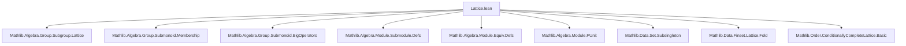
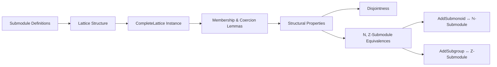

### Technical Brief: `Lattice.lean` — Lattice Structure on Submodules

---

#### **1. Key Definitions & Theorems**

| Name | Type / Signature | Purpose |
|------|------------------|---------|
| `⊥` | `Bot (Submodule R M)` | Bottom element: the zero submodule `{0}` |
| `⊤` | `Top (Submodule R M)` | Top element: the universal submodule `Set.univ` |
| `p ⊓ q` | `Min (Submodule R M)` | Infimum: intersection of submodules |
| `p ⊔ q` | `sup p q := sInf { x | p ≤ x ∧ q ≤ x }` | Supremum: smallest submodule containing both `p` and `q` |
| `sInf S` | `InfSet (Submodule R M)` | Intersection over a family `S : Set (Submodule R M)` |
| `sSup S` | `sSup S := sInf { m | ∀ s ∈ S, s ≤ m }` | Smallest submodule containing all `s ∈ S` |
| `completeLattice` | `CompleteLattice (Submodule R M)` | Establishes that submodules form a complete lattice |
| `bot_coe` | `↑(⊥ : Submodule R M) = {0}` | Coercion of bottom to underlying set |
| `top_coe` | `↑(⊤ : Submodule R M) = Set.univ` | Coercion of top to underlying set |
| `coe_inf` | `↑(p ⊓ q) = p ∩ q` | Coercion of infimum is intersection |
| `mem_inf` | `x ∈ p ⊓ q ↔ x ∈ p ∧ x ∈ q` | Membership in intersection |
| `coe_sInf` | `↑(sInf S) = ⋂ p ∈ S, ↑p` | Coercion of arbitrary infimum |
| `mem_sInf` | `x ∈ sInf S ↔ ∀ p ∈ S, x ∈ p` | Membership in arbitrary infimum |
| `botEquivPUnit` | `(⊥ : Submodule R M) ≃ₗ[R] PUnit` | Bottom submodule is linearly equivalent to `PUnit` |
| `topEquiv` | `(⊤ : Submodule R M) ≃ₗ[R] M` | Top submodule is linearly equivalent to the module |
| `subsingleton_iff_eq_bot` | `Subsingleton p ↔ p = ⊥` | Subsingleton submodule iff zero |
| `eq_bot_iff` | `p = ⊥ ↔ ∀ x ∈ p, x = 0` | Characterization of zero submodule |
| `disjoint_def` | `Disjoint p p' ↔ ∀ x ∈ p, x ∈ p' → x = 0` | Disjointness criterion for submodules |
| `AddSubmonoid.toNatSubmodule` | `AddSubmonoid M ≃o Submodule ℕ M` | Equivalence between additive submonoids and `ℕ`-submodules |
| `AddSubgroup.toIntSubmodule` | `AddSubgroup M ≃o Submodule ℤ M` | Equivalence between additive subgroups and `ℤ`-submodules |

---

#### **2. Naming Conventions**

- **Prefixes**:
  - `bot_`: properties of the bottom element (`⊥`)
  - `top_`: properties of the top element (`⊤`)
  - `mem_`: membership characterizations
  - `coe_`: coercion to underlying set
  - `subsingleton_`, `nontrivial_`: structural properties
  - `disjoint_`: disjointness-related lemmas
  - `toAddSubmonoid_`, `toAddSubgroup_`: relations to additive structures

- **Suffixes**:
  - `_iff`: biconditional characterizations (e.g., `eq_bot_iff`, `mem_bot`)
  - `_ext`: extensionality principles (e.g., `bot_ext`)
  - `_induction'`: induction principles (used internally in proofs)
  - `_def`, `_def'`: definitions or alternative forms (e.g., `disjoint_def`, `disjoint_def'`)

- **Notable patterns**:
  - `mk carrier smul_mem' = ⊥/⊤`: characterizations of bottom/top via construction
  - `toAddSubmonoid_inj`, `toAddSubgroup_inj`: injectivity of forgetful functors

---

#### **3. Tactic Stack**

Frequently used tactics in this file:

| Tactic | Usage |
|--------|-------|
| `simp` | Simplification of set-theoretic and algebraic expressions (e.g., `zero_mem`, `smul_mem`) |
| `rw` | Rewriting using equalities (especially `coe_`, `mem_`, `eq_` lemmas) |
| `exact` / `assumption` | Direct proof steps |
| `apply` | Applying lemmas (e.g., `le_sInf'`, `sInf_le'`) |
| `refine` | Partial proof construction with holes |
| `induction` | Structural induction (e.g., `iSup_induction'`) |
| `subsingleton` | Proving subsingleton instances |
| `ext` | Extensionality (e.g., `Subtype.ext`) |
| `aesop` | Not used here — file is mostly manual |
| `set_option backward.privateInPublic true` | Used to allow private definitions in public contexts (for internal lemmas) |

---

#### **4. Proof Logic**

- **Structure**: The file proceeds in three main sections:
  1. **Lattice structure on submodules**:
     - Define `⊥`, `⊤`, `⊔`, `⊓`, `sInf`, `sSup`
     - Prove `CompleteLattice` instance via `sInf`-based construction
     - Prove coercion lemmas (`coe_inf`, `coe_sInf`, etc.)
     - Prove membership lemmas (`mem_inf`, `mem_sInf`, etc.)
     - Prove algebraic properties (e.g., `add_mem_sup`, `sum_mem_iSup`)
  2. **Structural properties**:
     - `subsingleton_iff_eq_bot`, `eq_bot_iff`, `nontrivial_iff`
     - `botEquivPUnit`, `topEquiv`
     - `disjoint_def`, `eq_zero_of_coe_mem_of_disjoint`
  3. **Special cases**:
     - `ℕ`-submodules ↔ additive submonoids (`AddSubmonoid.toNatSubmodule`)
     - `ℤ`-submodules ↔ additive subgroups (`AddSubgroup.toIntSubmodule`)

- **Common proof patterns**:
  - **Set-theoretic reasoning**: many proofs reduce to set equalities/inclusions via coercion lemmas.
  - **Lattice-theoretic reasoning**: use of `sInf`/`sSup` definitions and monotonicity.
  - **Equivalence proofs**: often via `le_antisymm` or `Subtype.ext`.
  - **Induction on algebraic constructions**: e.g., `iSup_induction'` for `⨅`.

---

#### **5. Imports**

| Module | Purpose |
|--------|---------|
| `Mathlib.Algebra.Group.Subgroup.Lattice` | Lattice structure on subgroups |
| `Mathlib.Algebra.Group.Submonoid.Membership` | Membership lemmas for submonoids |
| `Mathlib.Algebra.Group.Submonoid.BigOperators` | Summation lemmas for submonoids |
| `Mathlib.Algebra.Module.Submodule.Defs` | Basic definitions of submodules |
| `Mathlib.Algebra.Module.Equiv.Defs` | Linear equivalences |
| `Mathlib.Algebra.Module.PUnit` | Module structure on `PUnit` |
| `Mathlib.Data.Set.Subsingleton` | Subsingleton set properties |
| `Mathlib.Data.Finset.Lattice.Fold` | Finite lattice operations |
| `Mathlib.Order.ConditionallyCompleteLattice.Basic` | Basic order theory (used for `sInf`/`sSup`) |

---

#### **6. Mermaid Diagrams**

##### **Dependency Graph (Top-Level)**



##### **Overview of Theory Flow**



##### **Lattice Structure Hierarchy**

```mermaid
graph TD
  Bot[Bot: ⊥ = {0}] --> OrderBot[OrderBot]
  Top[Top: ⊤ = univ] --> OrderTop[OrderTop]
  Inf[Inf: p ⊓ q = p ∩ q] --> Min[Min]
  Sup[Sup: p ⊔ q = sInf {x | p ≤ x ∧ q ≤ x}] --> CompleteLattice[CompleteLattice]
  OrderBot --> CompleteLattice
  OrderTop --> CompleteLattice
  Min --> CompleteLattice
  CompleteLattice --> MemLemmas
```

---

#### **7. Summary**

This file formalizes the **complete lattice structure** on submodules of a module over a semiring. It defines `⊥`, `⊤`, `⊔`, `⊓`, and arbitrary infima/suprema, proves their correctness via coercion and membership lemmas, and connects them to structural properties like subsingleness and disjointness. It also establishes equivalences between additive substructures and submodules over `ℕ` and `ℤ`, aligning with the broader algebraic hierarchy in Mathlib.

The file exemplifies Lean’s strength in **unifying algebraic and order-theoretic structures**, with careful attention to **coherence with existing additive monoid/group/lattice infrastructure**.
