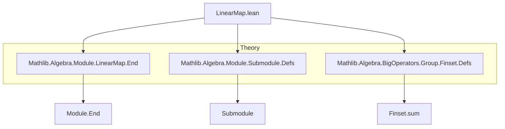
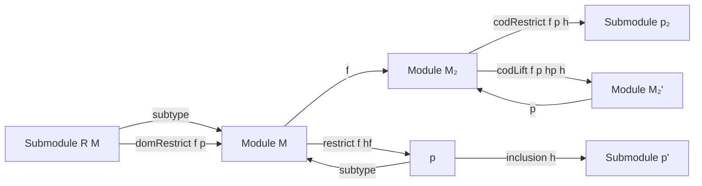

### Technical Brief: `LinearMap.lean` Module

---

#### **1. Key Definitions & Theorems**

| Name | Type | Purpose |
|------|------|---------|
| `SMulMemClass.subtype` | `S' →ₗ[R] M` | Natural linear embedding of a submodule-like type `S'` (e.g., `Submodule`) into the ambient module `M`. |
| `Submodule.subtype` | `p →ₗ[R] M` | Embedding of a submodule `p ≤ M` into `M`. |
| `LinearMap.domRestrict` | `f : M →ₛₗ[σ₁₂] M₂` ↦ `f.domRestrict p : p →ₛₗ[σ₁₂] M₂` | Restricts the domain of a semilinear map to a submodule of its domain. |
| `LinearMap.codRestrict` | `(p : Submodule R₂ M₂) → (∀ c, f c ∈ p) → M →ₛₗ[σ₁₂] p` | Restricts the codomain of a semilinear map to a submodule containing its range. |
| `LinearMap.codLift` | `(p : M₂' →ₗ[R₂] M₂) → Injective p → (∀ c, f c ∈ range p) → M →ₛₗ[σ₁₂] M₂'` | Lifts a map into `M₂` through an injective linear map `p` when its image lies in `range p`. |
| `LinearMap.restrict` | `f : M →ₗ[R] M₁`, `hf : ∀ x ∈ p, f x ∈ q` ↦ `f.restrict hf : p →ₗ[R] q` | Simultaneously restricts domain and codomain of a linear map to submodules. |
| `Submodule.inclusion` | `h : p ≤ p'` ↦ `inclusion h : p →ₗ[R] p'` | The linear map version of submodule inclusion. |

**Key Theorems**:
- `subtype_injective`, `coe_subtype`: `subtype` is injective and equal to `Subtype.val`.
- `domRestrict_apply`, `codRestrict_apply`, `restrict_apply`: Computational lemmas for applied values.
- `subtype_comp_restrict`, `restrict_eq_codRestrict_domRestrict`: Factorization lemmas.
- `restrict_commute`, `restrict_smul_one`, `pow_restrict`: Preservation of algebraic structure under restriction.
- `Module.End.pow_apply_mem_of_forall_mem`, `Module.End.pow_restrict`: Behavior of powers under invariance.

---

#### **2. Naming Conventions**

| Pattern | Meaning | Examples |
|--------|---------|----------|
| `subtype` | Canonical embedding of a submodule into ambient module | `Submodule.subtype`, `SMulMemClass.subtype` |
| `domRestrict` / `codRestrict` | Restriction of domain/codomain | `LinearMap.domRestrict`, `LinearMap.codRestrict` |
| `codLift` | Lift through injective codomain embedding | `LinearMap.codLift` |
| `restrict` | Joint domain/codomain restriction | `LinearMap.restrict` |
| `inclusion` | Submodule inclusion as linear map | `Submodule.inclusion` |
| `coe_` prefix | Equality of bundled map with underlying function | `coe_subtype`, `coe_domRestrict`, `coe_inclusion` |
| `apply` suffix | Computational behavior on elements | `subtype_apply`, `restrict_apply`, `inclusion_apply` |

---

#### **3. Tactic Stack**

Frequently used tactics in proofs:
- `rfl`, `ext`, `simp`, `simp_rw`: For definitional equalities and extensionality.
- `apply`, `have`, `simpa`: For constructing and simplifying intermediate goals.
- `induction ... with | zero | succ`: For induction on natural numbers.
- `congr 1`: For congruence of function equality.
- `rw [← ..., hG, zero_comp, zero_apply]`: Rewriting with algebraic identities and zero morphism properties.

---

#### **4. Proof Logic**

**Typical proof structure**:
1. **Extensionality**: Prove equality of linear maps via `ext x`, reducing to element-wise equality.
2. **Definitional unfolding**: Use `simp` or `rfl` to reduce definitions (e.g., `domRestrict`, `restrict`).
3. **Induction**: For properties involving powers or finite sums (e.g., `pow_restrict`, `coe_sum`).
4. **Lifting via injectivity**: Use `codLift` with `choose_spec` and injectivity to verify linearity.
5. **Submodule membership**: Use `h x.1 x.2` or `h c` to witness membership in submodules.

**Example flow** for `restrict_commute`:
- Expand `Commute` definition → reduce to `f.restrict hf ∘ g.restrict hg = g.restrict hg ∘ f.restrict hf`.
- Use `restrict_apply` and `commute` hypothesis to rewrite both sides.
- Apply `ext` and simplify.

---

#### **5. Imports**

| Import | Purpose |
|--------|---------|
| `Mathlib.Algebra.Module.LinearMap.End` | Endomorphism ring and related structures. |
| `Mathlib.Algebra.Module.Submodule.Defs` | Submodule definitions and basic operations. |
| `Mathlib.Algebra.BigOperators.Group.Finset.Defs` | Finite sum lemmas (e.g., `map_sum`). |

---

#### **8. Mermaid Diagrams**

##### **Dependency Graph (Module-Level)**



##### **Overview of Theory Flow**



##### **Core Construction Pipeline**

```mermaid
flowchart LR
  f[M →ₗ M₂] --> domRestrict[domRestrict p]
  p[Submodule p] --> subtype[M]
  domRestrict --> f|p[p →ₗ M₂]

  f --> codRestrict[codRestrict p h]
  h[∀x, f x ∈ p] --> codRestrict
  codRestrict --> f|p[p →ₗ p]

  f|p --> restrict[restrict hf]
  hf[∀x ∈ p, f x ∈ q] --> restrict
  restrict --> f|p[q ← p]

  p --> inclusion[inclusion h]
  h[p ≤ p'] --> inclusion
  inclusion --> p'[p' →ₗ M]
```

---

This module formalizes foundational constructions for manipulating linear maps relative to submodules, enabling reasoning about invariance, restriction, and lifting in module theory. It serves as a basis for more advanced structures like module endomorphism rings, annihilators, and quotient modules.
