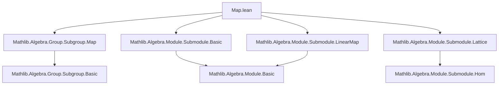

**Technical Brief: `Map.lean` — Submodule `map` and `comap` in Lean 4 / Mathlib**

---

### 1. Key Definitions & Theorems

| Name | Type / Signature | Purpose |
|------|------------------|---------|
| `Submodule.map` | `map (f : M →ₛₗ[σ₁₂] M₂) (p : Submodule R M) : Submodule R₂ M₂` | Pushforward of a submodule along a semilinear map `f`. |
| `Submodule.comap` | `comap (f : M →ₛₗ[σ₁₂] M₂) (q : Submodule R₂ M₂) : Submodule R M` | Pullback (preimage) of a submodule along `f`. |
| `mem_map` | `x ∈ map f p ↔ ∃ y, y ∈ p ∧ f y = x` | Membership characterization of `map`. |
| `mem_comap` | `x ∈ comap f q ↔ f x ∈ q` | Membership characterization of `comap`. |
| `map_id` | `map (LinearMap.id) p = p` | Identity preservation of `map`. |
| `comap_id` | `comap (LinearMap.id) q = q` | Identity preservation of `comap`. |
| `map_comp` | `map (g.comp f) p = map g (map f p)` | Functoriality of `map`. |
| `comap_comp` | `comap (g.comp f) q = comap f (comap g q)` | Functoriality of `comap`. |
| `map_le_iff_le_comap` | `map f p ≤ q ↔ p ≤ comap f q` | Adjunction (Galois connection) between `map` and `comap`. |
| `gc_map_comap` | `GaloisConnection (map f) (comap f)` | `map ⊣ comap` forms a Galois connection. |
| `giMapComap` | `Surjective f → GaloisInsertion (map f) (comap f)` | When `f` is surjective, `map ⊣ comap` is a *Galois insertion*. |
| `gciMapComap` | `Injective f → GaloisCoinsertion (map f) (comap f)` | When `f` is injective, `map ⊣ comap` is a *Galois coinsertion*. |
| `equivMapOfInjective` | `Injective f → p ≃ₛₗ[σ₁₂] p.map f` | Injective `f` induces a linear equivalence between `p` and its image. |
| `orderIsoMapComap` | `M ≃ₛₗ[σ₁₂] M₂ → Submodule R M ≃o Submodule R₂ M₂` | A linear equivalence induces an *order isomorphism* of submodules. |
| `map_equiv_eq_comap_symm` | `p.map e = p.comap e.symm` | For linear equivalence `e`, `map e = comap e.symm`. |
| `compatibleMaps` | `{ f : N →ₗ[R] N₂ | p ≤ comap f q }` | Submodule of linear maps preserving a pair of submodules. |

---

### 2. Naming Conventions

- **Prefixes**:
  - `map_`: operations involving pushforward (`map`, `map_coe`, `map_id`, `map_comp`, `map_mono`, `map_sup`, `map_iSup`, `map_bot`, `map_zero`, `map_neg`, `map_smul`, `map_inf`, `map_iInf`, `map_codRestrict`, `map_equiv`, `map_eq_bot_iff`, `map_ne_bot_iff`, etc.)
  - `comap_`: operations involving pullback (`comap`, `comap_coe`, `comap_id`, `comap_comp`, `comap_mono`, `comap_inf`, `comap_iInf`, `comap_top`, `comap_zero`, `comap_neg`, `comap_smul`, `comap_equiv`, etc.)
  - `submoduleMap`, `submoduleComap`: induced maps on submodules.
  - `equivMapOfInjective`, `submoduleMap` (in `LinearEquiv`): induced equivalences.

- **Suffixes**:
  - `_eq_of_surjective`, `_eq_of_injective`: equalities under surjectivity/injectivity.
  - `_of_surjective`, `_of_injective`: properties (e.g., `map_surjective_of_surjective`, `comap_injective_of_surjective`).
  - `_iff`: characterizations of order-theoretic properties (`map_le_map_iff_of_injective`, `comap_le_comap_iff_of_surjective`, `map_lt_map_iff_of_injective`, etc.).
  - `compatibleMaps`: “compatible with” submodules.

- **Special**:
  - `giMapComap`, `gciMapComap`: Galois (co)insertion constructors.
  - `orderIsoMapComap`, `orderIsoMapComapOfBijective`: order isomorphisms.

---

### 3. Tactic Stack

Frequently used tactics in proofs:

| Tactic | Role |
|--------|------|
| `simp` | Simplifying membership, `coe`, `image`, `preimage`, `map`, `comap`, `sup`, `inf`, `iSup`, `iInf`. |
| `rw` | Rewriting using lemmas like `mem_map`, `mem_comap`, `map_id`, `map_comp`, `gc_map_comap`, etc. |
| `ext` | Extensionality for submodules (proving equality by extensional membership). |
| `rfl` | Reflexivity for definitional equalities (e.g., `map_coe`, `comap_coe`). |
| `exact` / `assumption` | Immediate proof steps. |
| `intro` / `rintro` / `rcases` | Introducing hypotheses and destructing existentials/conjunctions. |
| `cases` | Case analysis on `a = 0` or surjectivity/injectivity. |
| `induction` | Induction on natural numbers (e.g., `le_comap_pow_of_le_comap`). |
| `apply` / `refine` | Applying lemmas or constructing proofs with holes. |
| `aesop` | Not used heavily here — proofs are mostly manual and structural. |
| `ring` | Not used — arithmetic is mostly in semirings/modules, not rings. |
| `set_like.coe_injective` | Proving submodule equality via coercion to sets. |
| `Set.image_subset_iff`, `image_inter_subset`, `image_preimage_eq_of_subset` | Set-theoretic lemmas for `map`. |
| `le_antisymm` | Proving submodule inclusions by double inequality. |

---

### 4. Proof Logic

The logical flow across most proofs follows this pattern:

1. **Extensionality**: Prove submodule equality via `ext`, reducing to membership statements.
2. **Membership Rewriting**: Use `mem_map` / `mem_comap` to reduce to set-theoretic membership.
3. **Set-Theoretic Reasoning**: Use `image`, `preimage`, `subset`, `image_inter`, `image_comp`, `image_preimage_eq_of_subset`, etc.
4. **Case Analysis**:
   - On `a = 0` for scalar multiplication lemmas (`map_smul`, `comap_smul`).
   - On injectivity/surjectivity of `f` to apply `giMapComap` / `gciMapComap`.
5. **Galois Theory**:
   - Use `map_le_iff_le_comap` to translate between `map` and `comap`.
   - Lift Galois connections to Galois (co)insertions under extra hypotheses.
6. **Equivalence Construction**:
   - Define maps on underlying types.
   - Prove well-definedness (e.g., `map_smul'`).
   - Prove inverse properties using `equivMapOfInjective`, `submoduleMap`, etc.

Induction appears in:
- `le_comap_pow_of_le_comap`: induction on `k ∈ ℕ`.
- `map_iInf`, `map_iSup`, `comap_iInf`, etc.: use `iInf`/`iSup` definitions and `Set.image_iInter_eq`, `Set.image_iUnion_eq`.

---

### 5. Imports & Dependencies

**Primary Dependencies**:
```lean
Mathlib.Algebra.Group.Subgroup.Map
Mathlib.Algebra.Module.Submodule.Basic
Mathlib.Algebra.Module.Submodule.Lattice
Mathlib.Algebra.Module.Submodule.LinearMap
```

**Key Concepts from Mathlib**:
- `AddSubmonoid.map`, `AddSubmonoid.comap`
- `Subgroup.map`, `Subgroup.comap`
- `GaloisConnection`, `GaloisInsertion`, `GaloisCoinsertion`
- `RingHomSurjective`, `RingHomInvPair`
- `LinearMap`, `SemilinearMap`, `LinearEquiv`
- `Submodule.lattice` (complete lattice structure)
- `Set.image`, `Set.preimage`, `Set.image_inter`, `Set.image_comp`

---

### 6. Mermaid Diagrams

#### Dependency Graph (Module-Level)



#### Theory Overview (Conceptual Flow)

```mermaid
graph LR
  A[Semilinear Maps M →ₛₗ M₂] --> B[map f : Submodule R M → Submodule R₂ M₂]
  A --> C[comap f : Submodule R₂ M₂ → Submodule R M]
  B --> D[map ⊣ comap (Galois Connection)]
  D --> E[Surjective f ⇒ Galois Insertion]
  D --> F[Injective f ⇒ Galois Coinsertion]
  E --> G[orderIsoMapComapOfBijective]
  F --> G
  G --> H[Submodule lattice isomorphism]
  B --> I[equivMapOfInjective]
  C --> J[submoduleComap, submoduleMap]
  I --> K[Submodule equivalence]
  J --> L[Induced maps on submodules]
```

#### Lattice-Theoretic Structure

```mermaid
graph LR
  A[Submodule R M] -->|map f| B[Submodule R₂ M₂]
  B -->|comap f| A
  A <-->|gc_map_comap| A
  B <-->|gc_map_comap| B
  A -.->|giMapComap (surj f)| B
  B -.->|gciMapComap (inj f)| A
  A <==|orderIsoMapComap| B
```

---

### 7. Summary

`Map.lean` formalizes the categorical behavior of submodules under linear (and semilinear) maps. It establishes:

- **Pushforward (`map`)** and **pullback (`comap`)** as adjoint functors (`map ⊣ comap`).
- **Galois (co)insertions** under surjectivity/injectivity, enabling lattice-theoretic lifting/lowering.
- **Equivalences** between submodules and their images under injective maps.
- **Order isomorphisms** induced by linear equivalences.
- **Computational lemmas** for `map`/`comap` over sums, infima, suprema, scalar multiplication, etc.

This file is foundational for module theory in Mathlib, especially in contexts involving quotient modules, dual modules, invariant submodules, and module homomorphism lattices.

--- 

*End of Technical Brief.*
