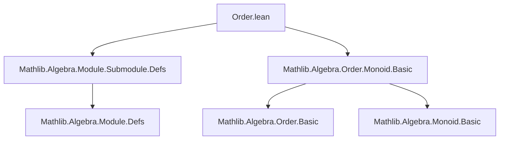
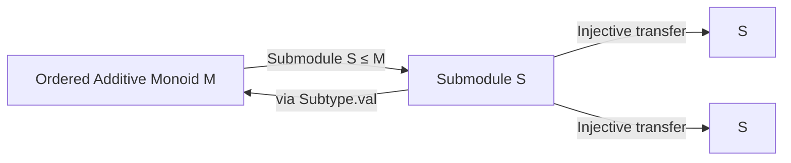

**Technical Brief: `Order.lean` — Ordered Instances on Submodules**

---

### 1. KEY DEFINITIONS & THEOREMS

| Name | Type | Purpose |
|------|------|---------|
| `toIsOrderedAddMonoid` | `IsOrderedAddMonoid S` | Shows that a submodule `S` of an ordered additive monoid `M` inherits the structure of an ordered additive monoid via the injective map `Subtype.val : S → M`. |
| `toIsOrderedCancelAddMonoid` | `IsOrderedCancelAddMonoid S` | Shows that a submodule `S` of an ordered *cancellative* additive monoid `M` inherits the structure of an ordered cancellative additive monoid, again via `Subtype.val`. |

Both are **instance proofs**, not theorems in the usual sense — they construct instances of typeclass `IsOrderedAddMonoid` and `IsOrderedCancelAddMonoid` on the subtype `S` (i.e., the submodule), using the `Function.Injective.isOrderedAddMonoid` and `Function.Injective.isOrderedCancelAddMonoid` lemmas from `Mathlib`.

---

### 2. NAMING CONVENTIONS

- **Prefix `to`**: Indicates construction of an instance (e.g., `toIsOrderedAddMonoid`, `toIsOrderedCancelAddMonoid`).  
- **Suffix `isOrdered*`**: Reflects the typeclass being instantiated (`IsOrderedAddMonoid`, `IsOrderedCancelAddMonoid`).  
- **No explicit `instance` in name**: Lean convention — instance names are often descriptive but not prefixed with `inst_`.

---

### 3. TACTIC STACK

- `.rfl` — used twice at the end of both proofs, indicating that the required equalities are definitional (i.e., `rfl`-provable).
- `Function.Injective.*` lemmas are applied directly; no custom tactics (e.g., `aesop`, `ring`, `simp`) appear in this file.

**Tactic usage summary**: Minimal — relies on existing infrastructure in `Mathlib` for transferring structures along injective maps.

---

### 4. PROOF LOGIC

- **Strategy**: Transfer structure along an injective map (`Subtype.val : S → M`).
- **Steps**:
  1. Use `Function.Injective.isOrderedAddMonoid` (or its cancellative variant).
  2. Provide:
     - The injective map (`Subtype.val`).
     - Proof that it is injective (`fun _ _ => rfl` — i.e., `Subtype.val_injective`).
     - Proof that the map preserves the operations and order *definitionally* (`.rfl`).
- **No induction or case analysis** — purely structural transfer.

---

### 5. IMPORTS

| Module | Role |
|--------|------|
| `Mathlib.Algebra.Module.Submodule.Defs` | Provides `Submodule R M`, the type of submodules of an `R`-module `M`. |
| `Mathlib.Algebra.Order.Monoid.Basic` | Provides `IsOrderedAddMonoid`, `IsOrderedCancelAddMonoid`, and the lemmas `Function.Injective.isOrderedAddMonoid`, etc. |

These imports define the ambient algebraic and order-theoretic context.

---

### 6. DEPENDENCY & THEORY OVERVIEW

#### Mermaid Diagram: Module Dependencies

#### Mermaid Diagram: Theory Flow (Structure Transfer)

#### Summary

This file formalizes the fact that **submodules inherit ordered monoid structures** from the ambient module. It leverages Lean’s typeclass inference and the general principle that injective maps allow transfer of algebraic + order-theoretic structures. The file is minimal, focused, and aligns with Lean’s philosophy of *small, reusable modules*.

--- 

Let me know if you'd like a formalized version of the dependency graph or expansion to related files (e.g., `OrderedSemiring`, `OrderedField`).
