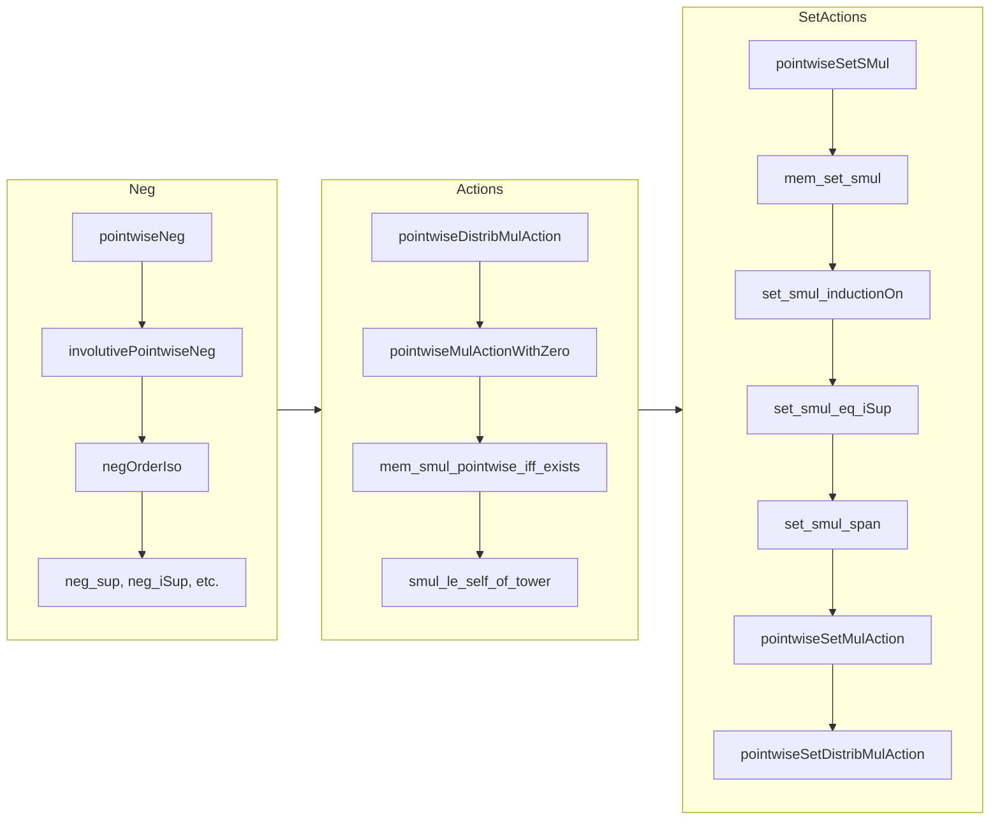

**Technical Brief: `Pointwise.lean` — Pointwise Instances on Submodules**

---

### 1. Key Definitions & Theorems

| Name | Type / Signature | Purpose |
|------|------------------|---------|
| `Submodule.pointwiseNeg` | `Neg (Submodule R M)` | Defines negation of a submodule: $-S = \{-s \mid s \in S\}$; involutive when $R$ is a ring. |
| `Submodule.involutivePointwiseNeg` | `InvolutiveNeg (Submodule R M)` | Proves $-(-S) = S$. |
| `negOrderIso` | `Submodule R M ≃o Submodule R M` | Order isomorphism induced by negation. |
| `Submodule.pointwiseDistribMulAction` | `DistribMulAction α (Submodule R M)` | Action of a monoid $\alpha$ on submodules via $a \cdot S = \{a \cdot s \mid s \in S\}^\text{submodule closure}$. |
| `Submodule.pointwiseMulActionWithZero` | `MulActionWithZero α (Submodule R M)` | Extends `pointwiseDistribMulAction` to act with zero (e.g., $0 \cdot S = \{0\}$). |
| `Submodule.pointwiseSetSMul` | `SMul (Set S) (Submodule R M)` | Defines $s \cdot N = \inf\{P \leq M \mid \forall r \in s, n \in N, r \cdot n \in P\}$. |
| `Submodule.pointwiseSetMulAction` | `MulAction (Set R) (Submodule R M)` | Multiplicative action of subsets of $R$ on submodules (requires `SMulCommClass R R M`). |
| `Submodule.pointwiseSetDistribMulAction` | `DistribMulAction (Set R) (Submodule R M)` | Distributive action of subsets of $R$ on submodules. |
| `mem_set_smul` | $x \in s \cdot N \iff \exists c : R \to_0 N, \operatorname{supp}(c) \subseteq s \land x = \sum_{r \in \operatorname{supp}(c)} r \cdot c(r)$ | Characterization of elements in $s \cdot N$ as finite $R$-linear combinations. |
| `set_smul_eq_iSup` | $s \cdot N = \bigvee_{a \in s} a \cdot N$ | Expresses $s \cdot N$ as supremum of pointwise actions. |
| `set_smul_span` / `span_set_smul` | $s \cdot \operatorname{span}(t) = \operatorname{span}(s \cdot t)$ | Interaction of set-action with span. |
| `set_smul_inductionOn` | Induction principle for $s \cdot N$ | Enables proving properties over $s \cdot N$ by checking closure under action, addition, and zero. |

---

### 2. Naming Conventions

- **Prefixes**:
  - `pointwise*`: Standard pointwise lifting of operations/actions to submodules (e.g., `pointwiseNeg`, `pointwiseDistribMulAction`, `pointwiseSetSMul`).
  - `set_*`: Actions of *sets* (not just elements) on submodules (e.g., `set_smul`, `set_smul_inductionOn`, `set_smul_le`).
- **Suffixes**:
  - `_def`: Definition lemmas (e.g., `mem_set_smul_def`).
  - `_le`, `_sup`, `_inf`, `_bot`, `_top`: Lemmas about order-theoretic behavior.
  - `_eq_*`: Equality lemmas (e.g., `neg_eq_self`, `singleton_set_smul`).
- **`coe_*`**: Lemmas about coercion to sets (e.g., `coe_set_neg`, `coe_pointwise_smul`).

---

### 3. Tactic Stack

- **Core tactics**:
  - `rfl`, `ext`, `apply`, `intro`, `exact`, `rw`, `simp`, `aesop`, `fconstructor`, `cases`, `induction`, `convert`, `congr_arg`, `funext`.
- **Specialized**:
  - `set_smul_inductionOn` (custom elimination rule).
  - `sInf_le`, `le_antisymm`, `sup_le_iff`, `iSup_le_iff`, `mem_sInf`, `mem_set_smul_of_mem_mem`.
  - `map_mono`, `map_sup`, `map_iSup`, `map_bot`, `map_comp`, `map_id`.
  - `Finset.sum_mem`, `Finsupp.sum`, `Finsupp.single_mem_supported`.
- **Order-theoretic**:
  - `le_sup_left`, `le_sup_right`, `sup_le`, `bot_le`, `le_iSup`, `iInf_le`.

---

### 4. Proof Logic

- **Structure**:
  - Most proofs follow a *two-step* pattern:
    1. Show inclusion $\subseteq$ using element-wise reasoning (`mem_set_smul_of_mem_mem`, `mem_sInf`, etc.).
    2. Show reverse inclusion via universal property (e.g., `set_smul_le`, `le_antisymm`, `sInf_le`).
- **Induction**:
  - `set_smul_inductionOn` is used to prove properties over $s \cdot N$ by verifying:
    - Base: $r \cdot n$ for $r \in s, n \in N$,
    - Closure: under $R$-action, addition, and zero.
- **Order-theoretic reasoning**:
  - Many lemmas (e.g., `neg_sup`, `neg_iSup`, `set_smul_eq_iSup`) rely on the fact that the order on submodules is given by inclusion and that sup/inf are categorical (sup = span of union, inf = intersection).
- **Leveraging existing structures**:
  - Use `map_*` lemmas for linear maps (e.g., `map_sup`, `map_iSup`) to lift actions.
  - Use `SMulCommClass`, `IsScalarTower`, `DistribSMul.toLinearMap` to justify compatibility of actions.

---

### 5. Imports

| Import | Purpose |
|--------|---------|
| `Mathlib.Algebra.GroupWithZero.Subgroup` | For `neg` and group-theoretic background. |
| `Mathlib.Algebra.Order.Group.Action` | For `DistribMulAction`, `MulActionWithZero`, `IsScalarTower`, etc. |
| `Mathlib.LinearAlgebra.Finsupp.Supported` | For `Finsupp`, `supported`, `lsum`, used in `set_smul_eq_map`. |
| `Mathlib.LinearAlgebra.Span.Basic` | For `span`, `span_le`, `span_image`, etc. |

---

### 6. Mermaid Diagrams

#### Dependency Graph (High-Level)

```mermaid
graph TD
  A[Pointwise.lean] --> B[Mathlib.Algebra.GroupWithZero.Subgroup]
  A --> C[Mathlib.Algebra.Order.Group.Action]
  A --> D[Mathlib.LinearAlgebra.Finsupp.Supported]
  A --> E[Mathlib.LinearAlgebra.Span.Basic]

  B --> F[Submonoid.Pointwise]
  C --> G[Group.Action.Lemmas]
  D --> H[Finsupp.Basic]
  E --> I[Span.Basic]

  A --> J[Mathlib.Algebra.Group.Submonoid.Pointwise] -- "similar lemmas copied from" -->
```

#### Overview of File Structure



---

### 7. Theory Context

- **Goal**: Extend pointwise operations (negation, scalar multiplication) from sets to submodules, preserving algebraic structure.
- **Key Insight**: Submodules form a complete lattice; many operations lift via:
  - **Map** along linear maps (`S.map f`).
  - **Infimum** over submodules satisfying closure conditions (`sInf {p | ...}`).
- **Bridge to Set Theory**: The `set_acting_on_submodules` section generalizes `Set.mulActionSet` to submodules, enabling module-theoretic analogues of set-based constructions (e.g., ideal actions on submodules).
- **Limitations**:
  - `pointwiseSetMulAction` requires `SMulCommClass R R M` (not generalizable to arbitrary `S`).
  - `add_smul` fails in general, so `pointwiseMulActionWithZero` is not a `Module`.

---

### 8. Summary

This file formalizes *pointwise* algebraic operations on submodules, enabling:
- Negation of submodules (as cones or additive subgroups).
- Scalar actions of monoids and rings on submodules.
- Actions of *sets* (e.g., subsets of a ring or monoid) on submodules, with induction principles and finite-sum characterizations.

It serves as a foundational module for ideal theory, module localization, and geometric constructions (e.g., convex cones), where set-based operations must be lifted to submodules.
