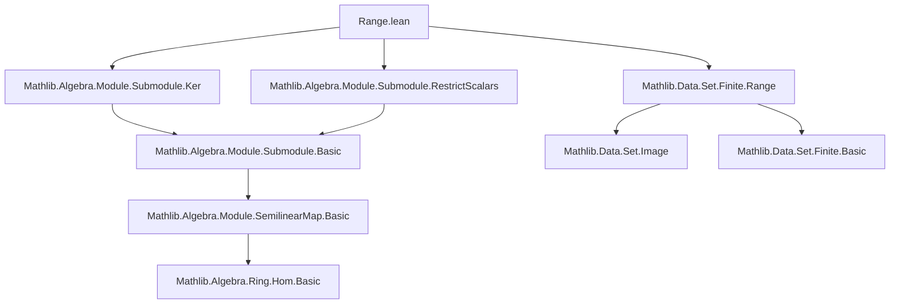

### Technical Brief: `Range.lean`

---

#### **1. Key Definitions & Theorems**

| Name | Type | Purpose |
|------|------|---------|
| `LinearMap.range` | `[RingHomSurjective τ₁₂] → (M →ₛₗ[τ₁₂] M₂) → Submodule R₂ M₂` | Defines the range of a semilinear map as a submodule of the codomain. |
| `coe_range` | `(range f : Set M₂) = Set.range f` | Identifies the coercion of `range f` to a set with the usual set-theoretic range. |
| `mem_range` | `x ∈ range f ↔ ∃ y, f y = x` | Membership criterion for the range submodule. |
| `range_eq_top` | `range f = ⊤ ↔ Surjective f` | Characterizes surjectivity via the range being the full codomain. |
| `range_comp` | `range (g.comp f) = map g (range f)` | Range of a composition equals the image of the intermediate range. |
| `range_le_ker_iff` | `range f ≤ ker g ↔ g.comp f = 0` | Connects range-kernel orthogonality to composition vanishing. |
| `rangeRestrict` | `M →ₛₗ[τ₁₂] range f` | Bundled codomain restriction of `f` to its range; core of the factorization `f = (range f ↪ M₂) ∘ f.rangeRestrict`. |
| `iterateRange` | `ℕ →o (Submodule R M)ᵒᵈ` | Decreasing sequence of submodules: `n ↦ range(fⁿ)`. |
| `fintypeRange` | `[Fintype M] → Fintype (range f)` | Finiteness of range when domain is finite. |
| `ker_eq_range_of_comp_eq_id` | `f ∘ g = id → ker f = range (id - g ∘ f)` | Decomposition of kernel under a retraction; key in splitting lemmas. |
| `submoduleImage` | `(ϕ : O →ₗ M') → Submodule R M → Submodule R M'` | Image of a submodule under a linear map defined on a submodule. |
| `MapSubtype.orderIso` | `Submodule R p ≃o {p' ≤ p}` | Equivalence between submodules of `p` and submodules of `M` beneath `p`. |

**Theorems of note:**
- `range_neg`: `range (-f) = range f` (for additive groups).
- `range_smul`: For nonzero scalar `a`, `range (a • f) = range f`.
- `range_codRestrict`: Image under codomain restriction equals comap.
- `map_comap_eq`: `map f (comap f q) = range f ⊓ q`.
- `range_le_bot_iff`: `range f = ⊥ ↔ f = 0`.

---

#### **2. Naming Conventions**

- **Prefixes:**
  - `range_`: Pertains to the range submodule (`range_eq_top`, `range_comp`, `range_zero`, etc.).
  - `ker_`: Pertains to kernels (`ker_eq_bot_of_cancel`, `ker_le_iff`, `range_le_ker_iff`).
  - `map_`: Pertains to image of submodules under maps (`map_top`, `map_subtype_le`, `map_comap_eq`).
  - `comap_`: Pertains to preimage submodules (`comap_subtype_eq_top`, `comap_le_comap_iff`).
  - `submoduleImage_`: For image constructions from maps defined on submodules.
  - `rangeRestrict_`: For the codomain-restricted map.

- **Suffixes:**
  - `_le_iff`, `_eq_iff`, `_iff`: Biconditional characterizations.
  - `_of_le`, `_of_injective`: Hypothesis-specific variants.
  - `_subtype`, `_inclusion`: Relating to inclusion maps and submodules.

- **Notable pattern:** `range f` is used as a *submodule*, while `Set.range f` is the underlying set.

---

#### **3. Tactic Stack**

- **Core simplifiers & rewriters:**
  - `simp`, `simp only`, `simp_rw`
  - `rw`, `rwa`
  - `ext`, `apply_fun`, `congr`
- **Algebraic reasoning:**
  - `ring`, `abel`, `monoid`, `add_monoid`
- **Submodule-specific:**
  - `submodule_tac`, `apply_subtype_val_injective`, `apply_injective`
  - `grind` (custom tactic for submodule reasoning)
- **Set-theoretic:**
  - `Set.range_id`, `Set.range_comp`, `Set.image_preimage_eq_of_subset`
- **Logical & structural:**
  - `exact`, `intro`, `rintro`, `obtain`, `exists`, `cases`
  - `apply`, `apply_fun`, `convert`, `refine`, `change`
- **Order-theoretic:**
  - `le_antisymm`, `le_of_eq`, `eq_of_le_of_ge`, `inf_eq_right`

---

#### **4. Proof Logic**

- **Inductive/structural style:** Proofs are mostly *extensionality-first* (`ext`), followed by unfolding definitions (`simp only [coe_range, mem_range]`), then element-chasing.
- **Common pattern:**
  1. `ext x` to reduce to membership.
  2. Unfold definitions (`mem_range`, `map`, `comap`, `range_eq_map`).
  3. Use `exists`/`obtain` to move between element and function representations.
  4. Apply algebraic lemmas (`map_zero`, `map_add`, `map_smul`).
  5. Use `le_antisymm` for equality of submodules.
- **Specialized reasoning:**
  - For `rangeRestrict`, rely on `codRestrict` lemmas (`range_rangeRestrict`, `ker_rangeRestrict`).
  - For `iterateRange`, monotonicity is shown via `Nat.exists_eq_add_of_le` and power laws.
  - For `ker_eq_range_of_comp_eq_id`, use decomposition `x = (id - g∘f)(x) + g(f(x))`.

---

#### **5. Imports & Dependencies**

- **Core algebraic infrastructure:**
  - `Mathlib.Algebra.Module.Submodule.Ker`
  - `Mathlib.Algebra.Module.Submodule.RestrictScalars`
  - `Mathlib.Data.Set.Finite.Range`
- **Implicit dependencies (via `Submodule`, `LinearMap`, `SemilinearMapClass`):**
  - `Mathlib.Algebra.Module.Basic`
  - `Mathlib.Algebra.Module.Submodule.Basic`
  - `Mathlib.Algebra.Module.SemilinearMap.Basic`
  - `Mathlib.Algebra.Ring.Hom.Basic` (for `RingHomSurjective`, `RingHomCompTriple`)
  - `Mathlib.Data.Set.Image`
  - `Mathlib.Data.Set.Subtype`
  - `Mathlib.Data.Fintype.Basic`
  - `Mathlib.Data.Nat.Basic` (for `iterateRange`)

---

#### **6. Mermaid Diagrams**

##### **Dependency Graph (Module-Level)**



##### **Conceptual Overview of `LinearMap.range` Theory**

```mermaid
flowchart LR
  A[Semilinear Map f : M →ₛₗ[σ] M₂] --> B[range f : Submodule R₂ M₂]
  B --> C[Set.range f]
  B --> D[map f ⊤]
  B --> E[Comap / Image relationships]
  B --> F[Surjectivity ↔ range = ⊤]
  B --> G[Factorization f = subtype ∘ rangeRestrict f]
  B --> H[Iterates fⁿ → range(fⁿ)]
  B --> I[Finite type instances]
  C --> J[Set theory lemmas]
  D --> K[Submodule map lemmas]
  E --> L[Ker-range orthogonality]
  E --> M[Splitting lemmas (e.g., ker = range(id - g∘f))]
```

---

#### **7. Theory Scope & Intent**

- **Scope:** Formalizes the *submodule-theoretic* range of semilinear maps, emphasizing:
  - Compatibility with `Submodule.map`/`comap`.
  - Behavior under composition, addition, scalar multiplication, and restriction.
  - Connections to surjectivity, injectivity, and splitting.
  - Finiteness and order-isomorphism properties via submodule lattices.
- **Design goals:**
  - Uniform treatment of linear and semilinear maps via `RingHomSurjective`.
  - Avoid dot-notation (`f.range`) due to typeclass inference limitations.
  - Enable modular reasoning via `rangeRestrict` and `submoduleImage`.
  - Support homological algebra (e.g., `range_le_ker_iff` for chain complexes).

---

#### **8. Notes & Future Work**

- **TODOs in comments:**
  - Generalize `ker_eq_range_of_comp_eq_id` to semilinear maps with `f ∘ g` bijective.
  - Resolve potential `Fintype`/`Subtype.fintype` diamond for `fintypeRange`.
- **Open questions:**
  - Can `iterateRange` be generalized to directed systems or filtrations?
  - Is there a universal property for `rangeRestrict` in the category of modules?

--- 

This file is a foundational module in the `Mathlib` linear algebra library, enabling high-level reasoning about images of linear maps as submodules.
