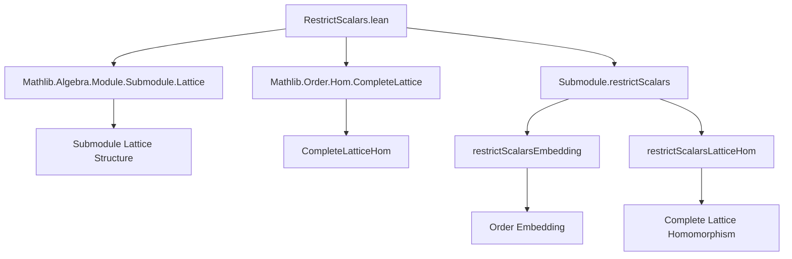
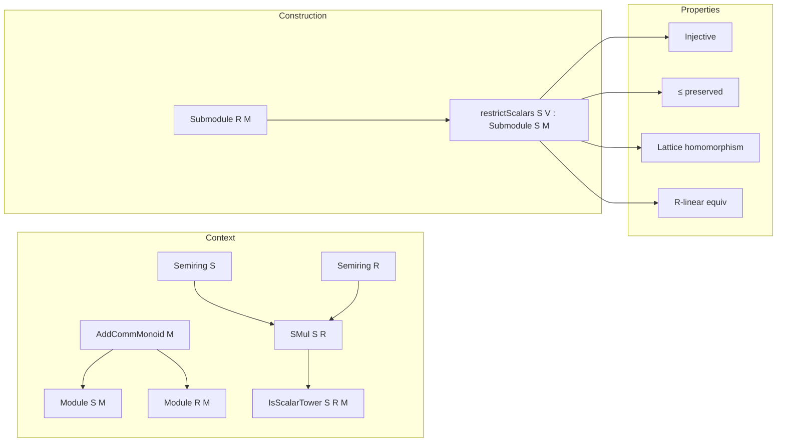

**Technical Brief: `RestrictScalars.lean`**

---

### 1. KEY DEFINITIONS & THEOREMS

| Name | Type | Purpose |
|------|------|---------|
| `restrictScalars` | `(V : Submodule R M) → Submodule S M` | Forgets the `R`-action on a submodule `V`, regarding it as an `S`-submodule via scalar restriction. |
| `coe_restrictScalars` | `(V : Submodule R M) : (V.restrictScalars S : Set M) = V` | Shows underlying set of `restrictScalars V S` is identical to `V`. |
| `restrictScalars_mem` | `m ∈ V.restrictScalars S ↔ m ∈ V` | Membership equivalence (trivial, by definition). |
| `restrictScalars_self` | `V.restrictScalars R = V` | Restriction along identity scalar action recovers original submodule. |
| `restrictScalars_injective` | `Function.Injective (restrictScalars S)` | `restrictScalars S` is injective on submodules. |
| `restrictScalars_inj` | `restrictScalars S V₁ = restrictScalars S V₂ ↔ V₁ = V₂` | Equational form of injectivity. |
| `restrictScalars_le` / `restrictScalars_lt` | `s.restrictScalars S ≤ t.restrictScalars S ↔ s ≤ t` | Preserves and reflects order (submodule inclusion/strict inclusion). |
| `restrictScalarsEmbedding` | `Submodule R M ↪o Submodule S M` | Lattice embedding (order-embedding + injective function). |
| `restrictScalarsEquiv` | `p.restrictScalars S ≃ₗ[R] p` | Linear equivalence over `R` between restricted submodule and original. |
| `restrictScalars_bot` / `top` | `restrictScalars S ⊥ = ⊥`, `restrictScalars S ⊤ = ⊤` | Preserves bottom/top submodule. |
| `restrictScalars_eq_bot_iff` / `eq_top_iff` | Characterizations of when restriction yields zero/full module. |
| `restrictScalars_sInf` / `sSup` | `restrictScalars S` commutes with arbitrary infima/suprema. |
| `restrictScalars_iInf` / `iSup` | Special case for indexed infima/suprema. |
| `restrictScalars_inf` / `sup` | Preserves binary meet/join. |
| `restrictScalarsLatticeHom` | `CompleteLatticeHom (Submodule R M) (Submodule S M)` | `restrictScalars S` as a complete lattice homomorphism. |
| `toIntSubmodule_toAddSubgroup` | `N.toAddSubgroup.toIntSubmodule = N.restrictScalars ℤ` | Connects integer restriction to additive subgroup → integer submodule conversion. |

---

### 2. NAMING CONVENTIONS

- **Prefix `restrictScalars_`**: All definitions and theorems related to scalar restriction.
- **Suffix `_mem`**: Membership characterizations (`restrictScalars_mem`).
- **Suffix `_inj` / `_injective`**: Injectivity properties.
- **Suffix `_le` / `_lt`**: Order-theoretic behavior.
- **Suffix `_equiv` / `_equiv`**: Equivalence/linear equivalence statements.
- **Suffix `_bot` / `_top`**: Behavior on least/greatest elements.
- **Suffix `_iff`**: Biconditional characterizations.
- **Suffix `_sInf` / `_sSup` / `_iInf` / `_iSup`**: Preservation of suprema/infima (set vs. indexed).
- **Suffix `_hom`**: Lattice homomorphism version.

---

### 3. TACTIC STACK

- `rfl`: Used heavily for definitional equalities (e.g., `coe_restrictScalars`, `restrictScalars_self`, `toIntSubmodule_toAddSubgroup`).
- `simp`: Dominant tactic for simplification, especially with `simp only`, `simp [SetLike.ext_iff]`, `simp [← toAddSubmonoid_inj]`, etc.
- `ext`: Extensionality for set equality or submodule equality.
- `apply`, `exact`, `intro`, `cases`: Standard proof scripting.
- `infer_instance`: For constructing instances (e.g., `restrictScalars.origModule`).
- `by infer_instance`: Used in instance proofs where Lean can infer automatically.
- `simpa`: Used to simplify and discharge goals using a lemma (e.g., `restrictScalars_sup`).
- `Set.ext_iff`, `SetLike.ext'_iff`, `Subtype.ext`: For proving equality of sets/subtypes.

---

### 4. PROOF LOGIC

- **Definitional reasoning**: Most proofs are immediate from definitions (`rfl`, `simp`).
- **Set-theoretic extensionality**: Submodule equality is reduced to equality of underlying sets via `ext`.
- **Order-theoretic reflection**: Inequalities are shown by unfolding membership and using `Iff.rfl`.
- **Lattice-theoretic preservation**: Suprema/infima preservation is shown by unfolding definitions and applying `simp` with lemmas like `toAddSubmonoid_sSup`, `Set.image_comp`, etc.
- **Instance construction**: Module/`IsScalarTower` instances are proven by `infer_instance` or direct verification of axioms.
- **Equivalence proofs**: Linear equivalences are constructed via `AddEquiv.refl` + `map_smul' := fun _ _ => rfl`.

---

### 5. IMPORTS

- `Mathlib.Algebra.Module.Submodule.Lattice`: Provides lattice structure on submodules (`⊔`, `⊓`, `sSup`, `sInf`, etc.).
- `Mathlib.Order.Hom.CompleteLattice`: Provides `CompleteLatticeHom` and related order-homomorphism machinery.

---

### 6. DEPENDENCY & THEORY OVERVIEW

#### **Core Theory**
- **Context**: Semirings `S`, `R`, an additive commutative monoid `M`, with:
  - `Module S M`, `Module R M`, `SMul S R`, and `IsScalarTower S R M`.
- **Goal**: Define and study the *restriction of scalars* map on submodules:  
  $$
  \text{restrictScalars}_S : \text{Submodule}_R(M) \to \text{Submodule}_S(M)
  $$
  induced by the scalar restriction along $S \to \text{End}(R)$ (via `SMul S R` and `IsScalarTower`).

#### **Key Properties**
- **Injective & order-embedding**: Preserves and reflects inclusion.
- **Complete lattice homomorphism**: Commutes with arbitrary suprema/infima.
- **Linear equivalence over `R`**: As an `R`-module, the restricted submodule is isomorphic to the original.
- **Special cases**: Behavior on `⊥`, `⊤`, binary joins/meets, and indexed sup/inf.

#### **Applications**
- Used in contexts where modules over different rings are related (e.g., base change, restriction from algebra to base ring, e.g., `ℤ`-structure of an `R`-module).
- Underlies constructions like `N.toAddSubgroup.toIntSubmodule = N.restrictScalars ℤ`.

---

### 7. MERMAID DIAGRAMS

#### **Dependency Graph (Module-Level)**

#### **Theoretical Overview**

--- 

This file formalizes a foundational but widely applicable construction: *restriction of scalars* on submodules, with full lattice-theoretic and module-structural compatibility.
