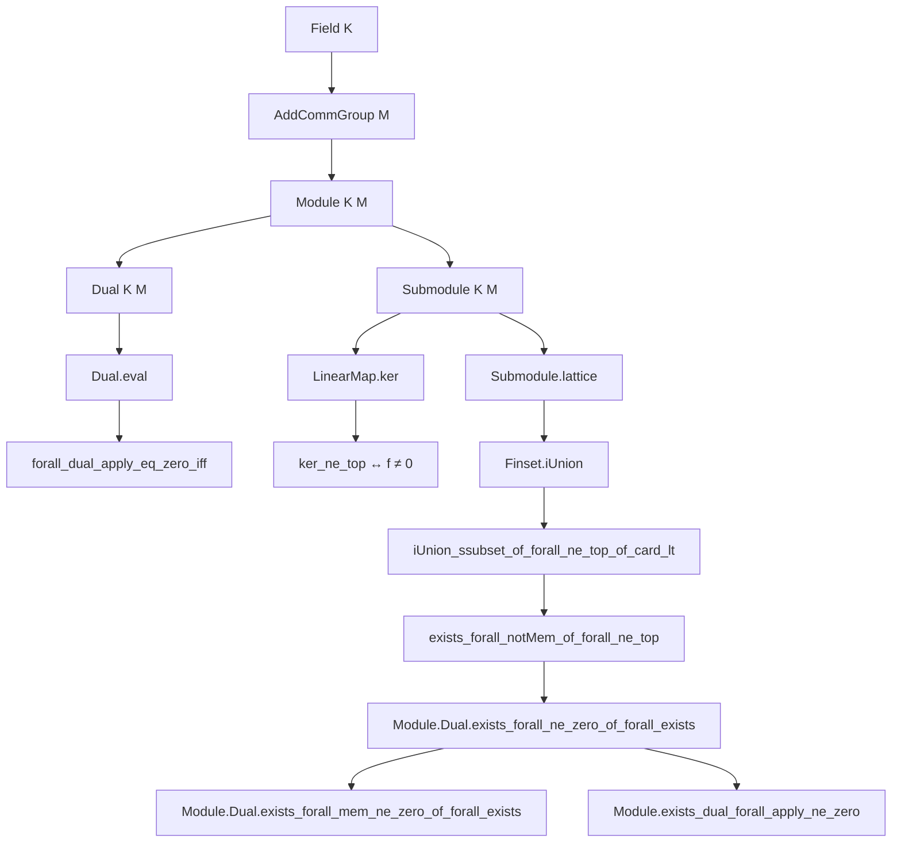
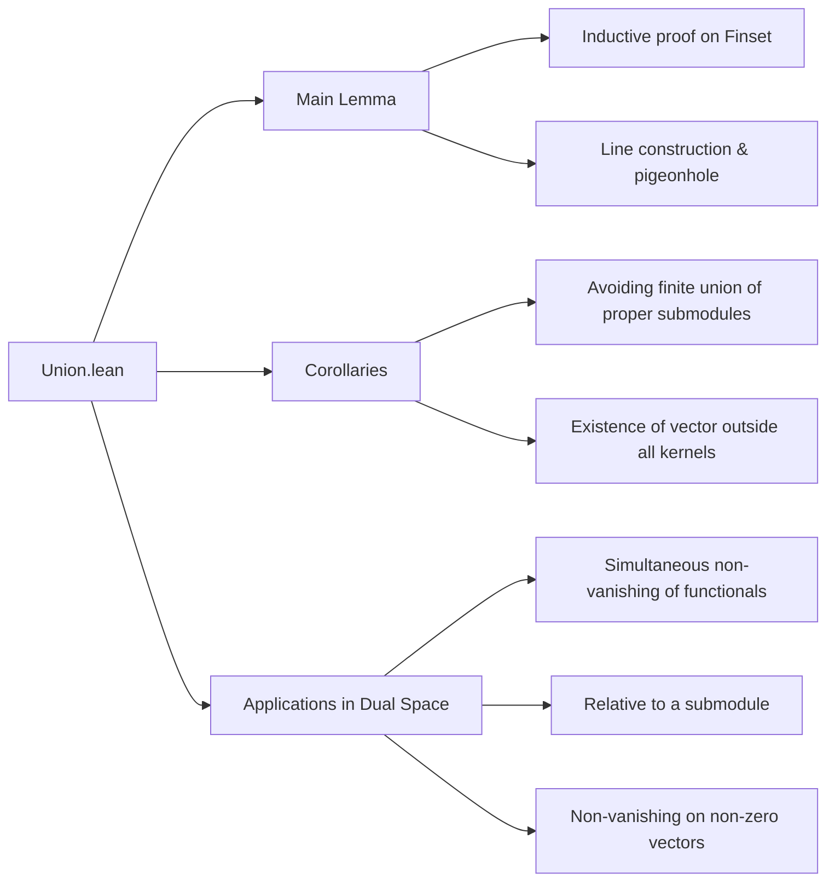

**Technical Brief: `Union.lean` — Unions of Submodules and Dual Space Applications**

---

### 1. KEY DEFINITIONS & THEOREMS

| Name | Type / Signature | Purpose |
|------|------------------|---------|
| `Submodule.iUnion_ssubset_of_forall_ne_top_of_card_lt` | `∀ s : Finset ι, p : ι → Submodule K M, (∀ i, p i ≠ ⊤) → s.card < ENat.card K → ⋃ i ∈ s, p i ⊂ univ` | A finite union of *proper* submodules is *proper* if the field is sufficiently large (cardinality > number of submodules). Core structural result. |
| `Submodule.exists_forall_notMem_of_forall_ne_top` | `∀ [Finite ι] [Infinite K], p : ι → Submodule K M, (∀ i, p i ≠ ⊤) → ∃ x, ∀ i, x ∉ p i` | Infinite field + finite index ⇒ existence of a point avoiding all proper submodules. Corollary of the main lemma. |
| `Module.Dual.exists_forall_ne_zero_of_forall_exists` | `∀ f : ι → Dual K M, (∀ i, ∃ x, f i x ≠ 0) → ∃ x, ∀ i, f i x ≠ 0` | Simultaneous non-vanishing: if each functional is non-zero somewhere, there exists a *single* vector where *all* are non-zero. Uses kernel submodules and previous lemma. |
| `Module.Dual.exists_forall_mem_ne_zero_of_forall_exists` | `∀ p : Submodule K M, f : ι → Dual K M, (∀ i, ∃ x ∈ p, f i x ≠ 0) → ∃ x ∈ p, ∀ i, f i x ≠ 0` | Relative version: non-vanishing *within a fixed submodule*. Uses restriction of functionals to the submodule. |
| `Module.exists_dual_forall_apply_ne_zero` | `∀ v : ι → M, (∀ i, v i ≠ 0) → ∃ f : Dual K M, ∀ i, f (v i) ≠ 0` | For any family of non-zero vectors, there exists a linear functional non-zero on *all* of them. Constructed via dual evaluation functionals and previous lemma. |

---

### 2. NAMING CONVENTIONS

- **Prefixes**:
  - `iUnion_`: indexed unions over `Finset` or arbitrary index types.
  - `exists_forall_`: existence of a point satisfying universal conditions (e.g., avoiding submodules, non-vanishing).
  - `mem_ne_zero`: membership in a set with non-zero evaluation.
- **Suffixes**:
  - `_of_forall_ne_top`: hypothesis that all submodules are proper (`≠ ⊤`).
  - `_of_forall_exists`: hypothesis that each object has *some* witness (e.g., each functional is non-zero somewhere).
- **Module/Dual-specific**:
  - `Dual.eval`, `domRestrict`, `ker`: standard dual space operations.
  - `Submodule.ker`: kernel submodule of a linear map.

---

### 3. TACTIC STACK

| Tactic | Frequency / Role |
|--------|------------------|
| `simp` / `simp only` | Very high — simplifies goals using definitional equalities, set/finset operations, module axioms. |
| `aesop` | High — handles trivial module arithmetic, set membership, disjointness, contradiction chains. |
| `rcases` / `obtain` | High — destructs existential/universal hypotheses, especially in the main proof’s combinatorial step. |
| `contrapose!` | Medium — flips implications to use non-membership or inequality assumptions. |
| `rw`, `convert`, `refine` | Medium — for rewriting using lemmas, constructing proofs via intermediate steps. |
| `module` | Low — custom tactic for module arithmetic (e.g., `sub_mem`, `smul_mem`). |
| `have`, `suffices`, `replace` | High — intermediate lemma introduction and strengthening. |
| `ext` | Medium — extensionality for set equality (e.g., proving submodules equal). |
| `Finset.induction_on` | Medium — structural induction on finite sets. |

---

### 4. PROOF LOGIC

The core proof of `iUnion_ssubset_of_forall_ne_top_of_card_lt` follows a **combinatorial geometry argument** (inspired by MathOverflow #14241):

1. **Induction on the finite set `s`** of submodules.
2. **Base case (`s = ∅`)**: trivial (`⋃ ∅ = ∅ ⊂ univ`).
3. **Inductive step**:
   - Assume union over `s` is proper; add `p j`.
   - If `p j = univ`, contradiction with `h₁`.
   - Construct a *line* $L = \{x + t \cdot y \mid t \ne 0\}$ disjoint from $p j$ (using existence of $y \notin p j$).
   - Show $L$ must intersect some $p k$ (for $k \in s$) in *at least two points* (via pigeonhole: more points on line than submodules in $s$).
   - Deduce $x, y \in p k$, hence $x \in p k$, contradicting that $x \in p j \setminus \bigcup_{i \in s} p i$.
4. **Key combinatorial ingredient**: cardinality bound `s.card < |K|` ensures enough scalars to guarantee distinct points on the line.

The corollaries (`exists_forall_notMem`, dual lemmas) reduce to applying the main lemma to kernels or evaluation maps, leveraging:
- `LinearMap.ker_ne_top ↔ functional ≠ 0`
- `Dual.eval` as evaluation map.
- Restriction of functionals to submodules.

---

### 5. IMPORTS

| Module | Role |
|--------|------|
| `Mathlib.Algebra.Module.Submodule.Lattice` | Lattice structure on submodules (inclusion, sup/inf, top/bottom). |
| `Mathlib.LinearAlgebra.Dual.Defs` | Definition of dual module and evaluation map. |
| `Mathlib.LinearAlgebra.Dual.Lemmas` | Key lemmas about duals (e.g., `forall_dual_apply_eq_zero_iff`). |
| `Mathlib.SetTheory.Cardinal.Finite` | Cardinal arithmetic, especially `encard`, `ENat.card`, finite/infinite types. |
| `Mathlib.Tactic.NormNum.Inv`, `Mathlib.Tactic.NormNum.Pow` | Numeric normalization for field arithmetic (used implicitly in `module` tactic). |

---

### 6. MERMAID DIAGRAMS

#### Dependency Graph (Theoretical Flow)

#### Overview of File Structure

---

### 7. DOMAIN-SPECIFIC INSIGHTS

- **Critical assumption**: `s.card < ENat.card K`. This is *tight* — over finite fields, a vector space can be covered by finitely many proper subspaces (e.g., $\mathbb{F}_p^2 = \bigcup_{a \in \mathbb{F}_p} \langle(1,a)\rangle \cup \langle(0,1)\rangle$).
- **Methodology**: The proof is *constructive in spirit* (via line argument), but uses classical logic (`classical`) to extract a witness from cardinality.
- **Applications**: Enables “generic” arguments in linear algebra over infinite fields — e.g., existence of linear functionals separating points, or avoiding bad subspaces in induction arguments.

--- 

Let me know if you'd like a formalized summary in Lean docstring format or a visualization of the main proof’s case analysis.
