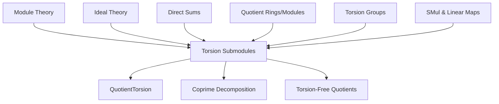
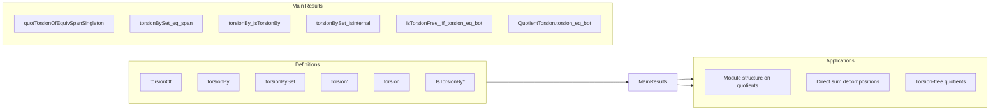

Here is the **technical metadata** extracted from the provided Lean 4 file `Basic.lean`, structured as requested:

---

### 1. **Key Definitions & Theorems**

| Name | Type / Signature | Purpose |
|------|------------------|---------|
| `torsionOf R M x` | `Ideal R` | The *torsion ideal* of an element `x : M`: all `a : R` such that `a • x = 0`. |
| `Submodule.torsionBy R M a` | `Submodule R M` | The *`a`-torsion submodule*: all `x ∈ M` with `a • x = 0`. |
| `Submodule.torsionBySet R M s` | `Submodule R M` | The *`s`-torsion submodule*: all `x ∈ M` with `a • x = 0` for all `a ∈ s`. |
| `Submodule.torsion' R M S` | `Submodule R M` | The *`S`-torsion submodule*: all `x ∈ M` with `a • x = 0` for some `a ∈ S`. |
| `Submodule.torsion R M` | `Submodule R M` | The *torsion submodule*: all `x ∈ M` with `a • x = 0` for some non-zero-divisor `a`. |
| `Module.IsTorsionBy R M a` | `Prop` | `M` is *`a`-torsion*: every `x ∈ M` satisfies `a • x = 0`. |
| `Module.IsTorsionBySet R M s` | `Prop` | `M` is *`s`-torsion*: every `x ∈ M` is killed by some `a ∈ s`. |
| `Module.IsTorsion' M S` | `Prop` | `M` is *`S`-torsion*: every `x ∈ M` is killed by some `a ∈ S`. |
| `Module.IsTorsion R M` | `Prop` | `M` is *torsion*: every `x ∈ M` is killed by some non-zero-divisor. |
| `quotTorsionOfEquivSpanSingleton R M x` | `(R ⧸ torsionOf R M x) ≃ₗ[R] R ∙ x` | Isomorphism between the span of `x` and the quotient by its torsion ideal. |
| `torsionBySet_eq_torsionBySet_span` | `torsionBySet R M s = torsionBySet R M (Ideal.span s)` | Torsion by a set equals torsion by the ideal it generates. |
| `torsionBy_isTorsionBy` | `IsTorsionBy R (torsionBy R M a) a` | The `a`-torsion submodule is an `a`-torsion module. |
| `torsionBySet_isInternal` | `DirectSum.IsInternal fun i => torsionBySet R M (p i)` | Internal direct sum decomposition under pairwise coprime ideals. |
| `isTorsionFree_iff_torsion_eq_bot` | `IsTorsionFree R M ↔ torsion R M = ⊥` | Over a domain, torsion-freeness ⇔ trivial torsion submodule. |
| `QuotientTorsion.torsion_eq_bot` | `torsion R (M ⧸ torsion R M) = ⊥` | Quotienting by torsion yields a torsion-free module. |
| `instIsTorsionFree` | `Module.IsTorsionFree R (M ⧸ torsion R M)` | Consequence of previous: quotient is torsion-free over a domain. |
| `IsTorsionBySet.module` | `Module (R ⧸ I) M` | Constructs an `R/I`-module structure from an `R`-module killed by `I`. |

---

### 2. **Naming Conventions**

- **Prefixes**:
  - `torsionOf_`: ideal of scalars killing a *vector*.
  - `torsionBy_`: submodule of vectors killed by a *scalar*.
  - `torsionBySet_`: submodule killed by a *set* of scalars.
  - `torsion'_`: generalization to action by a monoid `S`.
  - `IsTorsionBy_`, `IsTorsionBySet_`, `IsTorsion'_`, `IsTorsion`: *properties* of modules.
- **Suffixes**:
  - `_eq_top`: characterizes when a torsion submodule is the whole space.
  - `_eq_bot`: characterizes when a torsion submodule is trivial.
  - `_iff`: equivalence with a logical condition (e.g., `mem_torsionBy_iff`).
  - `_smul`, `_mk_smul`: lemmas about scalar multiplication in quotient/torsion modules.
- **Notation**:
  - `a`, `b`, `r`, `s`: scalars in `R`.
  - `x`, `y`, `z`: vectors in `M`.
  - `p`, `q`: ideals or elements (often coprime).
  - `ι`, `S`: indexing types / finite sets.

---

### 3. **Tactic Stack**

Frequently used tactics in proofs:
- `simp` / `simp_rw`: simplification with definitional lemmas (`mem_torsionBy_iff`, `smul_zero`, etc.).
- `rw`: rewriting using equivalences like `isTorsionBy_iff_torsionBy_eq_top`.
- `exact`, `intro`, `apply`, `refine`: standard proof construction.
- `ext`: extensionality for submodules/ideals/sets.
- `grind`: used in `isTorsionFree_iff_torsion_eq_bot`.
- `cases'`, `rcases`: destructuring existential/universal hypotheses.
- `convert`: for approximate unification (e.g., in `torsionBy_isInternal`).
- `apply_fun`, `funext`, `dfunlike.congr_fun`: functional extensionality.
- `finset`-based tactics: `Finset.sum_smul`, `Finset.inf_eq_iInf`, `iSup_le`, etc.

---

### 4. **Proof Logic**

Typical proof patterns:
- **Equational reasoning** over submodules/ideals using `le_antisymm`, `eq_top_iff`, `eq_bot_iff`.
- **Reduction to scalar actions**: e.g., proving `x ∈ torsionBy R M a` by showing `a • x = 0`.
- **Quotient module constructions**: lifting module structures via `QuotientAddGroup.lift`, `Module.IsTorsionBySet.module`.
- **Coprime decomposition**: using `iSup_torsionBySet_ideal_eq_torsionBySet_iInf` and `supIndep_torsionBySet_ideal` to get internal direct sums.
- **Annihilator-based reasoning**: connecting `annihilator R M` with `IsTorsionBySet`.
- **Induction on finite sets** (`Finset`) for coprime products/sums.
- **Transfer across equivalences**: e.g., `quotTorsionOfEquivSpanSingleton` to move between quotient and span.

---

### 5. **Imports**

Core dependencies defining the scope:
```lean
Mathlib.Algebra.DirectSum.Module
Mathlib.Algebra.Module.ZMod
Mathlib.Algebra.Regular.Opposite
Mathlib.GroupTheory.Torsion
Mathlib.LinearAlgebra.Isomorphisms
Mathlib.RingTheory.Coprime.Ideal
Mathlib.RingTheory.Finiteness.Defs
Mathlib.RingTheory.Ideal.Maps
Mathlib.RingTheory.Ideal.Quotient.Defs
Mathlib.RingTheory.SimpleModule.Basic
```
These indicate the file sits at the intersection of:
- Module theory (especially over commutative semirings/rings),
- Ideal theory (especially coprime ideals, annihilators),
- Torsion theory (group/module),
- Direct sum decompositions,
- Quotient constructions.

---

### 6. **Mermaid Diagrams**

#### **Dependency Graph (High-Level)**



#### **Overview of File Structure**



---

Let me know if you'd like a **formal dependency graph** (e.g., `leanpkg graph` output), or a **module-theoretic classification** of the lemmas (e.g., lattice-theoretic vs. homological).
