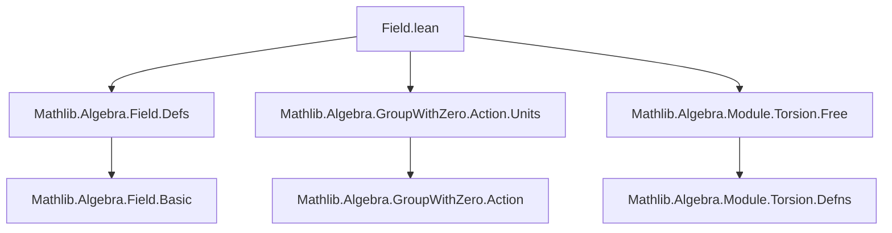
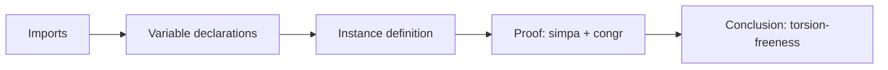

**Technical Brief: `Field.lean` (Vector Spaces are Torsion-Free)**

---

### 1. Key Definitions & Theorems

| Name | Type | Purpose |
|------|------|---------|
| `DivisionSemiring.to_moduleIsTorsionFree` | `IsTorsionFree 𝕜 M` | Instance showing that any module over a division semiring is torsion-free. |
| `IsTorsionFree` (imported) | `Prop` | Predicate stating that scalar multiplication by a nonzero element is injective: $ r ≠ 0 ∧ r • m₁ = r • m₂ → m₁ = m₂ $. |
| `isSMulRegular` (field of `IsTorsionFree`) | `∀ {r : 𝕜} {m₁ m₂ : M}, r ≠ 0 → r • m₁ = r • m₂ → m₁ = m₂` | The core property proven: left-cancellation of nonzero scalars. |

---

### 2. Naming Conventions

- **Prefixes**:  
  - `to_` in `DivisionSemiring.to_moduleIsTorsionFree`: indicates derivation of a typeclass instance from a structure (`DivisionSemiring` → `IsTorsionFree`).
- **Suffixes**:  
  - `IsTorsionFree`: standard naming for torsion-freeness properties in algebraic structures.
  - `ne_zero`: standard suffix for proofs of inequality with zero (e.g., `hr.ne_zero`).

No other recurring prefixes/suffixes are present in this file.

---

### 3. Tactic Stack

- `simpa`: Used to simplify the goal using a lemma (`hr.ne_zero`) and rewrite rules.
- `congr`: Applied to `r⁻¹ • $hm` to exploit injectivity of scalar multiplication by the inverse.
- Implicit use of `r⁻¹` (inverse in a division semiring) and module axioms via `simpa`.

No explicit `ring`, `simp`, or `linarith` used — proof is highly targeted and relies on algebraic simplification.

---

### 4. Proof Logic

The proof proceeds as follows:

1. Assume $ r ≠ 0 $ (`hr`) and $ r • m₁ = r • m₂ $ (`hm`).
2. Multiply both sides by $ r^{-1} $ (exists since $ r ≠ 0 $ in a division semiring).
3. Use `congr` to apply $ r^{-1} • $ to both sides, yielding $ m₁ = m₂ $.
4. `simpa` discharges the remaining goal using `hr.ne_zero` (to ensure $ r^{-1} $ is defined) and module laws.

This is a *direct algebraic argument* leveraging invertibility of nonzero scalars.

---

### 5. Imports

| Import | Role |
|--------|------|
| `Mathlib.Algebra.Field.Defs` | Defines `DivisionSemiring`, `Field`, and related structures. |
| `Mathlib.Algebra.GroupWithZero.Action.Units` | Provides action of units (e.g., inverses) on modules; used implicitly via `r⁻¹`. |
| `Mathlib.Algebra.Module.Torsion.Free` | Defines `IsTorsionFree` and torsion-related notions. |

These imports define the algebraic context: modules over division semirings and torsion-freeness.

---

### 8. Mermaid Diagrams

#### Dependency Graph (Module-Level)



#### Overview of Theoretical Context

```mermaid
graph LR
  subgraph Theory
    A[DivisionSemiring] --> B[Module 𝕜 M]
    B --> C[IsTorsionFree 𝕜 M]
    C --> D[Vector spaces are torsion-free]
  end

  subgraph Proof Strategy
    B -->|scalar invertibility| E[r⁻¹ • (r • m₁) = r⁻¹ • (r • m₂)]
    E --> F[m₁ = m₂]
  end
```

#### File Structure Summary



--- 

This file formalizes a foundational result: *nonzero scalars act injectively* in modules over division semirings — a key step toward establishing that vector spaces (and more generally, modules over division rings/fields) have no torsion.
