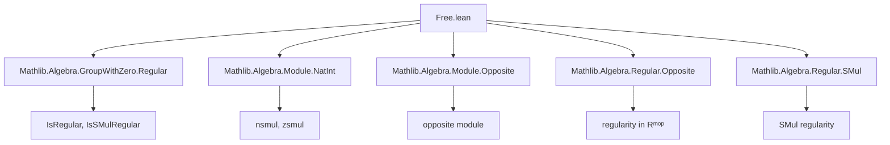
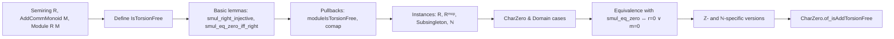

**Technical Brief: `Free.lean` — Torsion-Free Modules in Lean 4**

---

### 1. **Key Definitions & Theorems**

| Name | Type / Signature | Purpose |
|------|------------------|---------|
| `Module.IsTorsionFree` | `class Module.IsTorsionFree (R : Type*) [Semiring R] (M : Type*) [AddCommMonoid M] [Module R M] : Prop` | Defines torsion-freeness: scalar multiplication by a *regular* element of `R` is injective on `M`. |
| `isSMulRegular` | `IsRegular r → IsSMulRegular M r` | Core witness of `IsTorsionFree`; injectivity of `r • ·` when `r` is regular. |
| `smul_eq_zero` | `r • m = 0 ↔ r = 0 ∨ m = 0` | Equivalent characterization in domains (or char. 0 domains). |
| `smul_right_injective` | `IsRegular r → ((r • ·) : M → M).Injective` | Direct consequence of `IsTorsionFree`. |
| `smul_left_injective` | `m ≠ 0 → ((· • m) : R → M).Injective` | Injectivity of left multiplication when the vector is nonzero (in rings with `IsCancelMulZero` and `IsTorsionFree`). |
| `Module.isTorsionFree_iff_smul_eq_zero` | `IsTorsionFree R M ↔ ∀ r m, r • m = 0 → r = 0 ∨ m = 0` | Equivalence in integral domains. |
| `IsAddTorsionFree.of_isTorsionFree` | `IsTorsionFree ℕ M → IsAddTorsionFree M` | Relates scalar torsion-freeness over `ℕ` to additive torsion-freeness. |
| `CharZero.of_isAddTorsionFree` | `[Nontrivial M] → [IsAddTorsionFree M] → CharZero R` | Shows existence of nontrivial torsion-free module forces char. 0. |

---

### 2. **Naming Conventions**

- **Prefixes**:
  - `isSMulRegular`: Indicates injectivity of scalar multiplication.
  - `smul_right_`, `smul_left_`: Distinguish direction of multiplication (scalar on left/right).
  - `of_`: Pullback or implication from stronger assumptions (e.g., `of_isTorsionFree`, `of_isAddTorsionFree`).
  - `comap`: Pullback along a ring homomorphism.

- **Suffixes**:
  - `_inj`, `_injective`: Emphasize injectivity.
  - `_ne_zero_iff`, `_eq_zero_iff`: Biconditional characterizations.
  - `_int_iff_`, `_nat_iff_`: Equivalence lemmas between `ℤ`/`ℕ` and additive notions.

- **Aliases**:
  - `isSMulRegular` is aliased from `IsTorsionFree.isSMulRegular`.

---

### 3. **Tactic Stack**

Frequently used tactics in proofs:
- `simp` / `simp_rw`: Simplify using lemmas like `smul_eq_zero`, `smul_zero`, `sub_smul`.
- `rw`: Rewrite using biconditionals (`↔`) and implications.
- `exact`, `refine`, `apply`: Build proofs using existing lemmas.
- `obtain` / `cases`: Split on `eq_or_ne`, `ne_zero`, or existential witnesses.
- `dsimp`, `rwa`: Simplify and rewrite in one step.
- `aesop`: Not used here (leaner proofs, mostly manual).
- `by simpa using`: Combine simplification and application.

---

### 4. **Proof Logic**

- **Induction**: Not used directly (no structural induction on `ℕ`/`ℤ` beyond `nsmul`/`zsmul` lemmas).
- **Case analysis**: Common on `r = 0 ∨ r ≠ 0` (e.g., `eq_or_ne r 0`).
- **Injectivity arguments**: Core logic: show `r • m₁ = r • m₂ → m₁ = m₂` via `IsRegular r → IsSMulRegular M r`.
- **Pullback constructions**: Use `Function.Injective.moduleIsTorsionFree` and `comap` to transfer torsion-freeness along maps.
- **Equivalence proofs**: Two-directional proofs via `⟨...⟩` and `⟨...⟩` (or `mp`/`mpr` in `↔`).
- **Subsingleton handling**: Trivial proofs via `Function.injective_of_subsingleton`.

---

### 5. **Imports**

| Import | Purpose |
|--------|---------|
| `Mathlib.Algebra.GroupWithZero.Regular` | Defines `IsRegular`, `IsSMulRegular`. |
| `Mathlib.Algebra.Module.NatInt` | `nsmul`, `zsmul`, and their properties. |
| `Mathlib.Algebra.Module.Opposite` | `Rᵐᵒᵖ`, opposite module structure. |
| `Mathlib.Algebra.Regular.Opposite` | Regularity in opposite monoids. |
| `Mathlib.Algebra.Regular.SMul` | Scalar multiplication regularity. |

---

### 6. **Mermaid Diagrams**

#### **Dependency Graph (Module-Level)**

#### **Overview of Theory Flow**

---

### 7. **Domain-Specific AI Agent Notes**

- **Core reasoning pattern**:  
  `IsRegular r` ⇒ `IsSMulRegular M r` ⇒ injectivity of `r • ·` ⇒ biconditional simplifications (`smul_eq_zero_iff_right`, etc.).
- **Key proof strategy**: Reduce to regularity of `r`, then apply `isSMulRegular`.
- **Critical lemmas for automation**: `smul_eq_zero`, `smul_left_injective`, `CharZero.of_isAddTorsionFree`.
- **Common anti-patterns to avoid**:  
  - Assuming `r ≠ 0 → IsRegular r` without `IsCancelMulZero R`.  
  - Confusing additive torsion-freeness (`IsAddTorsionFree`) with scalar torsion-freeness (`IsTorsionFree`).

--- 

Let me know if you'd like a **proof automation strategy** or **Lean 4 tactic hint database** for this theory.
