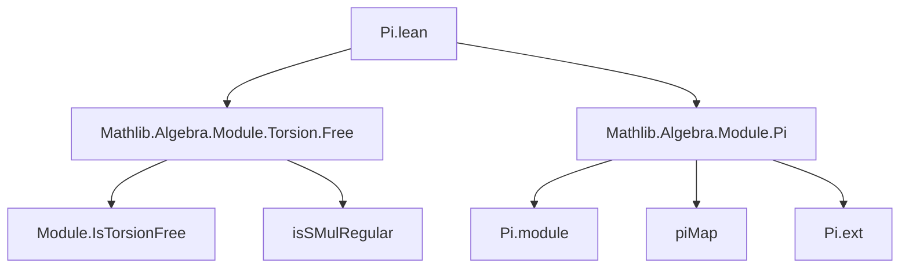

**Technical Brief: `Pi.lean` – Product of Torsion-Free Modules**

---

### 1. **Key Definitions & Theorems**

| Name | Type / Signature | Purpose |
|------|------------------|---------|
| `instModuleIsTorsionFree` | `∀ [Semiring R] [∀ i, AddCommMonoid (M i)] [∀ i, Module R (M i)] [∀ i, IsTorsionFree R (M i)], Module.IsTorsionFree R (∀ i, M i)` | Proves that the product module $\prod_{i : ι} M_i$ is torsion-free over $R$, assuming each $M_i$ is torsion-free. |

- **`Module.IsTorsionFree`**: A module $N$ over a semiring $R$ is *torsion-free* if for all $r \in R$, $r \neq 0$ implies the scalar multiplication map $n \mapsto r \cdot n$ is injective (i.e., `isSMulRegular r` holds).
- **`isSMulRegular`**: Predicate asserting that multiplication by $r$ is injective.
- **`.piMap`**: The canonical map $\prod_i f_i : \prod_i M_i \to \prod_i N_i$ induced by componentwise maps $f_i : M_i \to N_i$.

---

### 2. **Naming Conventions**

- **Prefixes**:
  - `isSMulRegular`: Predicate naming for injectivity of scalar multiplication.
  - `instModuleIsTorsionFree`: Instance naming pattern (`inst` + property), following Lean’s typeclass convention.
- **Suffixes**:
  - `isTorsionFree`: Standard suffix for torsion-freeness properties.
- **No `mul_`, `dist_`, or `add_` prefixes** — the proof is structural, not computational.

---

### 3. **Tactic Stack**

- **`intro` / `exact` / `apply`** (implicit in instance proof): Standard intro/apply style for typeclass inference.
- **`.piMap`**: Not a tactic, but a *constructor*/function application used to lift properties pointwise.
- **`fun _i ↦ hr.isSMulRegular`**: Uses the fact that each component satisfies `isSMulRegular`, lifted via `piMap`.

No heavy automation (e.g., `aesop`, `ring`, `simp`) is needed — the proof is *definitionally* straightforward.

---

### 4. **Proof Logic**

- **Strategy**: *Pointwise lifting* via product module structure.
- **Steps**:
  1. Let $r \in R$ be such that $r \neq 0$ (i.e., `hr : IsSMulRegular R r`).
  2. Need to show $r$ acts injectively on $\prod_i M_i$.
  3. Use `isSMulRegular` definition: show $r \cdot x = r \cdot y \implies x = y$.
  4. By extensionality, it suffices to check componentwise: for each $i$, $r \cdot x_i = r \cdot y_i \implies x_i = y_i$.
  5. Since each $M_i$ is torsion-free, `hr.isSMulRegular` gives injectivity in each component.
  6. Apply `.piMap` to the family of injective maps (multiplication by $r$ on each $M_i$), yielding injectivity on the product.

- **Key insight**: Torsion-freeness is preserved under arbitrary products because injectivity is checked pointwise.

---

### 5. **Imports**

| Import | Role |
|--------|------|
| `Mathlib.Algebra.Module.Torsion.Free` | Provides `IsTorsionFree`, `isSMulRegular`, and related lemmas. |
| `Mathlib.Algebra.Module.Pi` | Defines the product module structure `∀ i, M i` and operations like `piMap`. |

These imports define the *ambient algebraic context* and *product module infrastructure*.

---

### 6. **Mermaid Diagrams**

#### Dependency Graph (Module-Level)



#### Theoretical Overview (Proof Structure)

```mermaid
flowchart LR
  A[Assume: ∀ i, IsTorsionFree R (M i)] --> B[Take r ≠ 0]
  B --> C[Need: r·x = r·y ⇒ x = y in ∏ M i]
  C --> D[Check componentwise: r·x_i = r·y_i ⇒ x_i = y_i]
  D --> E[By assumption, each M_i torsion-free ⇒ injective]
  E --> F[Apply piMap to get injectivity on product]
  F --> G[Conclusion: ∏ M i is torsion-free]
```

---

### Summary

This file formalizes a foundational stability property of torsion-free modules: **arbitrary products preserve torsion-freeness**. The proof is elegant and minimal — leveraging the pointwise nature of the product module and the definition of `isSMulRegular`. It exemplifies Lean’s strength in *algebraic abstraction* via typeclasses and dependent products.
