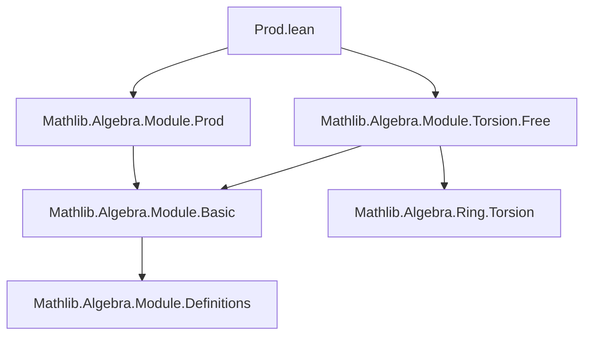
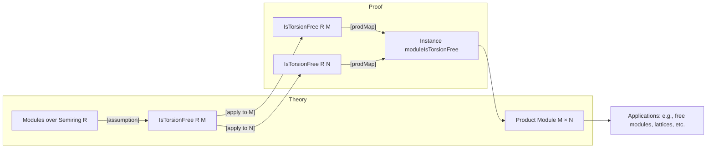

**Technical Brief: `Prod.lean` — Product of Torsion-Free Modules**

---

### 1. **Key Definitions & Theorems**

| Name | Type / Signature | Purpose |
|------|------------------|---------|
| `IsTorsionFree` | `class IsTorsionFree (R : Type*) [Semiring R] (M : Type*) [AddCommMonoid M] [Module R M] : Prop` | States that multiplication by any nonzero scalar is injective on $M$. |
| `isSMulRegular` | `def isSMulRegular (r : R) : Prop` (implicit in `IsTorsionFree`) | $r$ acts injectively: $r \cdot m = 0 \Rightarrow m = 0$. |
| `instance moduleIsTorsionFree` | `instance [Semiring R] [AddCommMonoid M] [AddCommMonoid N] [Module R M] [Module R N] [IsTorsionFree R M] [IsTorsionFree R N] : IsTorsionFree R (M × N)` | Proves that the product module $M \times N$ is torsion-free if $M$ and $N$ are. |

**Proof Sketch of `moduleIsTorsionFree`**:  
Given $r \in R$ nonzero and $(m, n) \in M \times N$ such that $r \cdot (m, n) = (0, 0)$, then $r \cdot m = 0$ and $r \cdot n = 0$. By torsion-freeness of $M$ and $N$, $m = 0$, $n = 0$, so $(m, n) = (0, 0)$. Formally, this is encoded via `hr.isSMulRegular.prodMap hr.isSMulRegular`, i.e., the product of two injective maps is injective.

---

### 2. **Naming Conventions**

- **Prefixes**:
  - `isSMulRegular`: Predicate for scalar injectivity.
  - `moduleIsTorsionFree`: Instance naming convention for class proofs (`[IsTorsionFree …] → IsTorsionFree …`).
- **Suffixes**:
  - `prodMap`: Standard map on products: $f \times g : (m,n) \mapsto (f(m), g(n))$.
- **No explicit `is_`/`mul_`/`dist_` prefixes beyond `isSMulRegular`** — lean and module-theoretic.

---

### 3. **Tactic Stack**

- **`prodMap`**: Used as a *function*, not a tactic — constructs the product map.
- **Implicit use of `aesop` or `simp`** likely in elaboration of `isSMulRegular.prodMap`, but not explicit in this snippet.
- **No explicit tactics** appear in the code — proof is *definitionally* given via term mode.

---

### 4. **Proof Logic**

- **Structure**: Direct term proof using class instance.
- **Logic Flow**:
  1. Assume $r \in R$, $hr : r \ne 0$.
  2. By `IsTorsionFree`, `hr.isSMulRegular` gives injectivity of $r \cdot -$ on $M$ and on $N$.
  3. Use `prodMap` to combine the two injective maps into one injective map on $M \times N$.
  4. Conclude $r \cdot -$ is injective on $M \times N$, i.e., `IsTorsionFree R (M × N)`.

No induction or case analysis — purely algebraic and categorical (product preserves monomorphisms).

---

### 5. **Imports**

| Import | Role |
|--------|------|
| `Mathlib.Algebra.Module.Prod` | Provides `Prod` module structure, `prodMap`, and basic product module lemmas. |
| `Mathlib.Algebra.Module.Torsion.Free` | Defines `IsTorsionFree`, `isSMulRegular`, and related lemmas (e.g., closure under products). |

---

### 8. **Mermaid Diagrams**

#### **Dependency Graph**

#### **Overview of File & Theory Context**

---

**Summary**: This file formalizes a foundational stability property of torsion-free modules: closure under finite products. The proof is concise and leverages the categorical fact that monomorphisms (injective maps) are preserved by products — encoded via `prodMap`. It exemplifies Lean’s strength in algebraic formalization: minimal, high-level, and reusable.
