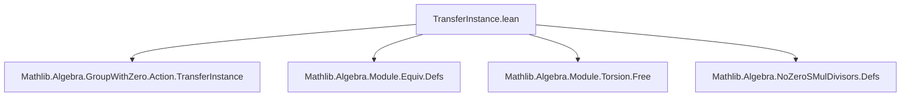

**Technical Brief: `TransferInstance.lean` (Mathlib)**  
*Domain: Algebra — Module Theory & Equivalence Transfer*

---

### 1. **Key Definitions & Theorems**

| Name | Type / Signature | Purpose |
|------|------------------|---------|
| `Equiv.noZeroSMulDivisors` | `[Zero R] [Zero β] [SMul R β] [NoZeroSMulDivisors R β] → NoZeroSMulDivisors R α` | Transfers the `NoZeroSMulDivisors` property across an equivalence `e : α ≃ β`, using transported `zero` and `smul`. |
| `Equiv.module` | `[AddCommMonoid β] [Module R β] → Module R α` | Transports an `R`-module structure on `β` to `α` via `e : α ≃ β`, using `Equiv.distribMulAction`. |
| `Equiv.linearEquiv` | `[AddCommMonoid β] [Module R β] → α ≃ₗ[R] β` | Constructs a linear equivalence (i.e., an isomorphism in the category of `R`-modules) from `α` to `β`, where `α` carries the transported module structure. |
| `Equiv.moduleIsTorsionFree` | `[AddCommMonoid β] [Module R β] [Module.IsTorsionFree R β] → Module.IsTorsionFree R α` | Transfers torsion-freeness of modules across an equivalence, using injectivity of the linear equivalence. |
| `AddEquiv.module` | `[AddCommMonoid α] [AddCommMonoid β] [Module A β] → Module A α` | Transports an `A`-module structure along an *additive* equivalence `e : α ≃+ β`, preserving the additive structure definitionaly (better than `Equiv.module`). |
| `LinearEquiv.isScalarTower` | `[Module R α] [Module R β] [IsScalarTower R A β] → IsScalarTower R A α` | Shows that scalar tower compatibility is preserved under linear equivalence, using transported module via `AddEquiv.module`. |

---

### 2. **Naming Conventions**

- **Prefixes**:
  - `Equiv.`: For constructions/lemmas using *equivalences* (`α ≃ β`).
  - `AddEquiv.`: For constructions using *additive equivalences* (`α ≃+ β`).
  - `LinearEquiv.`: For constructions using *linear equivalences* (`α ≃ₗ[R] β`).
- **Suffixes**:
  - `module`: Indicates module structure transport.
  - `isTorsionFree`, `noZeroSMulDivisors`: Property names carried over.
  - `isScalarTower`: Property name preserved under transport.

---

### 3. **Tactic Stack**

Frequent tactics used in proofs:
- `simp` (with custom lemmas like `smul_def`, `zero_def`, `add_def`, `Equiv.symm_apply_eq`, etc.)
- `extract_lets`: To simplify let-bindings introduced by `let := e.zero`, etc.
- `apply e.symm.injective`: Leveraging injectivity of equivalence inverses.
- `exact Iff.mpr ... rfl`: For rewriting via equivalence properties.
- `constructor`: For structure proofs (e.g., module axioms, scalar tower).
- `aesop` is *not* used here — proofs are mostly `simp`-driven and rely on definitional equalities.

---

### 4. **Proof Logic**

General proof pattern:
1. **Transport structure**: Use `let := e.zero`, `let := e.smul R`, etc., to define operations on `α` via `e`.
2. **Unpack definitions**: `extract_lets` simplifies the let-bindings.
3. **Reduce to known property on `β`**: Use `simp [smul_def, zero_def, ...]` to rewrite goals into statements about `β`.
4. **Apply known lemma**: E.g., `eq_zero_or_eq_zero_of_smul_eq_zero` for `NoZeroSMulDivisors`.
5. **Leverage injectivity/surjectivity**: For torsion-freeness and scalar tower, use injectivity of `e.symm` or `e` to lift properties.

Induction is *not* used — this is purely *structure transport* via equivalence.

---

### 5. **Imports**

| Module | Role |
|--------|------|
| `Mathlib.Algebra.GroupWithZero.Action.TransferInstance` | Base pattern for transfer across equivalences (group actions). |
| `Mathlib.Algebra.Module.Equiv.Defs` | Defines `Equiv.addCommMonoid`, `Equiv.distribMulAction`, `Equiv.smul_def`, etc. |
| `Mathlib.Algebra.Module.Torsion.Free` | Defines `Module.IsTorsionFree`. |
| `Mathlib.Algebra.NoZeroSMulDivisors.Defs` | Defines `NoZeroSMulDivisors`. |

---

### 6. **Mermaid Diagrams**

#### Dependency Graph (Module-Level)



#### Overview of Theory Flow

```mermaid
flowchart LR
  subgraph Equiv.Transport
    e[Equiv e : α ≃ β]
    zero[Transport Zero]
    smul[Transport SMul]
    module[Transport Module]
    linear[Linear Equiv α ≃ₗ[R] β]
  end

  subgraph AddEquiv.Transport
    ae[AddEquiv e : α ≃+ β]
    am[Transport Module via AddEquiv]
  end

  subgraph Properties
    nzsd[NoZeroSMulDivisors]
    tf[TorsionFree]
    st[ScalarTower]
  end

  e --> zero
  e --> smul
  e --> module
  module --> linear
  linear --> tf

  ae --> am
  am --> st

  linear -->|injective| tf
  st -->|via transport| st'
```

---

### 7. **Summary**

This file implements a *transport mechanism* for algebraic structures (especially modules) along equivalences. It distinguishes between:
- **Equiv-based transport** (weaker, but works for any equivalence),
- **AddEquiv-based transport** (stronger definitional behavior, preserves additive structure literally),
- **LinearEquiv-based transport** (full module isomorphism).

It continues the pattern from `Group/TransferInstance.lean`, extending it to modules and related properties (`NoZeroSMulDivisors`, `IsTorsionFree`, `IsScalarTower`). The proofs are mostly definitional, relying on `simp` and injectivity of equivalences.

--- 

Let me know if you'd like a formalized dependency graph or a comparison with `Group/TransferInstance.lean`.
