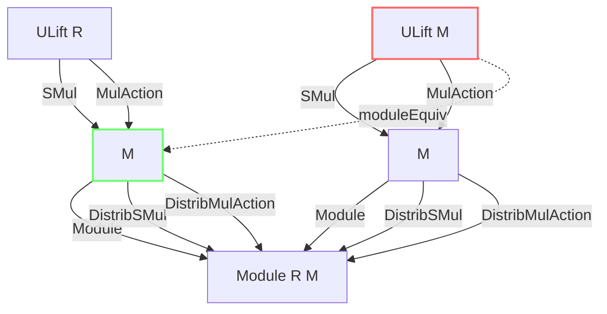
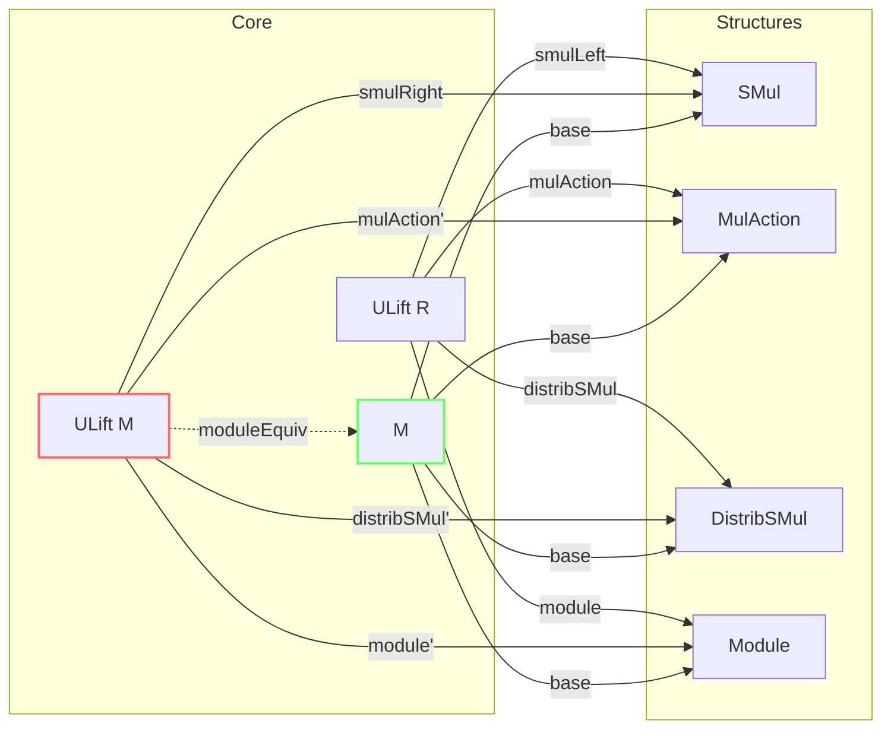

### Technical Brief: `ULift.lean` — Module and Multiplicative Action Instances on `ULift`

---

#### **1. Key Definitions & Theorems**

| Name | Type / Purpose |
|------|----------------|
| `ULift.smulLeft` | `SMul (ULift R) M` — defines left scalar multiplication on `M` via `ULift R` by projecting down. |
| `ULift.smul_def` | `s • x = s.down • x` — definition of scalar multiplication for `ULift.smulLeft`. |
| `ULift.isScalarTower`, `isScalarTower'`, `isScalarTower''` | `IsScalarTower` instances for combinations of `ULift R`, `ULift M`, `ULift N`. |
| `ULift.isCentralScalar` | `IsCentralScalar R (ULift M)` — central scalar action lifts to `ULift M`. |
| `ULift.mulAction`, `mulAction'` | `MulAction (ULift R) M` and `MulAction R (ULift M)` — multiplicative actions lifted. |
| `ULift.distribSMul`, `distribSMul'` | `DistribSMul` instances for `ULift R` and `ULift M`. |
| `ULift.distribMulAction`, `distribMulAction'` | `DistribMulAction` instances (combining `MulAction` + `DistribSMul`). |
| `ULift.mulDistribMulAction`, `mulDistribMulAction'` | `MulDistribMulAction` instances (multiplicative monoid action compatible with multiplication). |
| `ULift.smulWithZero`, `smulWithZero'` | `SMulWithZero` instances (scalar multiplication with zero compatibility). |
| `ULift.mulActionWithZero`, `mulActionWithZero'` | `MulActionWithZero` instances. |
| `ULift.module`, `module'` | `Module (ULift R) M` and `Module R (ULift M)` — module structures lifted. |
| `ULift.moduleEquiv` | `ULift M ≃ₗ[R] M` — linear equivalence between `ULift M` and `M`. |

---

#### **2. Naming Conventions**

- **Prefixes**:
  - `smulLeft`, `smulZeroClass`, `mulAction`, `distribSMul`, etc. — indicate the algebraic structure being defined.
  - `'` suffix (e.g., `module'`, `mulAction'`) — denotes the *second* argument (`M`) is lifted (i.e., `ULift M` is the domain/codomain).
  - `''` suffix (e.g., `isScalarTower''`) — used for cases where the *third* argument is lifted (`ULift N`).
- **No `is_` prefix** — unlike many Lean libraries, this file uses direct structure names (e.g., `module`, not `isModule`), consistent with `Mathlib`’s modern style.

---

#### **3. Tactic Stack**

Frequent tactics used in proofs:
- `ext` — extensionality for `ULift` (to prove equality of lifted terms).
- `simp [smul_def, smul_zero, smul_add, mul_smul, ...]` — simplification using definitions and known lemmas.
- `congr_arg ULift.up` — to lift equalities from `M` to `ULift M`.
- `rw [smul_assoc, smul_one, add_smul, ...]` — rewriting using algebraic axioms.
- `rfl` — for definitional equalities (e.g., `smul_def`).
- `by { ext; simp }` — common pattern for proving lifted properties.

---

#### **4. Proof Logic**

- **Pattern**: Most proofs follow a *definitional lifting* strategy:
  1. **Unfold definitions** (e.g., `smul_def`, `toFun`, `invFun`).
  2. **Reduce to base type** using `down`/`up` and known lemmas (e.g., `smul_assoc`, `add_smul`).
  3. **Lift back** using `congr_arg ULift.up` or `ULift.ext`.
- **Induction is not used** — all structures are defined *pointwise* via `ULift.down`/`up`, so proofs are mostly equational reasoning.
- **Symmetry**: For each structure on `M`, there is a corresponding lifted structure on `ULift M`, and vice versa — proofs mirror each other.

---

#### **5. Imports**

| Import | Purpose |
|--------|---------|
| `Mathlib.Algebra.GroupWithZero.ULift` | Base `ULift` group/monoid structures. |
| `Mathlib.Algebra.Ring.ULift` | Ring/module lifting (redundant with later imports, but kept for compatibility). |
| `Mathlib.Algebra.Module.Equiv.Defs` | Linear equivalences (`≃ₗ`) and definitions. |
| `Mathlib.Data.ULift` | Core `ULift` type and basic equivalences (`AddEquiv.ulift`). |

> **Note**: This file is a *companion* to `Mathlib.Data.ULift`, focusing on *algebraic structures* (module, action, etc.) rather than just type-theoretic properties.

---

#### **6. Mermaid Diagrams**

##### **Dependency Graph (Module Structure)**

##### **Overview of File Structure**

---

#### **7. Summary**

This file formalizes the *transport of algebraic structures* along the `ULift` equivalence. It ensures that any module, action, or distributive structure on `M` induces a corresponding structure on `ULift M`, and vice versa. The key result is the linear equivalence `moduleEquiv : ULift M ≃ₗ[R] M`, which confirms that `ULift` is *algebraically trivial* — it does not change the category-theoretic properties of the object, only its universe level.

This is foundational for higher-universe encodings in Lean, where one needs to lift types to avoid universe level mismatches without losing algebraic content.
