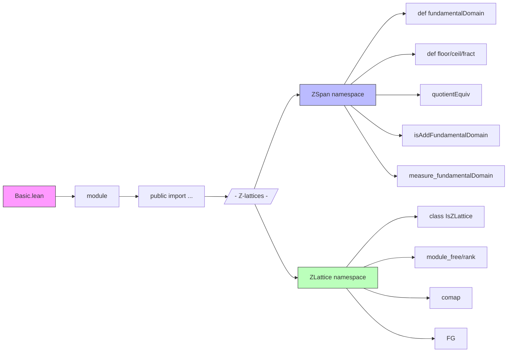

Here is the structured technical brief extracted from the provided `Basic.lean` file:

---

### **1. Key Definitions & Theorems**

| Name | Type / Signature | Purpose |
|------|------------------|---------|
| `ZSpan.fundamentalDomain` | `def fundamentalDomain (b : Basis ι K E) : Set E` | Defines the fundamental domain of a ℤ-lattice spanned by a basis `b` as vectors whose coordinates lie in `[0,1)`. |
| `ZSpan.floor`, `ZSpan.ceil`, `ZSpan.fract` | `def floor, ceil, fract : E → span ℤ (Set.range b)` | Rounding maps (floor/ceil) and fractional part w.r.t. basis `b`. Used to construct quotient representatives. |
| `ZSpan.quotientEquiv` | `def quotientEquiv : E ⧸ span ℤ (Set.range b) ≃ fundamentalDomain b` | Shows the quotient of `E` by the lattice is in bijection with the fundamental domain. |
| `ZSpan.isAddFundamentalDomain` | `theorem isAddFundamentalDomain : IsAddFundamentalDomain (span ℤ (Set.range b)) (fundamentalDomain b) μ` | Proves `fundamentalDomain b` is a fundamental domain for the additive group action of the lattice. |
| `ZLattice.IsZLattice` | `class IsZLattice (L : Submodule ℤ E)` | Defines a ℤ-lattice as a discrete ℤ-submodule that spans `E` over `K`. |
| `ZLattice.module_free` | `theorem module_free [IsZLattice K L] : Module.Free ℤ L` | Any ℤ-lattice is a free ℤ-module. |
| `ZLattice.rank` | `theorem rank [IsZLattice K L] : finrank ℤ L = finrank K E` | The ℤ-rank of a ℤ-lattice equals the `K`-dimension of `E`. |
| `ZLattice.comap` | `def comap (e : E →ₗ[K] F) (L : Submodule ℤ F) : Submodule ℤ E` | Pullback of a ℤ-lattice along a linear map; preserves `IsZLattice` under continuous linear equivalences. |
| `ZLattice.FG` | `theorem FG [IsZLattice K L] : L.FG` | Any ℤ-lattice is finitely generated as a ℤ-module. |

---

### **2. Naming Conventions**

- **Prefixes**:
  - `ZSpan.*`: For lattices constructed as `span ℤ (Set.range b)` from a basis `b`.
  - `ZLattice.*`: For abstract ℤ-lattices defined via `IsZLattice`.
  - `instIsZLattice*`: Instance names for `IsZLattice`.
- **Suffixes**:
  - `_apply`, `_repr_apply`: For lemmas about application or coordinate representation.
  - `_eq_self`, `_mem_*`: For membership or equality characterizations.
  - `_pi_basisFun`, `_singleton`: For special cases with product or singleton index types.
- **General**:
  - `quotientEquiv`, `fractRestrict`, `floor`, `ceil`: Standard lattice-theoretic constructions.
  - `measure_fundamentalDomain`, `volume_fundamentalDomain`: Measure-theoretic properties.

---

### **3. Tactic Stack**

Frequently used tactics in proofs:
- `simp`, `simp_rw`, `congr!`, `ext`, `rw`, `refine`, `apply`, `exact`
- `cases`, `obtain`, `have`, `suffices`, `contrapose!`
- `convert`, `change`, `rwa`, `rfl`, `linarith`, `ring`
- `finite_dimensional`, `finite`, `fintype`, `nonempty_fintype`
- `measurableSet_preimage`, `measure_mono_null`, `iUnion_null_iff`
- `aesop`, `interval_cases`, `omega` (for integer arithmetic)

---

### **4. Proof Logic**

- **Structure**:
  - Most proofs follow a *constructive* pattern: define maps (`floor`, `fract`, `quotientEquiv`), prove properties (e.g., surjectivity, equivariance), then deduce structural results (e.g., freeness, rank equality).
  - **Induction** is rarely used; instead, *basis expansion* and *coordinate-wise analysis* dominate.
  - **Measure-theoretic arguments** rely on:
    - Boundedness of `fundamentalDomain` (`fundamentalDomain_isBounded`)
    - Measurability (`fundamentalDomain_measurableSet`)
    - Haar measure properties (`measure_fundamentalDomain`, `measureReal_fundamentalDomain`)
  - **Algebraic arguments** use:
    - `span` properties (`span_span_of_tower`, `mem_span_iff_repr_mem`)
    - Discrete topology + proper space ⇒ finite intersection (`setFinite_inter`)
    - Rational extension (`Module.compHom E (algebraMap ℚ K)`) to leverage torsion-freeness.

- **Typical flow**:
  1. Reduce to finite-dimensional case via `finite_dimensional_of_finite`.
  2. Use basis `b` to identify `E ≅ ι → K`.
  3. Work in coordinates (e.g., `repr`, `fract`).
  4. Apply measure-theoretic or topological lemmas (e.g., `isAddFundamentalDomain.mk'`).
  5. Conclude via equivalence or finiteness.

---

### **5. Imports**

| Module | Purpose |
|--------|---------|
| `Mathlib.LinearAlgebra.Countable` | Countability arguments for lattices. |
| `Mathlib.LinearAlgebra.Dimension.OrzechProperty` | Used in rank arguments (e.g., `finrank_eq_card_chooseBasisIndex`). |
| `Mathlib.LinearAlgebra.FreeModule.PID` | Structure of free modules over PID (`ℤ`), e.g., `Module.Free`, `Module.Finite`. |
| `Mathlib.MeasureTheory.Group.FundamentalDomain` | Formalization of additive fundamental domains (`IsAddFundamentalDomain`). |
| `Mathlib.MeasureTheory.Measure.Lebesgue.EqHaar` | Equivalence of Haar measures (used in `measure_fundamentalDomain`). |
| `Mathlib.RingTheory.Localization.Module` | Localization and extension of scalars (e.g., `ℤ → ℚ`). |

---

### **6. Mermaid Diagrams**

#### **Dependency Graph (Top-Level)**

```mermaid
graph TD
  A[Basic.lean] --> B[Mathlib.LinearAlgebra.Countable]
  A --> C[Mathlib.LinearAlgebra.Dimension.OrzechProperty]
  A --> D[Mathlib.LinearAlgebra.FreeModule.PID]
  A --> E[Mathlib.MeasureTheory.Group.FundamentalDomain]
  A --> F[Mathlib.MeasureTheory.Measure.Lebesgue.EqHaar]
  A --> G[Mathlib.RingTheory.Localization.Module]

  subgraph Theory
    B --> H[Countable Sets]
    C --> I[Dimension Theory]
    D --> J[Free Modules over ℤ]
    E --> K[Fundamental Domains]
    F --> L[Haar Measures]
    G --> M[Localization & Scalars]
  end

  A --> N[Z-lattices]
  N --> O[ZSpan: span ℤ (range b)]
  N --> P[ZLattice: IsZLattice]
  O --> Q[Fundamental Domain]
  O --> R[Quotient Equiv]
  P --> S[Free & Rank]
  P --> T[Comap & Pullback]
```

#### **Overview of File Structure**



---

### **7. Summary**

This file formalizes the theory of **ℤ-lattices** in finite-dimensional normed vector spaces over `K`, where `K` is a `NormedLinearOrderedField` with a `FloorRing` structure (e.g., `ℝ`). It provides two complementary perspectives:

- **Concrete**: via `ZSpan`, built from a basis `b`, with explicit constructions (`floor`, `fract`, `fundamentalDomain`).
- **Abstract**: via `ZLattice`, defined by topological (`DiscreteTopology`) and algebraic (`span_top`) properties.

Key results include:
- The quotient `E / L` is equivalent to the fundamental domain.
- ℤ-lattices are free of rank equal to `dim_K E`.
- Measure-theoretic properties (e.g., volume of fundamental domain = absolute determinant).

The formalization is consistent with standard algebraic number theory and geometry of numbers, and is designed for compatibility with `Mathlib`’s measure theory and linear algebra libraries.

---
