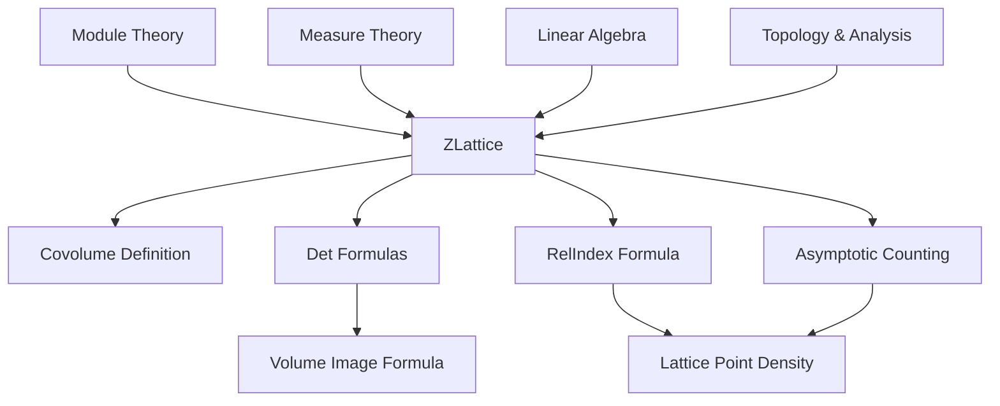
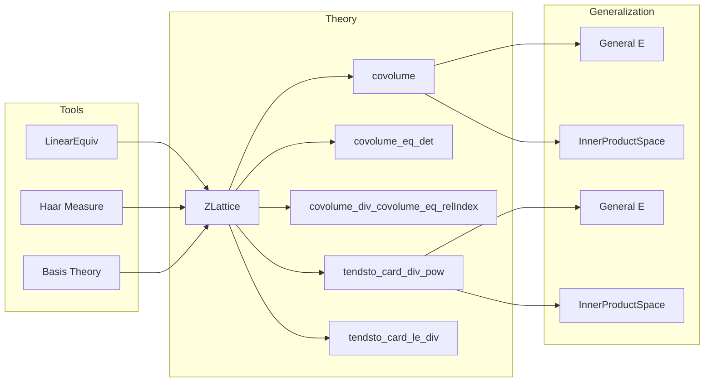

### Technical Brief: `Covolume.lean`

---

#### **1. Key Definitions & Theorems**

| Name | Type / Signature | Purpose |
|------|------------------|---------|
| `covolume` | `def covolume (μ : Measure E := by volume_tac) : ℝ` | Defines the covolume of a ℤ-lattice $L$ as the real volume of a fundamental domain (independent of choice, see `covolume_eq_measure_fundamentalDomain`). |
| `covolume_eq_measure_fundamentalDomain` | `theorem` | Proves that `covolume L μ` equals the measure of any additive fundamental domain $F$ of $L$. |
| `covolume_ne_zero`, `covolume_pos` | `theorem` | Establishes that the covolume is strictly positive. |
| `covolume_comap` | `theorem` | Shows invariance of covolume under linear isomorphisms preserving Haar measure. |
| `covolume_eq_det_mul_measureReal` | `theorem` | Relates covolume to determinant of a ℤ-basis and volume of a fundamental parallelepiped. |
| `covolume_eq_det` | `theorem` | In the case $E = ι → ℝ$, covolume equals the absolute value of the determinant of any ℤ-basis matrix. |
| `covolume_eq_det_inv` | `theorem` | Expresses covolume as the inverse of the absolute determinant of the change-of-basis linear equivalence. |
| `covolume_div_covolume_eq_relIndex` | `theorem` | For sublattices $L_1 \le L_2$, $\frac{\text{covolume}(L_1)}{\text{covolume}(L_2)} = [L_2 : L_1]$. |
| `covolume_div_covolume_eq_relIndex'`, `covolume_div_covolume_eq_relIndex''` | `theorem` | Generalizations to `InnerProductSpace` and general finite-dimensional $E$. |
| `volume_image_eq_volume_div_covolume` | `theorem` | For $E = ι → ℝ$, volume of image under ℤ-basis equivalence equals $\frac{\text{volume}(s)}{\text{covolume}(L)}$. |
| `volume_image_eq_volume_div_covolume'`, `volume_image_eq_volume_div_covolume''` | `theorem` | Generalizations to `InnerProductSpace` and general $E$. |
| `tendsto_card_div_pow''`, `tendsto_card_div_pow'`, `tendsto_card_div_pow` | `theorem` | Asymptotic density of lattice points in scaled sets: $\#(s \cap n^{-1} \cdot L) / n^{\dim} \to \text{volume}(s)/\text{covolume}(L)$. |
| `tendsto_card_le_div''`, `tendsto_card_le_div'`, `tendsto_card_le_div` | `theorem` | Asymptotic count of lattice points in sublevel sets of homogeneous functions: $\#\{x \in X \mid F(x) \le c\} \cap L / c \to \text{volume}(\{F \le 1\}) / \text{covolume}(L)$. |

---

#### **2. Naming Conventions**

- **Prefixes**:
  - `covolume_`: properties of the covolume function.
  - `tendsto_card_`: asymptotic counting results.
- **Suffixes**:
  - No suffix: ambient space is $ι → ℝ$ (pi-space).
  - `'` (prime): ambient space is `InnerProductSpace ℝ E`.
  - `''` (double prime): general finite-dimensional normed space $E$.
- **Other**:
  - `comap`, `map`, `equivFun`, `ofZLatticeBasis`, `chooseBasis`, `fundamentalDomain`: standard constructions for lattices.
  - `real`, `ENNReal.ofReal`, `toReal`: conversions between measure types.

---

#### **3. Tactic Stack**

Frequently used tactics:
- `rw`, `congr`, `ext`, `simp`, `simp_rw`
- `convert`, `trans`, `refine`, `exact`
- `have`, `obtain`, `let`, `classical`
- `filter_upwards`, `eventually_gt_atTop`
- `volume_tac`, `measureReal_def`, `ENNReal.toReal_div`, `Real.rpow_*`
- `set_option backward.privateInPublic true`: used to allow private definitions in public theorems.

---

#### **4. Proof Logic**

- **Structure**:
  - Most proofs reduce to the standard case $E = ι → ℝ$ via linear equivalences (e.g., `EuclideanSpace.equiv`, `stdOrthonormalBasis`).
  - For general $E$, one pulls back to $ι → ℝ$ using `covolume_comap`, then applies the pi-case result.
- **Common patterns**:
  - Use of `FundamentalDomain` and `IsAddFundamentalDomain`.
  - Determinant identities: `Basis.det_mul_det`, `Basis.det_inv`, `LinearEquiv.det`.
  - Measure transformation under linear equivalences: `Measure.addHaar_preimage_linearEquiv`.
  - Asymptotic counting via `tendsto_card_div_pow_atTop_volume` and variants.
  - Homogeneity of sets/functions: `tendsto_card_le_div''_aux` lemma for scaling arguments.

---

#### **5. Imports**

| Import | Purpose |
|--------|---------|
| `Mathlib.Analysis.BoxIntegral.UnitPartition` | For volume computations on partitions, fundamental domains. |
| `Mathlib.LinearAlgebra.FreeModule.Finite.CardQuotient` | For index/covolume relations via determinant and quotient cardinalities. |
| `Mathlib.MeasureTheory.Measure.Haar.InnerProductSpace` | For Haar measure properties in inner product spaces, measure-preserving equivalences. |

---

#### **6. Mermaid Diagrams**

##### **Dependency Graph (High-Level)**

##### **File Overview**

---

#### **7. Theory Scope**

This module formalizes the **covolume theory of ℤ-lattices** in finite-dimensional real vector spaces, with three levels of generality:
- **Pi-case** (`ι → ℝ`): most explicit, determinant-based.
- **InnerProductSpace case**: uses orthonormal bases and Euclidean structure.
- **General normed space case**: via linear equivalences to standard spaces.

It connects:
- Algebraic structure (lattices, bases, indices),
- Measure theory (Haar measure, fundamental domains),
- Asymptotic analysis (lattice point counting, equidistribution).

---

#### **8. Notable Lemmas & Identities**

- **Covolume = det**:
  $$
  \operatorname{covolume}(L) = \left| \det\left( (b_i) \right) \right|^{-1}
  $$
  where $b$ is a ℤ-basis of $L$, viewed as a real matrix.

- **Index–covolume relation**:
  $$
  \frac{\operatorname{covolume}(L_1)}{\operatorname{covolume}(L_2)} = [L_2 : L_1]
  $$

- **Lattice point asymptotics**:
  $$
  \frac{\#(s \cap n^{-1} \cdot L)}{n^{\dim}} \to \frac{\operatorname{vol}(s)}{\operatorname{covolume}(L)}
  $$

- **Homogeneous sublevel counting**:
  $$
  \frac{\#\{x \in X \mid F(x) \le c\} \cap L}{c} \to \frac{\operatorname{vol}(\{F \le 1\})}{\operatorname{covolume}(L)}
  $$

--- 

Let me know if you'd like a formalized dependency graph (e.g., `.lean`-level imports), or a summary of the `ZLattice` typeclass hierarchy.
